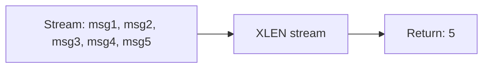

# How to Use XLEN in Redis to Get Stream Length

Author: [nawazdhandala](https://www.github.com/nawazdhandala)

Tags: Redis, XLEN, Stream, Monitoring, Queue

Description: Learn how to use XLEN in Redis to get the number of messages in a stream, and how to use it for monitoring queue depth, backlog detection, and stream capacity management.

---

## How XLEN Works

XLEN returns the number of messages (entries) in a Redis Stream. It counts all messages currently stored in the stream regardless of whether they have been read or acknowledged by consumers. XLEN is O(1) because Redis maintains an internal counter for the stream length.



## Syntax

```redis
XLEN key
```

Returns an integer: the number of messages in the stream. Returns 0 if the stream does not exist (unlike many commands, XLEN does not distinguish between an empty stream and a non-existent key for the length count).

## Examples

### Check the length of a stream

```redis
XADD orders:stream * product "laptop" qty 1 user "alice"
XADD orders:stream * product "mouse" qty 2 user "bob"
XADD orders:stream * product "keyboard" qty 1 user "carol"

XLEN orders:stream
```

```text
(integer) 3
```

### XLEN on an empty stream

```redis
XADD empty:stream * field "value"
XDEL empty:stream 1748700000000-0

XLEN empty:stream
```

```text
(integer) 0
```

### XLEN on a non-existent key

```redis
XLEN nonexistent:stream
```

```text
(integer) 0
```

### Monitor stream growth

```bash
# Check stream length every second
while true; do
  length=$(redis-cli XLEN events:log)
  echo "Stream length: $length"
  sleep 1
done
```

### Track queue backlog

```redis
XLEN jobs:pending
```

```text
(integer) 1247
```

If the queue is growing faster than consumers are processing, this number will keep increasing.

### Stream length after XTRIM

```redis
XADD events:log MAXLEN = 100 * action "heartbeat"

XLEN events:log
```

```text
(integer) 100
```

### Compare with consumer group pending count

XLEN counts total messages in the stream. The pending entry list (PEL) for a consumer group shows how many messages are delivered but not yet acknowledged:

```redis
# Total messages in stream
XLEN events:log
```

```text
(integer) 500
```

```redis
# Messages acknowledged and consumed (from a specific group)
XINFO GROUPS events:log
```

Use XLEN alongside XINFO GROUPS to understand both total stream depth and per-group processing lag.

## XLEN vs XINFO STREAM

| Command | Information |
|---|---|
| XLEN key | Number of messages in the stream |
| XINFO STREAM key | Detailed stream metadata including length, first/last ID, consumer groups |

For a quick length check, XLEN is faster. For full stream metadata, use XINFO STREAM.

```redis
XINFO STREAM orders:stream
```

```text
 1) "length"
 2) (integer) 3
 3) "radix-tree-keys"
 4) (integer) 1
 5) "radix-tree-nodes"
 6) (integer) 2
 7) "last-generated-id"
 8) "1748700000002-0"
 ...
```

## Use Cases

**Queue depth monitoring** - Alert when XLEN exceeds a threshold, indicating consumer lag or backlog buildup.

**Backpressure implementation** - Check stream length before adding new messages; if the stream is too large, apply backpressure to producers.

**Capacity planning** - Track stream size over time to estimate memory consumption and set appropriate MAXLEN limits.

**Health checks** - Include stream length in health check endpoints to expose queue depth to monitoring systems.

**Consumer group lag** - Compare XLEN with the number of acknowledged messages in a consumer group to measure processing lag.

## Summary

XLEN is a fast O(1) command that returns the total number of messages stored in a Redis Stream. It is essential for monitoring queue depth, detecting consumer lag, and implementing backpressure. Use XLEN alongside XINFO GROUPS to understand both the raw stream size and how much of it has been processed by consumer groups. For bounded stream sizes, pair XADD with MAXLEN or use XTRIM to keep stream length under control.
