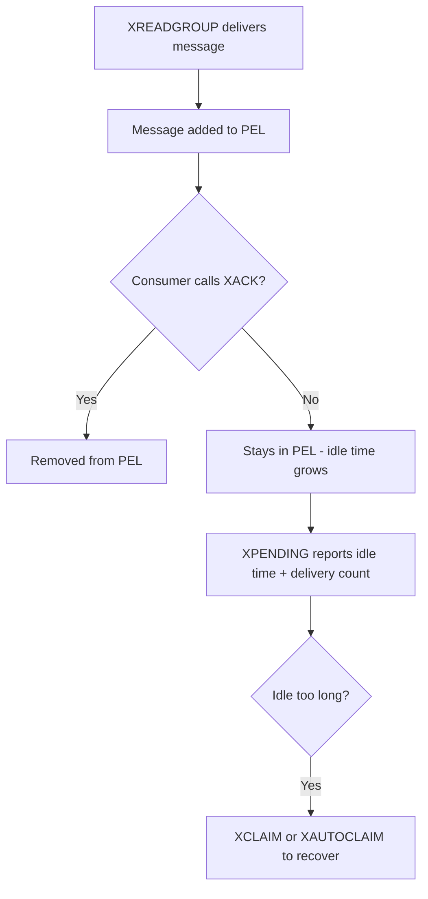

# How to Use XPENDING in Redis to List Unacknowledged Messages

Author: [nawazdhandala](https://www.github.com/nawazdhandala)

Tags: Redis, Stream, XPENDING, Consumer Group, Monitoring

Description: Learn how to use XPENDING to inspect unacknowledged pending messages in a Redis Stream consumer group, including idle time and delivery counts.

---

After `XREADGROUP` delivers a message, that message sits in the Pending Entries List (PEL) until the consumer calls `XACK`. `XPENDING` lets you query this PEL to see which messages are outstanding, who owns them, how long they have been idle, and how many times they have been delivered.

## How XPENDING Works

`XPENDING` has two forms. The summary form returns aggregate counts per consumer. The range form returns detailed information about individual pending messages between two IDs.



## Syntax

Summary form - aggregate info per consumer:

```redis
XPENDING key group [[IDLE min-idle-time] start end count [consumer]]
```

- `key` - stream name
- `group` - consumer group name
- `start` - minimum message ID (use `-` for lowest)
- `end` - maximum message ID (use `+` for highest)
- `count` - max number of entries to return
- `consumer` - filter to a specific consumer (optional)
- `IDLE min-idle-time` - only return messages idle for at least this many ms (Redis 7.0+)

## Examples

### Summary Overview

Get a high-level count of pending messages for all consumers in the group:

```redis
XPENDING mystream workers
```

Example output:

```text
1) (integer) 5
2) "1711900000000-0"
3) "1711900004000-0"
4) 1) 1) "consumer1"
         2) "3"
   2) 1) "consumer2"
         2) "2"
```

The response shows total pending count, lowest and highest pending IDs, and a per-consumer breakdown.

### Detailed Range Query

List up to 10 pending messages across all consumers:

```redis
XPENDING mystream workers - + 10
```

Example output:

```text
1) 1) "1711900000000-0"
   2) "consumer1"
   3) (integer) 75000
   4) (integer) 1
2) 1) "1711900001000-0"
   2) "consumer1"
   3) (integer) 60000
   4) (integer) 2
```

Each entry contains: message ID, owner consumer, idle time in milliseconds, and delivery count.

### Filter by Consumer

View only pending messages held by a specific consumer:

```redis
XPENDING mystream workers - + 10 consumer1
```

### Filter by Idle Time (Redis 7.0+)

List messages that have been pending for more than 60 seconds:

```redis
XPENDING mystream workers IDLE 60000 - + 10
```

## Monitoring Workflow

Use `XPENDING` as part of a regular health check:

```bash
# Check how many messages are stuck
redis-cli XPENDING mystream workers

# Find messages idle over 30 seconds
redis-cli XPENDING mystream workers IDLE 30000 - + 100

# For each stalled ID, claim it to a recovery consumer
redis-cli XCLAIM mystream workers recovery 30000 1711900000000-0
```

## Delivery Count as a Poison Pill Detector

If a message has a high delivery count, it may be unprocessable (poison pill). Route it to a dead-letter stream:

```bash
# Delivery count > 5 means the message keeps failing
redis-cli XPENDING mystream workers - + 100
# If delivery count >= 5, move to dead-letter stream
redis-cli XADD dead-letter-stream '*' original-id 1711900000000-0 reason "max-retries"
redis-cli XACK mystream workers 1711900000000-0
```

## Use Cases

- **Operational monitoring** - dashboard showing pending message counts per consumer
- **Failure detection** - alert when idle times exceed a threshold
- **Poison pill detection** - find messages with abnormally high delivery counts
- **Audit trails** - track message delivery history for debugging

## Summary

`XPENDING` is the primary observability tool for Redis Streams consumer groups. Use the summary form for quick health checks and the range form for detailed diagnostics. Combining `XPENDING` with `XCLAIM` or `XAUTOCLAIM` gives you complete control over fault recovery in distributed stream processing systems.
