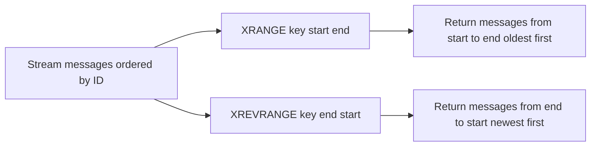

# How to Use XRANGE and XREVRANGE in Redis Streams

Author: [nawazdhandala](https://www.github.com/nawazdhandala)

Tags: Redis, XRANGE, XREVRANGE, Stream, Range Query

Description: Learn how to use XRANGE and XREVRANGE in Redis Streams to retrieve messages within an ID range in forward and reverse order, with examples for pagination and time-based queries.

---

## How XRANGE and XREVRANGE Work

XRANGE returns a list of messages from a stream whose IDs fall within a specified range, in ascending (oldest first) order. XREVRANGE does the same in descending (newest first) order.

Both commands support an optional COUNT limit and use special `-` and `+` sentinels to represent the minimum and maximum possible IDs, respectively. The exclusive `(` prefix allows exclusive range boundaries.



## Syntax

```redis
XRANGE key start end [COUNT count]
XREVRANGE key end start [COUNT count]
```

- `start` / `end` - ID boundaries; `-` = min possible ID, `+` = max possible ID
- Use `(id` for an exclusive lower bound (not the full ID, just the start)
- `COUNT count` - limit the number of messages returned

## Examples

### Setup - add messages to a stream

```redis
XADD sensor:temp 1748700000000-0 celsius 22.5 location "server-room"
XADD sensor:temp 1748700060000-0 celsius 23.1 location "server-room"
XADD sensor:temp 1748700120000-0 celsius 22.8 location "server-room"
XADD sensor:temp 1748700180000-0 celsius 24.0 location "server-room"
XADD sensor:temp 1748700240000-0 celsius 23.5 location "server-room"
```

### XRANGE - read all messages

```redis
XRANGE sensor:temp - +
```

```text
1) 1) "1748700000000-0"
   2) 1) "celsius"
      2) "22.5"
      3) "location"
      4) "server-room"
2) 1) "1748700060000-0"
   2) 1) "celsius"
      2) "23.1"
      ...
```

### XRANGE - limit results with COUNT

```redis
XRANGE sensor:temp - + COUNT 2
```

```text
1) 1) "1748700000000-0"
   2) 1) "celsius"
      2) "22.5"
      ...
2) 1) "1748700060000-0"
   ...
```

### XRANGE - read within a time window

Read messages between timestamps 1748700060000 and 1748700180000:

```redis
XRANGE sensor:temp 1748700060000 1748700180000
```

```text
1) 1) "1748700060000-0"
   2) ...
2) 1) "1748700120000-0"
   2) ...
3) 1) "1748700180000-0"
   2) ...
```

### XRANGE with exclusive lower bound

To page through results without re-fetching the last seen ID, use the `(` exclusive prefix:

```redis
# First page
XRANGE sensor:temp - + COUNT 2
# Last ID returned: 1748700060000-0

# Next page - start AFTER the last seen ID
XRANGE sensor:temp (1748700060000-0 + COUNT 2
```

```text
1) 1) "1748700120000-0"
   2) ...
2) 1) "1748700180000-0"
   2) ...
```

### XRANGE with partial ID (timestamp only)

You can use just the millisecond timestamp without the sequence number:

```redis
XRANGE sensor:temp 1748700060000 1748700180000
```

Redis treats bare timestamps as `timestamp-0` for the start and `timestamp-18446744073709551615` for the end.

### XREVRANGE - newest messages first

```redis
XREVRANGE sensor:temp + - COUNT 3
```

```text
1) 1) "1748700240000-0"
   2) ...
2) 1) "1748700180000-0"
   2) ...
3) 1) "1748700120000-0"
   2) ...
```

### XREVRANGE for latest N messages

Get the 5 most recent readings:

```redis
XREVRANGE sensor:temp + - COUNT 5
```

### XREVRANGE with a time window (newest in range first)

```redis
XREVRANGE sensor:temp 1748700180000 1748700060000
```

```text
1) 1) "1748700180000-0"
   2) ...
2) 1) "1748700120000-0"
   2) ...
3) 1) "1748700060000-0"
   2) ...
```

Note: In XREVRANGE, the first argument is the higher bound and the second is the lower bound (reversed from XRANGE).

## Pagination Pattern

Forward pagination with XRANGE:

```bash
last_id="-"
page_size=10

while true; do
  if [ "$last_id" = "-" ]; then
    page=$(redis-cli XRANGE mystream - + COUNT $page_size)
  else
    page=$(redis-cli XRANGE mystream "($last_id" + COUNT $page_size)
  fi

  # Process page
  count=$(echo "$page" | count_messages)
  if [ "$count" -lt "$page_size" ]; then
    break  # Last page
  fi

  last_id=$(echo "$page" | get_last_id)
done
```

## Use Cases

**Time-range queries** - Fetch sensor readings, events, or logs within a specific time window by using millisecond timestamps as range boundaries.

**Pagination** - Use XRANGE with COUNT and exclusive lower bounds to paginate through stream history efficiently.

**Recent events feed** - Use XREVRANGE with COUNT to show the N most recent events in a user's activity feed.

**Replay and audit** - Read historical messages in order to replay events or audit what happened during a time range.

**Stream inspection** - Use `XRANGE key - + COUNT 10` to inspect recent messages in a stream during debugging.

## Summary

XRANGE returns stream messages in ascending ID order (oldest first); XREVRANGE returns them in descending order (newest first). Both support range boundaries using IDs or millisecond timestamps, with `-` and `+` as open-ended sentinels. Use COUNT to limit results and the `(` exclusive prefix for efficient cursor-based pagination. These commands are ideal for time-based queries, activity feeds, and paginated history views over Redis Stream data.
