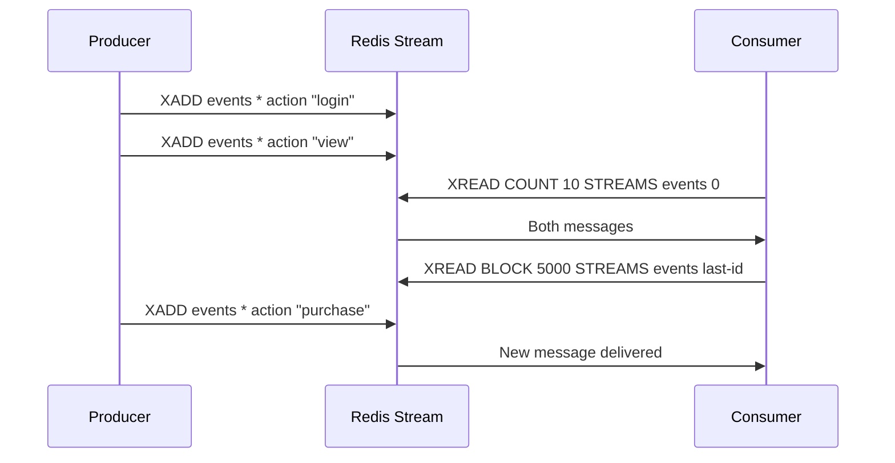

# How to Use XREAD in Redis Streams to Read Messages

Author: [nawazdhandala](https://www.github.com/nawazdhandala)

Tags: Redis, XREAD, Stream, Consumer, Message Queue

Description: Learn how to use XREAD in Redis Streams to read new messages from one or more streams, with blocking support and cursor-based iteration for real-time consumers.

---

## How XREAD Works

XREAD reads messages from one or more streams, starting from a specified ID. It is the primary way for simple consumers (without consumer groups) to read from a stream. It supports:

- Reading from multiple streams in one call
- Starting from a specific ID to replay history
- Using `$` as the ID to receive only new messages after the call
- Blocking with BLOCK until new messages arrive



## Syntax

```redis
XREAD [COUNT count] [BLOCK milliseconds] STREAMS key [key ...] id [id ...]
```

- `COUNT count` - maximum number of messages to return per stream
- `BLOCK milliseconds` - block until a new message arrives (0 = block indefinitely)
- `STREAMS` - required keyword separating keys from IDs
- `key [key ...]` - stream key names
- `id [id ...]` - starting ID for each stream (must match the order of keys)

Special IDs:
- `0` or `0-0` - start from the very beginning
- `$` - receive only messages added after this XREAD call (new messages only)
- `last-received-id` - receive all messages after the last one you processed

## Examples

### Read all messages from the beginning

```redis
XADD events:log * action "login" user "alice"
XADD events:log * action "view" user "alice"
XADD events:log * action "logout" user "alice"

XREAD COUNT 100 STREAMS events:log 0
```

```text
1) 1) "events:log"
   2) 1) 1) "1748700000000-0"
         2) 1) "action"
            2) "login"
            3) "user"
            4) "alice"
      2) 1) "1748700000001-0"
         2) 1) "action"
            2) "view"
            3) "user"
            4) "alice"
      3) 1) "1748700000002-0"
         2) 1) "action"
            2) "logout"
            3) "user"
            4) "alice"
```

### Read new messages only (non-blocking)

Using `$` means "only messages added after this XREAD call":

```redis
XREAD COUNT 10 STREAMS events:log $
```

If no new messages arrive, returns immediately:

```text
(nil)
```

### Blocking XREAD - wait for new messages

Block for up to 5 seconds (5000ms) waiting for a new message:

```redis
XREAD BLOCK 5000 COUNT 1 STREAMS events:log $
```

If a message arrives within 5 seconds:

```text
1) 1) "events:log"
   2) 1) 1) "1748700000010-0"
         2) 1) "action"
            2) "purchase"
            3) "user"
            4) "bob"
```

If timeout expires:

```text
(nil)
```

### Block indefinitely

```redis
XREAD BLOCK 0 STREAMS events:log $
```

Blocks until a message arrives or the connection is closed.

### Cursor-based iteration pattern

Maintain a cursor to process new messages continuously:

```bash
last_id="0"
while true; do
  result=$(redis-cli XREAD COUNT 100 BLOCK 5000 STREAMS events:log "$last_id")
  if [ -n "$result" ]; then
    # Process messages and update cursor
    last_id=$(echo "$result" | parse_last_id)
  fi
done
```

### Read from multiple streams simultaneously

```redis
XREAD COUNT 5 STREAMS stream:A stream:B 0 0
```

Returns messages from both streams starting from the beginning. The IDs must be in the same order as the keys.

### Read new messages from multiple streams (blocking)

```redis
XREAD BLOCK 10000 STREAMS stream:orders stream:inventory $ $
```

Blocks until any of the streams gets a new message.

## Tracking Your Position

XREAD does not track your position automatically. You must track the last ID you received and pass it as the starting ID on the next call:

```bash
# First call - get all existing messages
result=$(redis-cli XREAD COUNT 100 STREAMS events:log 0)
last_id="1748700000002-0"  # parse from result

# Subsequent calls - only get new messages
result=$(redis-cli XREAD BLOCK 5000 STREAMS events:log "$last_id")
```

## XREAD vs Consumer Groups

| Feature | XREAD | Consumer Groups (XREADGROUP) |
|---|---|---|
| Position tracking | Manual | Automatic per consumer |
| Multiple consumers | All see all messages | Messages divided among consumers |
| Acknowledgment | Not required | Required (XACK) |
| Pending message tracking | No | Yes |
| Use case | Simple single-consumer reads | Distributed parallel processing |

## Use Cases

**Simple event consumers** - A single process that needs to process all events from a stream in order.

**Fan-out reading** - Multiple independent consumers each using XREAD with their own cursor to receive all messages.

**Stream tailing** - Monitor a stream for new activity in real time using BLOCK with `$`.

**Stream replay** - Replay historical events by starting XREAD from ID `0` or a specific historical ID.

## Summary

XREAD reads messages from one or more Redis Streams starting from a specified ID. Use ID `0` to read from the beginning, `$` to receive only new messages, or a specific ID to resume from your last position. The BLOCK option enables efficient real-time consumption without polling. For distributed workloads where multiple consumers should each process different messages, use consumer groups (XREADGROUP/XACK) instead of plain XREAD.
