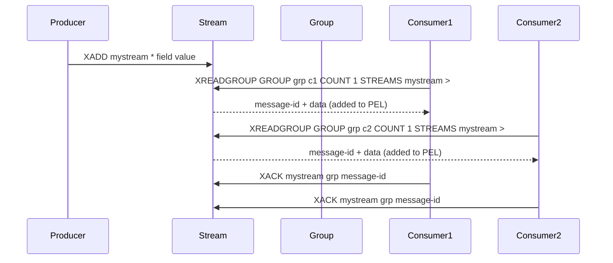

# How to Use XREADGROUP in Redis Streams Consumer Groups

Author: [nawazdhandala](https://www.github.com/nawazdhandala)

Tags: Redis, Stream, XREADGROUP, Consumer Group, Messaging

Description: Learn how to use XREADGROUP to read messages from a Redis Stream within a consumer group, enabling parallel processing and reliable message delivery.

---

Redis Streams provide a durable, append-only log that supports multiple consumers reading from the same stream in parallel. Consumer groups allow you to distribute messages across multiple workers while keeping track of which messages have been processed.

## How XREADGROUP Works

When you use `XREADGROUP`, Redis delivers messages from the stream to a specific consumer within a group. Each message is tracked in a Pending Entries List (PEL) until the consumer acknowledges it with `XACK`. This guarantees at-least-once delivery even if a consumer crashes.



## Syntax

```redis
XREADGROUP GROUP group consumer [COUNT count] [BLOCK milliseconds] [NOACK] STREAMS key [key ...] id [id ...]
```

- `GROUP group consumer` - the group name and consumer name
- `COUNT count` - maximum number of messages to return
- `BLOCK milliseconds` - block for this many ms if no messages available (0 = forever)
- `NOACK` - deliver without adding to PEL (fire-and-forget)
- `STREAMS key id` - use `>` as the id to get new undelivered messages; use a specific ID to re-read pending messages

## Setting Up a Consumer Group

Before reading, create the consumer group. The `$` ID means start from new messages only; `0` means start from the beginning.

```redis
XGROUP CREATE mystream workers $ MKSTREAM
```

Use `0` to process historical messages from the beginning of the stream:

```redis
XGROUP CREATE mystream workers 0 MKSTREAM
```

## Examples

### Reading New Messages

The special `>` ID tells Redis to return messages that have not yet been delivered to any consumer in this group.

```redis
XREADGROUP GROUP workers consumer1 COUNT 5 STREAMS mystream >
```

Example output:

```text
1) 1) "mystream"
   2) 1) 1) "1711900000000-0"
         2) 1) "task"
            2) "send_email"
            3) "to"
            4) "user@example.com"
```

### Blocking Read

Block for up to 5 seconds waiting for new messages:

```redis
XREADGROUP GROUP workers consumer1 COUNT 10 BLOCK 5000 STREAMS mystream >
```

### Re-reading Pending Messages

After a restart, a consumer can re-fetch its own pending (unacknowledged) messages by providing `0` as the ID:

```redis
XREADGROUP GROUP workers consumer1 COUNT 10 STREAMS mystream 0
```

### Acknowledging Messages

After processing, acknowledge the message to remove it from the PEL:

```redis
XACK mystream workers 1711900000000-0
```

### NOACK Mode

For best-effort delivery where acknowledgment is not needed:

```redis
XREADGROUP GROUP workers consumer1 COUNT 5 NOACK STREAMS mystream >
```

## Practical Worker Loop

A typical worker reads, processes, and acknowledges in a loop:

```bash
# Bash pseudo-loop using redis-cli
while true; do
  redis-cli XREADGROUP GROUP workers consumer1 COUNT 10 BLOCK 2000 STREAMS mystream >
  # process messages, then XACK each one
done
```

## Use Cases

- **Task queues** - distribute background jobs across multiple worker processes
- **Event processing pipelines** - fan-out events to dedicated consumer groups per downstream system
- **Microservice integration** - decouple services using streams as a durable message bus
- **Audit and replay** - re-read stream messages from any offset for debugging or recovery

## Summary

`XREADGROUP` is the core command for consuming Redis Stream messages within a consumer group. It provides reliable, at-least-once delivery by tracking unacknowledged messages in a Pending Entries List. Combine it with `XACK` to confirm processing, `XPENDING` to inspect outstanding work, and `XCLAIM` to reassign stalled messages - giving you a fully fault-tolerant distributed message processing system.
