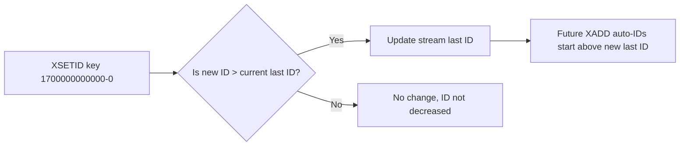
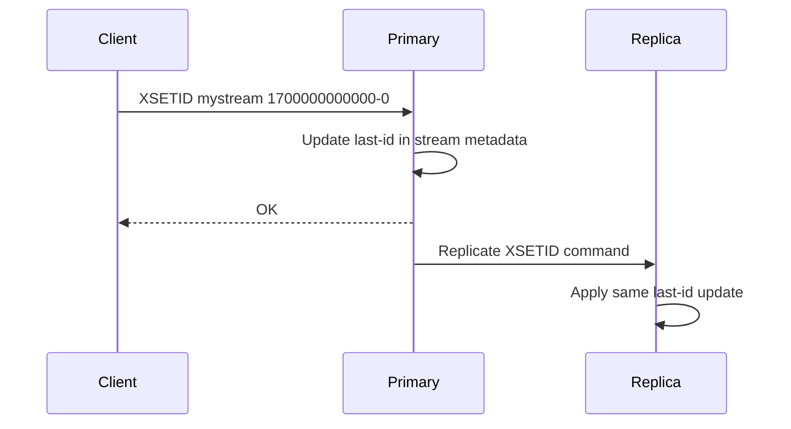

# How to Use XSETID in Redis to Set the Last Stream ID

Author: [nawazdhandala](https://www.github.com/nawazdhandala)

Tags: Redis, XSETID, Stream, Data structure

Description: Learn how to use XSETID in Redis to manually set the last entry ID of a stream, controlling auto-increment behavior and enabling stream state restoration.

---

## What is XSETID

XSETID updates the last entry ID recorded for a Redis stream. Every stream tracks the highest ID ever added so that auto-generated IDs always increase monotonically. XSETID lets you change that recorded value directly, which matters when restoring a stream from a backup or when you need to seed the counter to a specific point.

```redis
XSETID key last-id [ENTRIESADDED entries-added]
```

The `last-id` must be in the form `<milliseconds>-<sequence>`. The optional `ENTRIESADDED` hint tells Redis the total number of entries ever added to the stream, used for statistics in `XINFO STREAM FULL`.



## Basic Usage

### Check the current last ID

```redis
XINFO STREAM mystream
```

The `last-generated-id` field shows the current value.

### Set the last ID to a specific value

```redis
XSETID mystream 1700000000000-0
```

### Set with ENTRIESADDED hint

```redis
XSETID mystream 1700000000000-0 ENTRIESADDED 5000
```

This tells Redis that 5000 entries have been added in total. The hint is only informational and does not affect stream contents.

## Practical Scenarios

### Restoring a stream from backup

When you restore stream entries using `XADD` with explicit IDs, the stream's last ID is automatically updated as you add entries. However, if you restore entries out of order or skip the final range, XSETID lets you finalize the counter to the correct value.

```redis
-- Restore entries with explicit IDs
XADD mystream 1699999990000-0 field value
XADD mystream 1699999995000-0 field value

-- Finalize to the true last ID from the original stream
XSETID mystream 1700000000000-0
```

### Seeding a new stream for controlled IDs

If you want future auto-generated IDs to start at a specific millisecond range:

```redis
-- Force the counter forward so new entries start after a threshold
XSETID mystream 1700000000000-0
XADD mystream * event user_login
-- Result ID will be >= 1700000000001-0
```

### Preventing time-skew issues after clock correction

A system clock jumping backward would normally cause XADD to fail because the new timestamp would be lower than the last recorded ID. XSETID can advance the counter past the problem range:

```redis
XSETID events 1700500000000-0
```

## Replication and Persistence

XSETID propagates to replicas and is written to the AOF log like any other write command. Restoring from a dump.rdb file preserves the last ID, so XSETID is typically only needed for edge cases involving partial restores or controlled migrations.



## XSETID vs XADD with Explicit ID

| Approach | Effect on stream content | Effect on last ID |
|---|---|---|
| `XADD key <id> field value` | Adds a new entry | Advances last ID to `<id>` |
| `XSETID key <id>` | No new entry | Sets last ID to `<id>` if higher |

XSETID never removes or adds entries. It only adjusts the metadata counter.

## Error Cases

```redis
-- Trying to set an ID lower than the current last ID
XSETID mystream 0-1
-- Returns: OK, but last ID remains unchanged if current is higher

-- Invalid ID format
XSETID mystream notanid
-- Returns: ERR Invalid stream ID specified as stream command argument
```

## Summary

XSETID sets the last entry ID for a Redis stream without adding or removing any entries. It is most useful when restoring streams from backup, seeding the ID counter before loading data, or recovering from clock skew. The optional `ENTRIESADDED` parameter provides a hint for stream statistics. Because XSETID only moves the counter forward, it is safe to call even on active streams.
