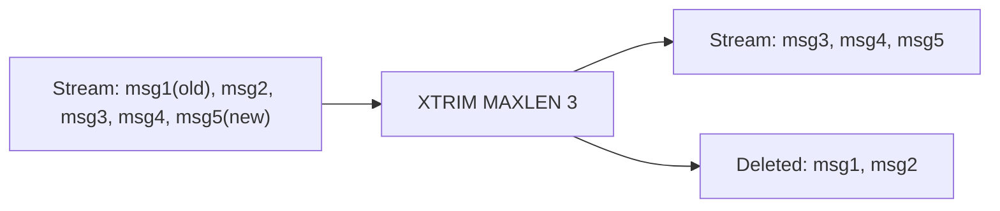

# How to Use XTRIM in Redis Streams to Limit Stream Size

Author: [nawazdhandala](https://www.github.com/nawazdhandala)

Tags: Redis, Stream, XTRIM, Memory Management

Description: Learn how to use XTRIM to cap a Redis Stream's length or age, preventing unbounded memory growth while retaining recent messages.

---

Redis Streams grow indefinitely by default. `XTRIM` lets you enforce a maximum size or a minimum message age, evicting the oldest entries first. This is essential for production deployments where memory is finite.

## How XTRIM Works

`XTRIM` removes entries from the beginning (head) of the stream. You can trim by count with `MAXLEN` or by age with `MINID`. The approximate (`~`) modifier allows Redis to trim to a nearby boundary for performance, avoiding costly mid-node splits in the internal radix tree.



## Syntax

```redis
XTRIM key MAXLEN | MINID [= | ~] threshold [LIMIT count]
```

- `MAXLEN` - trim to at most this many entries
- `MINID` - trim entries with IDs lower than this value
- `=` - exact trim (default if omitted)
- `~` - approximate trim (faster, may leave slightly more entries)
- `LIMIT count` - maximum number of entries to evict per call (used with `~`)

## Examples

### Exact Trim by Count

Keep only the 1000 most recent messages:

```redis
XTRIM mystream MAXLEN 1000
```

### Approximate Trim (Recommended for Production)

Allow Redis to trim near 1000 entries for better performance:

```redis
XTRIM mystream MAXLEN ~ 1000
```

### Trim by Minimum ID (Time-Based)

Remove all messages older than a specific timestamp. This uses the millisecond timestamp component of the stream ID. To keep only messages from the last hour:

```redis
XTRIM mystream MINID ~ 1711896400000
```

### Trim with LIMIT

Evict at most 100 entries per call (useful for gradual background cleanup):

```redis
XTRIM mystream MAXLEN ~ 5000 LIMIT 100
```

### Inline Trim with XADD

You can trim as part of the append operation to keep the stream bounded:

```redis
XADD mystream MAXLEN ~ 1000 * event "user_login" user_id "42"
```

## Exact vs Approximate Trimming

| Mode | Eviction | Performance | Use Case |
|---|---|---|---|
| `MAXLEN =` | Precise | Slower | Low-throughput, strict limits |
| `MAXLEN ~` | Near limit | Faster | High-throughput production |
| `MINID =` | Precise ID | Slower | Strict time-based retention |
| `MINID ~` | Near ID | Faster | Time-based with high write rates |

## Use Cases

- **Bounded event logs** - keep the last N events without unbounded growth
- **Time-windowed data** - retain only messages from the last hour/day
- **Memory budget enforcement** - cap stream memory in Redis instances with limited RAM
- **Rolling logs** - combine with `XADD MAXLEN` for a sliding window log

## Summary

`XTRIM` is the primary tool for controlling Redis Stream size. Use `MAXLEN ~` for count-based trimming in high-throughput systems, and `MINID` for time-based retention policies. Combining `XTRIM` with `XADD MAXLEN` allows you to enforce size limits at write time without separate maintenance jobs.
