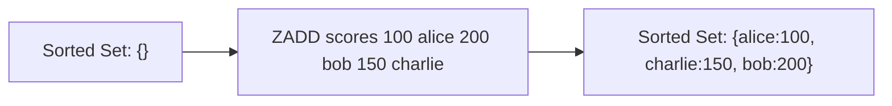

# How to Use ZADD in Redis to Add Members to a Sorted Set

Author: [nawazdhandala](https://www.github.com/nawazdhandala)

Tags: Redis, Sorted Set, ZADD, Command

Description: Learn how to use the Redis ZADD command to add members with scores to a sorted set, including all flags for conditional inserts and score updates.

---

## How ZADD Works

`ZADD` adds one or more members to a Redis sorted set, each with an associated floating-point score. Members are ordered by score (ascending), and the order is updated automatically when scores change. Member names within a sorted set are unique - adding a member that already exists updates its score.

ZADD supports several option flags that control update behavior, making it versatile for leaderboards, rate limiters, and priority queues.



## Syntax

```redis
ZADD key [NX | XX] [GT | LT] [CH] [INCR] score member [score member ...]
```

- `key` - the sorted set key
- `NX` - only add new members; do not update existing scores
- `XX` - only update existing members; do not add new ones
- `GT` - only update score if the new score is greater than the current
- `LT` - only update score if the new score is less than the current
- `CH` - change the return value to the count of added + updated (default is only added)
- `INCR` - treat the score as an increment (like ZINCRBY); only one score/member pair allowed
- `score` - a double-precision float; use `+inf` and `-inf` for infinity
- `member` - the member name

Returns the count of new members added (or added + updated with CH flag).

## Examples

### Add Multiple Members

```redis
ZADD leaderboard 100 "alice" 200 "bob" 150 "charlie"
ZRANGE leaderboard 0 -1 WITHSCORES
```

```text
1) "alice"
2) "100"
3) "charlie"
4) "150"
5) "bob"
6) "200"
```

### Update Existing Score

```redis
ZADD leaderboard 300 "alice"
ZSCORE leaderboard "alice"
```

```text
"300"
```

### NX Flag - Only Add New Members

```redis
ZADD leaderboard NX 999 "alice"
ZSCORE leaderboard "alice"
```

```text
"300"
```

"alice" already exists, so NX prevents the update. Score remains 300.

```redis
ZADD leaderboard NX 50 "diana"
ZSCORE leaderboard "diana"
```

```text
"50"
```

"diana" is new, so she is added.

### XX Flag - Only Update Existing Members

```redis
ZADD leaderboard XX 400 "alice"
ZSCORE leaderboard "alice"
```

```text
"400"
```

```redis
ZADD leaderboard XX 500 "newuser"
EXISTS leaderboard
ZSCORE leaderboard "newuser"
```

```text
(nil)
```

"newuser" is not added because XX only updates existing members.

### GT Flag - Update Only If New Score Is Greater

```redis
ZADD leaderboard GT 100 "alice"
ZSCORE leaderboard "alice"
```

```text
"400"
```

100 is less than 400, so no update.

```redis
ZADD leaderboard GT 500 "alice"
ZSCORE leaderboard "alice"
```

```text
"500"
```

500 is greater, so update succeeds.

### LT Flag - Update Only If New Score Is Less

```redis
ZADD leaderboard LT 600 "alice"
ZSCORE leaderboard "alice"
```

```text
"500"
```

600 is not less than 500, no update.

```redis
ZADD leaderboard LT 100 "alice"
ZSCORE leaderboard "alice"
```

```text
"100"
```

### CH Flag - Return Changed Count

Without CH, ZADD returns only the count of newly added members.

```redis
ZADD leaderboard 200 "bob" 300 "diana"
```

```text
(integer) 0
```

0 because no new members were added (both existed).

With CH:

```redis
ZADD leaderboard CH 200 "bob" 300 "diana"
```

```text
(integer) 2
```

2 because both existing scores were changed.

### INCR Flag - Increment Score

```redis
ZADD leaderboard INCR 50 "bob"
```

```text
"250"
```

Equivalent to ZINCRBY.

### Infinity Scores

```redis
ZADD tasks +inf "eternal:task"
ZADD tasks -inf "urgent:task"
ZRANGE tasks 0 -1 WITHSCORES
```

```text
1) "urgent:task"
2) "-inf"
3) "eternal:task"
4) "+inf"
```

## Use Cases

### Game Leaderboard

```redis
ZADD game:scores 4500 "player:alice" 7200 "player:bob" 3100 "player:charlie"
ZREVRANGE game:scores 0 2 WITHSCORES
```

```text
1) "player:bob"
2) "7200"
3) "player:alice"
4) "4500"
5) "player:charlie"
6) "3100"
```

### Rate Limiter (Sliding Window)

```redis
ZADD ratelimit:user:42 1711900000 "req:001"
ZADD ratelimit:user:42 1711900001 "req:002"
```

Use timestamps as scores to enable time-range queries.

### Priority Queue

```redis
ZADD jobs 1 "job:low" 5 "job:medium" 10 "job:high"
ZPOPMAX jobs
```

```text
1) "job:high"
2) "10"
```

### Best-Price Tracking (LT)

Always keep the lowest known price.

```redis
ZADD prices LT 9.99 "product:A"
ZADD prices LT 12.99 "product:A"
ZSCORE prices "product:A"
```

```text
"9.99"
```

## Performance Considerations

- ZADD is O(log N) per member added or updated, where N is the sorted set size.
- Adding M members is O(M log N).
- The INCR flag makes ZADD equivalent to ZINCRBY, both O(log N).

## Summary

`ZADD` is the core command for building sorted sets in Redis, supporting score-based ordering, conditional updates (NX/XX/GT/LT), increment mode (INCR), and a flexible return mode (CH). Its O(log N) complexity makes it suitable for leaderboards, priority queues, rate limiters, and any ordered collection that requires efficient ranking and score management.
