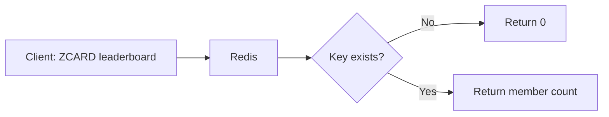

# How to Use ZCARD in Redis to Count Sorted Set Members

Author: [nawazdhandala](https://www.github.com/nawazdhandala)

Tags: Redis, Sorted set, ZCARD, Command

Description: Learn how to use ZCARD in Redis to get the total number of members in a sorted set, with examples for leaderboards, queues, and monitoring.

---

## Introduction

`ZCARD` returns the cardinality (total number of members) of a sorted set. It is a simple, O(1) command that is safe to call at any frequency without performance impact, making it useful for size checks, pagination metadata, and monitoring.

## Syntax

```redis
ZCARD key
```

- Returns the number of members in the sorted set at `key`.
- Returns `0` if the key does not exist.

## How It Works



## Basic Example

```redis
ZADD leaderboard 1500 "alice"
ZADD leaderboard 2200 "bob"
ZADD leaderboard 1800 "charlie"

ZCARD leaderboard
-- (integer) 3
```

## Return Value for Missing Keys

```redis
ZCARD nonexistent
-- (integer) 0
```

No error is raised. A missing key is treated as an empty sorted set.

## Real-World Use Cases

### Leaderboard Size Check

Before rendering a leaderboard page, confirm it is populated:

```redis
ZCARD leaderboard:global
-- (integer) 10000
```

### Pagination Metadata

```redis
-- Total members for paginated API response
ZCARD posts:by-date
-- (integer) 4872
```

Use the count to compute total pages: `CEIL(count / page_size)`.

### Queue Depth Monitoring

Use a sorted set as a delayed job queue keyed by scheduled timestamp:

```redis
ZADD jobs:scheduled 1743000000 "job:a"
ZADD jobs:scheduled 1743000060 "job:b"
ZADD jobs:scheduled 1743000120 "job:c"

ZCARD jobs:scheduled
-- (integer) 3
```

Alert when the queue depth exceeds a threshold.

### Enforce Maximum Leaderboard Size

```redis
ZADD scores 500 "new-player"

-- Check if we are over the limit
ZCARD scores
-- (integer) 101

-- If over limit, remove lowest scorer
ZREMRANGEBYRANK scores 0 0
```

## Monitoring Set Growth Over Time

```redis
-- Log the cardinality periodically
ZADD leaderboard 3000 "dave"
ZCARD leaderboard
-- (integer) 4
```

Combine with a time-series tool to track growth rate.

## Time Complexity

**O(1)** - Redis stores the count as metadata on the sorted set structure, so `ZCARD` never iterates members.

## ZCARD vs ZCOUNT

| Command  | Scope             | Complexity |
|----------|-------------------|------------|
| `ZCARD`  | All members       | O(1)       |
| `ZCOUNT` | Score range only  | O(log N)   |

Use `ZCARD` for the full count; use `ZCOUNT` when you need members within a specific score range.

## Summary

`ZCARD` retrieves the total member count of a sorted set in O(1) time. It is the go-to command for size checks, pagination metadata, and queue depth monitoring. When you need to count members within a score range, use `ZCOUNT` instead.
