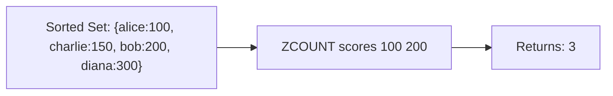

# How to Use ZCOUNT in Redis to Count Members in Score Range

Author: [nawazdhandala](https://www.github.com/nawazdhandala)

Tags: Redis, Sorted Set, ZCOUNT, Command

Description: Learn how to use the Redis ZCOUNT command to count sorted set members whose scores fall within a specified range, including unbounded and exclusive boundary examples.

---

## How ZCOUNT Works

`ZCOUNT` counts the number of members in a sorted set with scores between a minimum and maximum value. Unlike ZRANGEBYSCORE (which returns the members), ZCOUNT returns only the integer count. This makes it more efficient when you only need the number, not the data.



## Syntax

```redis
ZCOUNT key min max
```

- `key` - sorted set key
- `min` - minimum score; use `-inf` for no lower bound
- `max` - maximum score; use `+inf` for no upper bound
- Prefix with `(` to make a boundary exclusive

Returns the count of members with scores in the specified range. Returns 0 for empty ranges or non-existent keys.

## Examples

### Setup

```redis
ZADD scores 50 "eve" 100 "alice" 150 "charlie" 200 "bob" 300 "diana"
```

### Count in a Range

```redis
ZCOUNT scores 100 200
```

```text
(integer) 3
```

alice (100), charlie (150), and bob (200) are in the range.

### Count All Members

```redis
ZCOUNT scores -inf +inf
```

```text
(integer) 5
```

### Count with Lower Bound Only

Count members with score >= 150.

```redis
ZCOUNT scores 150 +inf
```

```text
(integer) 3
```

charlie, bob, and diana.

### Count with Upper Bound Only

Count members with score <= 150.

```redis
ZCOUNT scores -inf 150
```

```text
(integer) 3
```

eve, alice, and charlie.

### Exclusive Lower Boundary

Use `(` to exclude the lower boundary value.

```redis
ZCOUNT scores (100 200
```

```text
(integer) 2
```

charlie (150) and bob (200); alice (100) is excluded.

### Exclusive Upper Boundary

```redis
ZCOUNT scores 100 (200
```

```text
(integer) 2
```

alice (100) and charlie (150); bob (200) is excluded.

### Both Boundaries Exclusive

```redis
ZCOUNT scores (100 (200
```

```text
(integer) 1
```

Only charlie (150).

### Empty Range Returns 0

```redis
ZCOUNT scores 400 500
```

```text
(integer) 0
```

### Non-Existent Key Returns 0

```redis
DEL ghost
ZCOUNT ghost 0 100
```

```text
(integer) 0
```

## Use Cases

### Count Active Users in Score Band

Count users with activity scores between 500 and 1000.

```redis
ZADD activity:scores 200 "u1" 700 "u2" 950 "u3" 1200 "u4"
ZCOUNT activity:scores 500 1000
```

```text
(integer) 2
```

### Rate Limit Check

Count requests in the last 60 seconds using timestamps as scores.

```redis
ZADD requests:user:42 1711900000 "r1" 1711900010 "r2" 1711900070 "r3"
ZCOUNT requests:user:42 1711899940 1711900000
```

```text
(integer) 2
```

If count >= limit, deny the request.

### Count Items in a Price Range

```redis
ZADD prices 9.99 "A" 14.99 "B" 19.99 "C" 29.99 "D"
ZCOUNT prices 10 20
```

```text
(integer) 2
```

B (14.99) and C (19.99) fall in the $10-$20 range.

### Check Leaderboard Tier Size

Count players in a specific score tier.

```redis
ZADD game 1500 "p1" 2500 "p2" 3500 "p3" 4500 "p4"
-- Count players in "Gold" tier (2000-3999)
ZCOUNT game 2000 3999
```

```text
(integer) 2
```

### Count Events in a Time Window

```redis
ZADD events 1000 "login" 1050 "purchase" 1100 "logout" 1200 "login"
ZCOUNT events 1000 1100
```

```text
(integer) 3
```

## Comparing ZCOUNT with ZCARD

`ZCARD` returns the total count of all members. `ZCOUNT` returns the count within a score range.

```redis
ZCARD scores
-- Returns 5 (all members)

ZCOUNT scores 100 200
-- Returns 3 (only in range)
```

## Combining ZCOUNT with ZRANGEBYSCORE

Use ZCOUNT to check before using ZRANGEBYSCORE.

```redis
ZCOUNT scores 100 200
-- Returns 3
ZRANGEBYSCORE scores 100 200 WITHSCORES
-- Returns the 3 members with their scores
```

## Performance Considerations

- ZCOUNT is O(log N) where N is the sorted set size.
- It is faster than ZRANGEBYSCORE followed by counting because no data is transferred.
- For just checking whether a range contains at least one member, ZCOUNT with a LIMIT is not possible - but ZRANGEBYSCORE with LIMIT 0 1 achieves this efficiently.

## Summary

`ZCOUNT` efficiently counts sorted set members within a score range without returning the members themselves. It supports inclusive and exclusive boundaries, unbounded ranges with `-inf` and `+inf`, and returns 0 for empty or non-existent sets. Use it whenever you need the size of a score-based window rather than the actual data.
