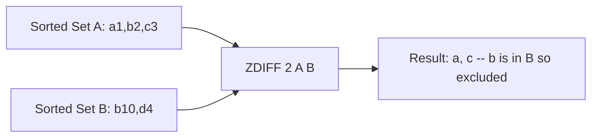

# How to Use ZDIFF in Redis to Find Sorted Set Differences

Author: [nawazdhandala](https://www.github.com/nawazdhandala)

Tags: Redis, Sorted Set, ZDIFF, Command

Description: Learn how to use ZDIFF in Redis to find members in a sorted set that do not exist in subsequent sets, with optional score output.

---

## Introduction

`ZDIFF` computes the difference between sorted sets: it returns members from the first sorted set that do not appear in any of the other provided sorted sets. Scores can optionally be included in the output. The source sets are not modified.

Available since Redis 6.2.

## Syntax

```redis
ZDIFF numkeys key [key ...] [WITHSCORES]
```

- `numkeys` is the number of input keys.
- The first key is the base sorted set.
- Subsequent keys are subtracted.
- `WITHSCORES` appends the score of each returned member.

## How It Works



## Basic Example

```redis
ZADD zset:a 1 "alpha" 2 "beta" 3 "gamma" 4 "delta"
ZADD zset:b 10 "beta" 20 "delta"

ZDIFF 2 zset:a zset:b
-- 1) "alpha"
-- 2) "gamma"
```

With `WITHSCORES`:

```redis
ZDIFF 2 zset:a zset:b WITHSCORES
-- 1) "alpha"
-- 2) "1"
-- 3) "gamma"
-- 4) "3"
```

Scores in the result come from the first (base) set.

## Three-Set Difference

```redis
ZADD products:all    1 "p:1" 2 "p:2" 3 "p:3" 4 "p:4" 5 "p:5"
ZADD products:sold   1 "p:2" 2 "p:4"
ZADD products:hidden 1 "p:5"

ZDIFF 3 products:all products:sold products:hidden
-- 1) "p:1"
-- 2) "p:3"
```

## Real-World Use Cases

### Available Product Listing

Members in the catalog that are neither sold out nor hidden:

```redis
ZADD catalog 100 "item:a" 200 "item:b" 300 "item:c" 400 "item:d"
ZADD sold-out 1 "item:b"
ZADD hidden   1 "item:d"

ZDIFF 3 catalog sold-out hidden WITHSCORES
-- 1) "item:a"
-- 2) "100"
-- 3) "item:c"
-- 4) "300"
```

### Unacknowledged Alerts

```redis
ZADD alerts:fired 1743000000 "alert:1" 1743000060 "alert:2" 1743000120 "alert:3"
ZADD alerts:acked 1 "alert:2"

ZDIFF 2 alerts:fired alerts:acked WITHSCORES
-- 1) "alert:1"
-- 2) "1743000000"
-- 3) "alert:3"
-- 4) "1743000120"
```

### Leaderboard Entries Not Yet Awarded

```redis
ZADD leaderboard 5000 "alice" 4500 "bob" 4000 "charlie"
ZADD awarded     1 "alice"

ZDIFF 2 leaderboard awarded WITHSCORES
-- 1) "bob"
-- 2) "4500"
-- 3) "charlie"
-- 4) "4000"
```

## Behavior with Missing Keys

```redis
ZADD base 1 "x" 2 "y"

ZDIFF 2 base nonexistent
-- 1) "x"
-- 2) "y"
```

A missing key is treated as an empty sorted set, so the difference is the full base set.

## numkeys Must Match Key Count

```redis
-- Correct: 2 keys, numkeys=2
ZDIFF 2 zset:a zset:b

-- Incorrect: will cause an error
ZDIFF 3 zset:a zset:b
-- (error) ERR syntax error
```

## Time Complexity

**O(L + (N-K) log(N-K))** where L is the total number of elements across all input sets, N is the size of the first set, and K is the number of elements removed. For small exclusion sets this is close to O(N).

## ZDIFF vs ZDIFFSTORE

| Command      | Returns          | Stores |
|--------------|------------------|--------|
| `ZDIFF`      | Members (scores) | No     |
| `ZDIFFSTORE` | Count            | Yes    |

## Summary

`ZDIFF` returns members from the first sorted set that are absent from all other provided sets, with optional scores. It is useful for finding items not yet processed, alerts not yet acknowledged, and products not yet sold. Use `ZDIFFSTORE` when you need to persist the result.
