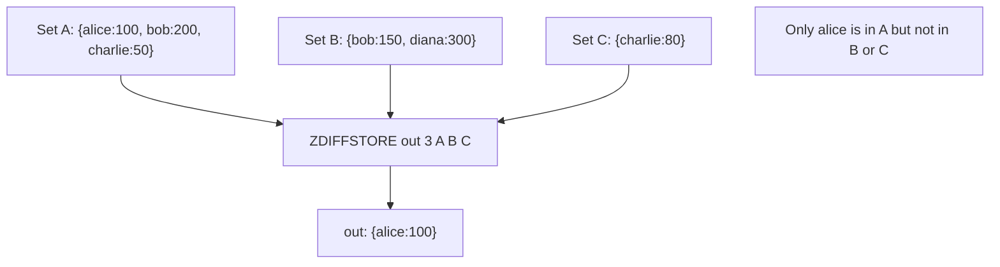

# How to Use ZDIFFSTORE in Redis for Sorted Set Difference

Author: [nawazdhandala](https://www.github.com/nawazdhandala)

Tags: Redis, Sorted Set, ZDIFFSTORE, Command

Description: Learn how to use ZDIFFSTORE in Redis to compute the difference between sorted sets and store the result, with examples for filtering, exclusion lists, and new-item detection.

---

## How ZDIFFSTORE Works

`ZDIFFSTORE` computes the sorted set difference - members in the first set that are not in any of the subsequent sets - and stores the result in a destination key. The scores of surviving members are taken from the first set; no aggregation is performed.

In Redis 6.2+, the non-storing variant `ZDIFF` is also available for returning the result without storing.

ZDIFFSTORE was introduced in Redis 6.2.



## Syntax

```redis
ZDIFFSTORE destination numkeys key [key ...]
```

- `destination` - key to store result; overwrites if exists
- `numkeys` - count of input keys
- `key [key ...]` - first key is the reference set; subsequent keys are subtracted from it

Returns the number of members in the destination set.

## Examples

### Basic Two-Set Difference

```redis
ZADD setA 100 "alice" 200 "bob" 50 "charlie"
ZADD setB 200 "bob" 300 "diana"
ZDIFFSTORE result 2 setA setB
ZRANGE result 0 -1 WITHSCORES
```

```text
(integer) 2
---
1) "charlie"
2) "50"
3) "alice"
4) "100"
```

"alice" and "charlie" are in setA but not in setB.

### Three-Set Difference

```redis
ZADD setC 50 "charlie"
ZDIFFSTORE result3 3 setA setB setC
ZRANGE result3 0 -1 WITHSCORES
```

```text
(integer) 1
---
1) "alice"
2) "100"
```

"charlie" is now subtracted by setC as well.

### Scores Come from the First Set

Members in the result retain their score from the reference set, regardless of scores in subtracted sets.

```redis
ZADD ref 500 "x" 600 "y" 700 "z"
ZADD exclude 999 "y"
ZDIFFSTORE diff 2 ref exclude
ZRANGE diff 0 -1 WITHSCORES
```

```text
1) "x"
2) "500"
3) "z"
4) "700"
```

"y" is excluded. "x" and "z" keep their scores from "ref" (500, 700).

### No Difference

When the reference set is a subset of the subtracted sets.

```redis
ZADD full 1 "a" 2 "b"
ZADD super 1 "a" 2 "b" 3 "c"
ZDIFFSTORE nodiff 2 full super
ZCARD nodiff
```

```text
(integer) 0
```

### Empty Subtracting Set

```redis
DEL ghost
ZDIFFSTORE out 2 setA ghost
ZRANGE out 0 -1 WITHSCORES
```

```text
1) "charlie"
2) "50"
3) "alice"
4) "100"
5) "bob"
6) "200"
```

Subtracting an empty set leaves setA unchanged.

## Use Cases

### New Members Since Last Snapshot

Find users who joined since the last scan.

```redis
ZADD users:yesterday 1000 "u1" 1100 "u2" 1200 "u3"
ZADD users:today 1000 "u1" 1100 "u2" 1200 "u3" 1300 "u4" 1400 "u5"
ZDIFFSTORE users:new 2 users:today users:yesterday
ZRANGE users:new 0 -1 WITHSCORES
```

```text
1) "u4"
2) "1300"
3) "u5"
4) "1400"
```

### Unread Items in a Feed

Find posts the user has not seen.

```redis
ZADD posts:all 1000 "p1" 1010 "p2" 1020 "p3" 1030 "p4"
ZADD posts:read 1000 "p1" 1020 "p3"
ZDIFFSTORE posts:unread 2 posts:all posts:read
ZRANGE posts:unread 0 -1 WITHSCORES
```

```text
1) "p2"
2) "1010"
3) "p4"
4) "1030"
```

### Exclusion List Filtering

Filter out banned or excluded members from a candidates list.

```redis
ZADD candidates 90 "cand:A" 85 "cand:B" 70 "cand:C" 95 "cand:D"
ZADD excluded 0 "cand:B" 0 "cand:D"
ZDIFFSTORE eligible 2 candidates excluded
ZREVRANGE eligible 0 -1 WITHSCORES
```

```text
1) "cand:A"
2) "90"
3) "cand:C"
4) "70"
```

### Items Not Yet Processed

Track pending items by removing processed ones from the full queue.

```redis
ZADD queue:all 1 "job:1" 2 "job:2" 3 "job:3" 4 "job:4"
ZADD queue:done 1 "job:1" 3 "job:3"
ZDIFFSTORE queue:pending 2 queue:all queue:done
ZRANGE queue:pending 0 -1 WITHSCORES
```

```text
1) "job:2"
2) "2"
3) "job:4"
4) "4"
```

## ZDIFFSTORE vs ZDIFF (Redis 6.2+)

`ZDIFF` returns the difference directly without storing it.

```redis
-- Returns members directly
ZDIFF 2 setA setB WITHSCORES

-- Stores result in destination
ZDIFFSTORE dest 2 setA setB
```

Use ZDIFFSTORE when you want to cache the result, query it with ZRANGE, or apply EXPIRE.

## Performance Considerations

- ZDIFFSTORE is O(L log(L) + (N - K) log(N)) where L is the first set size, N is the total member count across all sets, and K is the intersection size.
- Results retain the first set's scores; no aggregation overhead.
- For very large reference sets with large exclusion lists, the operation scales with reference set size.

## Summary

`ZDIFFSTORE` computes the sorted set difference - members in the first set not in any other - and stores the result with scores from the reference set. It is the right tool for new-item detection, unread tracking, exclusion filtering, and pending work identification. Use `ZDIFF` (Redis 6.2+) for a non-storing variant when you only need the result once.
