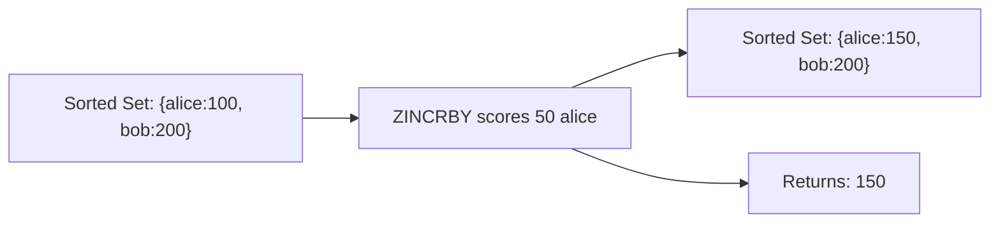

# How to Use ZINCRBY in Redis to Increment Sorted Set Scores

Author: [nawazdhandala](https://www.github.com/nawazdhandala)

Tags: Redis, Sorted Set, ZINCRBY, Command

Description: Learn how to use the Redis ZINCRBY command to atomically increment or decrement the score of a sorted set member, with examples for counters, voting, and ranking updates.

---

## How ZINCRBY Works

`ZINCRBY` atomically increments the score of a member in a sorted set by a specified amount. The member's position in the set is updated automatically to reflect the new score. If the member does not exist, it is created with the increment as its initial score. If the key does not exist, a new sorted set is created.

The increment can be positive (increase score) or negative (decrease score). Infinity values are supported.



## Syntax

```redis
ZINCRBY key increment member
```

- `key` - sorted set key
- `increment` - a double-precision float to add to the current score; can be negative
- `member` - the member whose score to increment

Returns the new score as a string. Creates the member with score = increment if it does not exist.

## Examples

### Basic Increment

```redis
ZADD scores 100 "alice"
ZINCRBY scores 50 "alice"
ZSCORE scores "alice"
```

```text
"150"
---
"150"
```

### Decrement with Negative Value

```redis
ZINCRBY scores -30 "alice"
ZSCORE scores "alice"
```

```text
"120"
```

### Member Does Not Exist - Creates with Increment as Score

```redis
DEL leaderboard
ZINCRBY leaderboard 10 "newplayer"
ZSCORE leaderboard "newplayer"
```

```text
"10"
```

### Floating-Point Increment

```redis
ZADD prices 9.99 "item:A"
ZINCRBY prices 1.50 "item:A"
ZSCORE prices "item:A"
```

```text
"11.49"
```

### Increment to Infinity

```redis
ZADD myset 100 "member"
ZINCRBY myset +inf "member"
ZSCORE myset "member"
```

```text
"inf"
```

### Multiple Increments in Sequence

```redis
ZADD votes 0 "option:A" 0 "option:B"
ZINCRBY votes 1 "option:A"
ZINCRBY votes 1 "option:B"
ZINCRBY votes 1 "option:A"
ZINCRBY votes 1 "option:A"
ZRANGE votes 0 -1 WITHSCORES
```

```text
1) "option:B"
2) "1"
3) "option:A"
4) "3"
```

## Use Cases

### Vote / Like Counter

Increment a post's score each time it receives a vote.

```redis
ZADD trending 0 "post:101" 0 "post:102"
ZINCRBY trending 1 "post:101"
ZINCRBY trending 1 "post:101"
ZINCRBY trending 1 "post:102"
ZREVRANGE trending 0 -1 WITHSCORES
```

```text
1) "post:101"
2) "2"
3) "post:102"
4) "1"
```

### Game Score Update

Add points to a player's score after each match.

```redis
ZADD game:scores 0 "player:alice"
ZINCRBY game:scores 150 "player:alice"
ZINCRBY game:scores 200 "player:alice"
ZSCORE game:scores "player:alice"
```

```text
"350"
```

### Reputation System

Track user reputation by upvoting and downvoting.

```redis
ZADD reputation 500 "user:42"
-- Upvote
ZINCRBY reputation 10 "user:42"
-- Downvote
ZINCRBY reputation -5 "user:42"
ZSCORE reputation "user:42"
```

```text
"505"
```

### Word Frequency Counting

Count how often each word appears.

```redis
ZINCRBY wordcount 1 "redis"
ZINCRBY wordcount 1 "sorted"
ZINCRBY wordcount 1 "redis"
ZINCRBY wordcount 1 "set"
ZINCRBY wordcount 1 "redis"
ZREVRANGE wordcount 0 -1 WITHSCORES
```

```text
1) "redis"
2) "3"
3) "set"
4) "1"
5) "sorted"
6) "1"
```

### Countdown Timer

Decrement a budget or quota.

```redis
ZADD quota 100 "user:1"
ZINCRBY quota -10 "user:1"
ZSCORE quota "user:1"
```

```text
"90"
```

## ZINCRBY vs ZADD INCR

`ZINCRBY key inc member` and `ZADD key INCR inc member` are equivalent.

```redis
-- These produce the same result:
ZINCRBY scores 10 "alice"
ZADD scores INCR 10 "alice"
```

Use ZADD INCR when you want to combine an increment with conditional flags (NX, XX, GT, LT).

```redis
-- Increment only if member already exists
ZADD scores XX INCR 10 "alice"
```

## Performance Considerations

- ZINCRBY is O(log N) where N is the sorted set size, because the member's position in the sorted index must be updated.
- It is atomic, so concurrent ZINCRBY calls on the same member are safe without additional locking.
- For high-throughput counters (millions of increments/sec), consider using a Redis counter (INCR) and syncing to a sorted set periodically if the O(log N) overhead becomes a bottleneck.

## Summary

`ZINCRBY` provides atomic score updates for sorted set members, automatically adjusting their ranked position. It creates new members if they do not exist, supports negative decrements, and returns the updated score. Use it for voting systems, leaderboard updates, frequency counting, and any scenario where a numeric value tied to a ranked member needs to change over time.
