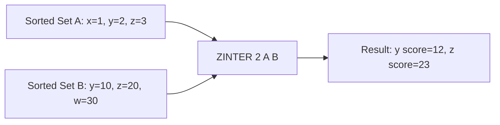

# How to Use ZINTER in Redis to Find Sorted Set Intersections

Author: [nawazdhandala](https://www.github.com/nawazdhandala)

Tags: Redis, Sorted set, ZINTER, Command

Description: Learn how to use ZINTER in Redis to find members common to multiple sorted sets with score aggregation options including SUM, MIN, and MAX.

---

## Introduction

`ZINTER` returns members that appear in all of the provided sorted sets. Scores are aggregated according to the specified strategy: `SUM` (default), `MIN`, or `MAX`. Scores can also be weighted before aggregation. The source sets are never modified.

Available since Redis 6.2.

## Syntax

```redis
ZINTER numkeys key [key ...] [WEIGHTS weight [weight ...]] [AGGREGATE SUM|MIN|MAX] [WITHSCORES]
```

- `numkeys` must match the count of keys provided.
- `WEIGHTS` scales each set's scores before aggregation.
- `AGGREGATE` controls how scores from different sets are combined.
- `WITHSCORES` includes scores in the output.

## How It Works



Default aggregation is `SUM`, so scores from matching members are added.

## Basic Examples

### Default SUM Aggregation

```redis
ZADD users:active   1 "alice" 3 "bob" 2 "charlie"
ZADD users:premium  5 "bob" 4 "charlie" 6 "diana"

ZINTER 2 users:active users:premium WITHSCORES
-- 1) "charlie"
-- 2) "6"   (2+4)
-- 3) "bob"
-- 4) "8"   (3+5)
```

### MIN Aggregation

```redis
ZINTER 2 users:active users:premium AGGREGATE MIN WITHSCORES
-- 1) "charlie"
-- 2) "2"
-- 3) "bob"
-- 4) "3"
```

### MAX Aggregation

```redis
ZINTER 2 users:active users:premium AGGREGATE MAX WITHSCORES
-- 1) "charlie"
-- 2) "4"
-- 3) "bob"
-- 4) "5"
```

## Using WEIGHTS

Scale each set's scores before aggregation:

```redis
ZADD scores:exam1 80 "alice" 70 "bob"
ZADD scores:exam2 90 "alice" 85 "bob"

-- exam1 counts 40%, exam2 counts 60%
ZINTER 2 scores:exam1 scores:exam2 WEIGHTS 0.4 0.6 WITHSCORES
-- 1) "bob"
-- 2) "79"   (70*0.4 + 85*0.6 = 28+51)
-- 3) "alice"
-- 4) "86"   (80*0.4 + 90*0.6 = 32+54)
```

## Real-World Use Cases

### Active Premium Users

```redis
ZADD users:by-spend   500 "alice" 1200 "bob" 300 "charlie"
ZADD users:by-logins  50 "alice" 80 "bob"

ZINTER 2 users:by-spend users:by-logins WITHSCORES
-- 1) "alice"
-- 2) "550"
-- 3) "bob"
-- 4) "1280"
```

### Multi-Criteria Scoring

Combine relevance score with recency score:

```redis
ZADD results:relevance 95 "doc:1" 80 "doc:2" 70 "doc:3"
ZADD results:recency   50 "doc:1" 90 "doc:2"

ZINTER 2 results:relevance results:recency WEIGHTS 0.7 0.3 WITHSCORES
-- 1) "doc:2"
-- 2) "83"   (80*0.7 + 90*0.3)
-- 3) "doc:1"
-- 4) "81.5" (95*0.7 + 50*0.3)
```

### Common Tags Across Articles

```redis
ZADD article:1:tags 1 "redis" 1 "nosql" 1 "database"
ZADD article:2:tags 1 "redis" 1 "performance"

ZINTER 2 article:1:tags article:2:tags
-- 1) "redis"
```

## Empty Intersection

```redis
ZADD set:a 1 "x"
ZADD set:b 1 "y"

ZINTER 2 set:a set:b
-- (empty array)
```

## Time Complexity

**O(N*K) + O(M*log(M))** where N is the size of the smallest set, K is the number of sets, and M is the result size. Redis optimizes by starting with the smallest set.

## ZINTER vs ZINTERSTORE vs ZINTERCARD

| Command       | Returns              | Stores |
|---------------|----------------------|--------|
| `ZINTER`      | Members (scores)     | No     |
| `ZINTERSTORE` | Count                | Yes    |
| `ZINTERCARD`  | Count (with LIMIT)   | No     |

## Summary

`ZINTER` returns members common to all provided sorted sets, with configurable score aggregation (SUM, MIN, MAX) and optional per-set weight scaling. It is ideal for multi-criteria scoring, finding users active across multiple dimensions, and tag intersection. Use `ZINTERSTORE` to persist results or `ZINTERCARD` when only the count is needed.
