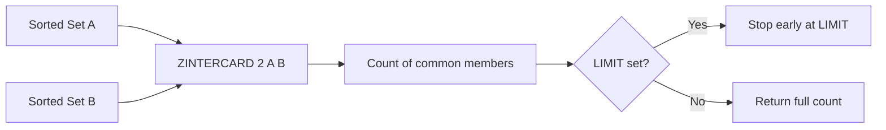

# How to Use ZINTERCARD in Redis to Count Sorted Set Intersections

Author: [nawazdhandala](https://www.github.com/nawazdhandala)

Tags: Redis, Sorted Set, ZINTERCARD, Command

Description: Learn how to use ZINTERCARD in Redis to count members common to multiple sorted sets with an optional LIMIT for early exit optimization.

---

## Introduction

`ZINTERCARD` counts members that exist in all provided sorted sets without returning the members themselves. An optional `LIMIT` argument allows Redis to stop counting once the limit is reached, making it efficient when you only need to know whether the intersection exceeds a threshold.

Available since Redis 7.0.

## Syntax

```redis
ZINTERCARD numkeys key [key ...] [LIMIT limit]
```

- `numkeys` must equal the number of keys provided.
- Returns the cardinality of the intersection.
- `LIMIT 0` means no limit (returns the true count).
- `LIMIT N` causes Redis to stop and return N once N matching members are found.

## How It Works



## Basic Example

```redis
ZADD set:a 1 "alpha" 2 "beta" 3 "gamma" 4 "delta"
ZADD set:b 10 "beta" 20 "gamma" 30 "epsilon"

ZINTERCARD 2 set:a set:b
-- (integer) 2
```

`beta` and `gamma` are common to both sets, so the result is 2.

## Using LIMIT

```redis
ZADD set:a 1 "a" 2 "b" 3 "c" 4 "d" 5 "e"
ZADD set:b 1 "a" 2 "b" 3 "c" 4 "f"

-- Full count
ZINTERCARD 2 set:a set:b
-- (integer) 3

-- Stop after finding 2
ZINTERCARD 2 set:a set:b LIMIT 2
-- (integer) 2

-- LIMIT larger than intersection
ZINTERCARD 2 set:a set:b LIMIT 100
-- (integer) 3
```

`LIMIT 0` is equivalent to no limit:

```redis
ZINTERCARD 2 set:a set:b LIMIT 0
-- (integer) 3
```

## Real-World Use Cases

### Check Overlap Before Expensive Operation

Before computing a full intersection, verify enough overlap exists:

```redis
ZADD segment:a 1 "u:1" 2 "u:2" 3 "u:3" 4 "u:4"
ZADD segment:b 1 "u:3" 2 "u:4" 3 "u:5"

ZINTERCARD 2 segment:a segment:b
-- (integer) 2

-- If count >= minimum_overlap, proceed with ZINTERSTORE
```

### Feature Flag Eligibility Check

Check if at least one user is in all required segments:

```redis
ZADD segment:paid     1 "u:10" 1 "u:11"
ZADD segment:active   1 "u:11" 1 "u:12"
ZADD segment:beta     1 "u:11"

ZINTERCARD 3 segment:paid segment:active segment:beta LIMIT 1
-- (integer) 1  -- at least one user qualifies, stop early
```

### Audit: Common Permissions Across Roles

```redis
ZADD role:admin  1 "read" 1 "write" 1 "delete"
ZADD role:editor 1 "read" 1 "write"
ZADD role:viewer 1 "read"

ZINTERCARD 3 role:admin role:editor role:viewer
-- (integer) 1
```

### Quick Overlap Metric

```redis
ZINTERCARD 2 playlist:user:1 playlist:user:2
-- (integer) 7  -- 7 songs in common
```

## Three-Set Intersection Count

```redis
ZADD tags:doc:1 1 "redis" 1 "nosql" 1 "cache"
ZADD tags:doc:2 1 "redis" 1 "cache" 1 "performance"
ZADD tags:doc:3 1 "redis" 1 "cache"

ZINTERCARD 3 tags:doc:1 tags:doc:2 tags:doc:3
-- (integer) 2
```

## Time Complexity

**O(N*K)** where N is the size of the smallest set and K is the number of sets. With `LIMIT`, Redis exits early once the limit is reached, which can significantly reduce work for large sets with small overlap.

## ZINTERCARD vs ZINTER vs ZINTERSTORE

| Command       | Returns              | Stores | Early exit |
|---------------|----------------------|--------|------------|
| `ZINTERCARD`  | Count                | No     | Yes (LIMIT)|
| `ZINTER`      | Members (scores)     | No     | No         |
| `ZINTERSTORE` | Count                | Yes    | No         |

## Summary

`ZINTERCARD` efficiently counts members common to all provided sorted sets. The `LIMIT` option enables early exit, making it ideal for threshold checks where you only need to know whether the intersection is at least a certain size. Use `ZINTER` or `ZINTERSTORE` when you need the actual members.
