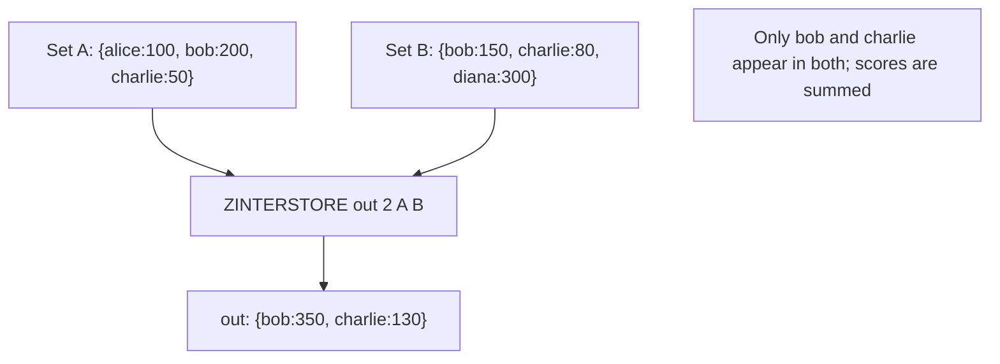

# How to Use ZINTERSTORE in Redis for Sorted Set Intersection

Author: [nawazdhandala](https://www.github.com/nawazdhandala)

Tags: Redis, Sorted Set, ZINTERSTORE, Command

Description: Learn how to use ZINTERSTORE in Redis to compute the intersection of multiple sorted sets with score aggregation and weighting, storing the result for queries.

---

## How ZINTERSTORE Works

`ZINTERSTORE` computes the intersection of multiple sorted sets - returning only members that appear in every input set - and stores the result in a destination key. Scores for matching members are aggregated using SUM (default), MIN, or MAX, and input sets can be weighted before aggregation.

In Redis 6.2+, the non-storing variant `ZINTER` is also available.



## Syntax

```redis
ZINTERSTORE destination numkeys key [key ...] [WEIGHTS weight [weight ...]] [AGGREGATE SUM | MIN | MAX]
```

- `destination` - key to store result; overwrites if exists
- `numkeys` - count of input keys
- `key [key ...]` - sorted sets to intersect
- `WEIGHTS` - multiply each set's scores by the corresponding weight before aggregation
- `AGGREGATE` - how to combine scores (default: SUM)

Returns the number of members in the destination set.

## Examples

### Basic Intersection with SUM (Default)

```redis
ZADD setA 100 "alice" 200 "bob" 50 "charlie"
ZADD setB 150 "bob" 80 "charlie" 300 "diana"
ZINTERSTORE result 2 setA setB
ZRANGE result 0 -1 WITHSCORES
```

```text
(integer) 2
---
1) "charlie"
2) "130"
3) "bob"
4) "350"
```

Only "bob" and "charlie" appear in both sets. "alice" and "diana" are excluded.

### Intersection with MIN Aggregate

```redis
ZINTERSTORE result_min 2 setA setB AGGREGATE MIN
ZRANGE result_min 0 -1 WITHSCORES
```

```text
1) "charlie"
2) "50"
3) "bob"
4) "150"
```

The lower score is kept for each common member.

### Intersection with MAX Aggregate

```redis
ZINTERSTORE result_max 2 setA setB AGGREGATE MAX
ZRANGE result_max 0 -1 WITHSCORES
```

```text
1) "charlie"
2) "80"
3) "bob"
4) "200"
```

The higher score is kept.

### Weighted Intersection

```redis
ZINTERSTORE weighted 2 setA setB WEIGHTS 2 1
ZRANGE weighted 0 -1 WITHSCORES
```

```text
1) "charlie"
2) "180"
3) "bob"
4) "550"
```

bob: (200 * 2) + (150 * 1) = 400 + 150 = 550.

### Three-Set Intersection

```redis
ZADD setC 10 "bob" 5 "charlie" 100 "eve"
ZINTERSTORE out3 3 setA setB setC AGGREGATE SUM
ZRANGE out3 0 -1 WITHSCORES
```

```text
1) "charlie"
2) "135"
3) "bob"
4) "360"
```

Only "bob" and "charlie" are in all three sets.

### No Common Members Results in Empty Destination

```redis
ZADD setX 1 "x" 2 "y"
ZADD setY 3 "p" 4 "q"
ZINTERSTORE no_common 2 setX setY
ZCARD no_common
```

```text
(integer) 0
```

## Use Cases

### Users Who Are Active in All Channels

Find users who have activity in every tracked channel.

```redis
ZADD activity:channel1 10 "u1" 5 "u2" 8 "u3"
ZADD activity:channel2 7 "u1" 9 "u3" 3 "u4"
ZADD activity:channel3 4 "u1" 6 "u3" 2 "u5"
ZINTERSTORE active:all 3 activity:channel1 activity:channel2 activity:channel3 AGGREGATE SUM
ZREVRANGE active:all 0 -1 WITHSCORES
```

```text
1) "u1"
2) "21"
3) "u3"
4) "23"
```

Only u1 and u3 are active in all three channels.

### Common Products Rated by Multiple Users

```redis
ZADD rated:user1 5 "prod:A" 3 "prod:B" 4 "prod:C"
ZADD rated:user2 4 "prod:A" 5 "prod:C" 2 "prod:D"
ZINTERSTORE common:rated 2 rated:user1 rated:user2 AGGREGATE SUM
ZRANGE common:rated 0 -1 WITHSCORES
```

```text
1) "prod:A"
2) "9"
3) "prod:C"
4) "9"
```

Products rated by both users, with combined ratings.

### Multi-Criteria Ranking

Score candidates across multiple criteria; only keep those who qualify in all.

```redis
ZADD criteria:speed 90 "cand:A" 70 "cand:B" 85 "cand:C"
ZADD criteria:quality 80 "cand:A" 95 "cand:C" 60 "cand:D"
ZINTERSTORE final:score 2 criteria:speed criteria:quality AGGREGATE SUM
ZREVRANGE final:score 0 -1 WITHSCORES
```

```text
1) "cand:C"
2) "180"
3) "cand:A"
4) "170"
```

Only candidates who meet both criteria are ranked.

### User Segments Overlap with Score Sum

Find users who belong to two segments and rank by combined engagement.

```redis
ZADD segment:engaged 50 "u1" 30 "u2" 40 "u3"
ZADD segment:premium 60 "u1" 70 "u3" 80 "u4"
ZINTERSTORE engaged:premium 2 segment:engaged segment:premium AGGREGATE SUM
ZREVRANGE engaged:premium 0 -1 WITHSCORES
```

```text
1) "u3"
2) "110"
3) "u1"
4) "110"
```

## ZINTERSTORE vs ZUNIONSTORE

| Aspect | ZINTERSTORE | ZUNIONSTORE |
|---|---|---|
| Members kept | Only in ALL sets | In ANY set |
| Use case | Qualification across multiple criteria | Merging collections |
| Result size | <= smallest input set | >= largest input set |

## Performance Considerations

- ZINTERSTORE is O(N * K log(N * K)) where N is the size of the smallest set and K is the number of sets.
- Redis optimizes by using the smallest set as the iteration base and checking membership in all others.
- Large sets with tiny overlaps will still iterate over the small set efficiently.

## Summary

`ZINTERSTORE` computes the intersection of multiple sorted sets, aggregates scores for common members, and stores the result. The WEIGHTS option scales input scores before aggregation; AGGREGATE controls whether scores are summed, minimized, or maximized. It is essential for multi-criteria qualification, cross-channel engagement, and any ranked intersection query.
