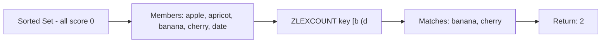

# How to Use ZLEXCOUNT in Redis for Lexicographic Count

Author: [nawazdhandala](https://www.github.com/nawazdhandala)

Tags: Redis, ZLEXCOUNT, Sorted Set, Lexicographic, Range

Description: Learn how to use ZLEXCOUNT in Redis to count members in a sorted set within a lexicographic range, useful for autocomplete and alphabetical data queries.

---

## How ZLEXCOUNT Works

ZLEXCOUNT counts the number of members in a sorted set that fall within a specified lexicographic (alphabetical) range. It is designed for use with sorted sets where all members have the same score (typically 0), as lexicographic ordering is only well-defined when scores are equal.

The command uses special bracket notation for range boundaries, similar to ZRANGEBYLEX.



## Syntax

```redis
ZLEXCOUNT key min max
```

- `key` - the sorted set key
- `min` - lower bound; use `[` for inclusive, `(` for exclusive, or `-` for negative infinity
- `max` - upper bound; use `[` for inclusive, `(` for exclusive, or `+` for positive infinity

## Examples

### Setup - create a sorted set with equal scores

```redis
ZADD fruits 0 apple
ZADD fruits 0 apricot
ZADD fruits 0 avocado
ZADD fruits 0 banana
ZADD fruits 0 cherry
ZADD fruits 0 date
ZADD fruits 0 elderberry
ZADD fruits 0 fig
```

### Count all members

Use `-` and `+` as the range to count everything:

```redis
ZLEXCOUNT fruits - +
```

```text
(integer) 8
```

### Count members starting with 'a'

Use an inclusive lower bound `[a` and exclusive upper bound `(b`:

```redis
ZLEXCOUNT fruits [a (b
```

```text
(integer) 3
```

The three members are: apple, apricot, avocado.

### Count members in a range

Count members between "banana" (inclusive) and "date" (exclusive):

```redis
ZLEXCOUNT fruits [banana (date
```

```text
(integer) 2
```

Members matched: banana, cherry.

### Count members from a specific letter to end

```redis
ZLEXCOUNT fruits [d +
```

```text
(integer) 3
```

Members: date, elderberry, fig.

### Count members up to a specific value (exclusive)

```redis
ZLEXCOUNT fruits - (cherry
```

```text
(integer) 4
```

Members: apple, apricot, avocado, banana.

### Count with inclusive upper bound

```redis
ZLEXCOUNT fruits [banana [cherry
```

```text
(integer) 2
```

Members: banana, cherry.

## Autocomplete Pattern

ZLEXCOUNT is commonly used alongside ZRANGEBYLEX to build autocomplete features:

```redis
ZADD autocomplete 0 "search"
ZADD autocomplete 0 "search engine"
ZADD autocomplete 0 "searching"
ZADD autocomplete 0 "setup"
ZADD autocomplete 0 "signal"

# Count how many completions exist for prefix "sea"
ZLEXCOUNT autocomplete [sea (seb
```

```text
(integer) 3
```

## Use Cases

**Autocomplete suggestions** - Count how many completions exist for a given prefix before fetching them, useful for showing suggestion counts or paginating results.

**Alphabetical range statistics** - Quickly count how many usernames, product names, or tags fall within a given alphabetical range without fetching all records.

**Pagination planning** - Determine the total number of items in a lex range before using ZRANGEBYLEX with LIMIT to page through them.

**Alphabetical partitioning** - Count records in each letter partition (A-F, G-M, N-Z) for reporting or load balancing.

## Important Notes

ZLEXCOUNT only produces meaningful results when all members in the sorted set have the same score. If scores differ, the lexicographic order is secondary to score order and ZLEXCOUNT results may be surprising.

The boundary strings are compared byte-by-byte, so case matters. "Apple" comes before "apple" in lexicographic order.

## Summary

ZLEXCOUNT is a specialized command for counting sorted set members within a lexicographic range. It works best when all members share the same score, making it a natural companion to commands like ZRANGEBYLEX and ZRANGEBYSCORE for building features like autocomplete, alphabetical pagination, and prefix-based statistics. The bracket notation gives you precise control over inclusive and exclusive boundaries.
