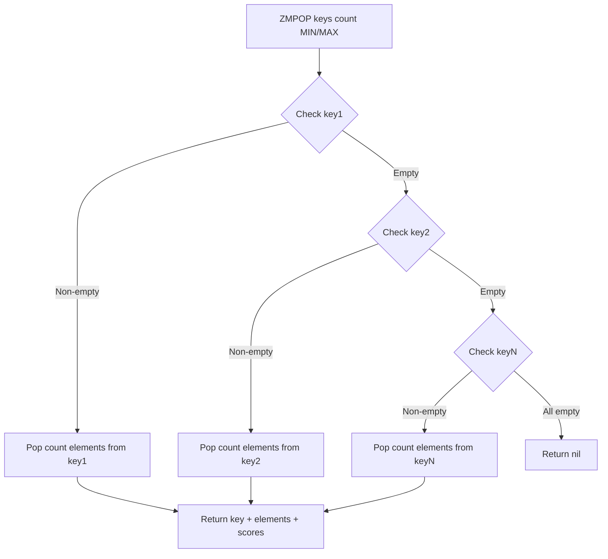

# How to Use ZMPOP in Redis to Pop from Multiple Sorted Sets

Author: [nawazdhandala](https://www.github.com/nawazdhandala)

Tags: Redis, ZMPOP, Sorted Set, Queue, Data Structure

Description: Learn how to use ZMPOP in Redis to atomically pop elements from the first non-empty sorted set in a list of keys, with practical examples and use cases.

---

## How ZMPOP Works

ZMPOP is a Redis command introduced in Redis 7.0 that pops one or more elements from the first non-empty sorted set found in a given list of keys. It works similarly to LMPOP but operates on sorted sets, removing elements with either the lowest or highest scores.

The command checks each key in order and pops from the first one that is non-empty. This makes it ideal for priority queue implementations where you have multiple sorted sets and want to drain the highest-priority set first.



## Syntax

The full syntax for ZMPOP is:

```redis
ZMPOP numkeys key [key ...] MIN|MAX [COUNT count]
```

- `numkeys` - number of keys to check
- `key [key ...]` - list of sorted set keys
- `MIN|MAX` - whether to pop the element with the lowest (MIN) or highest (MAX) score
- `COUNT count` - optional number of elements to pop (default: 1)

## Examples

### Basic ZMPOP - Pop the lowest score element

First, set up some sorted sets:

```redis
ZADD tasks:critical 1 "fix-login-bug"
ZADD tasks:critical 2 "patch-memory-leak"
ZADD tasks:critical 3 "update-ssl-cert"

ZADD tasks:normal 10 "add-dark-mode"
ZADD tasks:normal 20 "improve-docs"
```

Pop the element with the minimum score from the first non-empty sorted set:

```redis
ZMPOP 2 tasks:critical tasks:normal MIN
```

```text
1) "tasks:critical"
2) 1) 1) "fix-login-bug"
      2) "1"
```

### Pop multiple elements at once

```redis
ZMPOP 2 tasks:critical tasks:normal MIN COUNT 2
```

```text
1) "tasks:critical"
2) 1) 1) "patch-memory-leak"
      2) "2"
   2) 1) "update-ssl-cert"
      2) "3"
```

### Pop when the first key is empty

When `tasks:critical` is now empty, ZMPOP falls through to the next key:

```redis
ZMPOP 2 tasks:critical tasks:normal MIN
```

```text
1) "tasks:normal"
2) 1) 1) "add-dark-mode"
      2) "10"
```

### Pop with MAX - highest score first

```redis
ZADD leaderboard 1500 "alice"
ZADD leaderboard 2300 "bob"
ZADD leaderboard 1100 "carol"

ZMPOP 1 leaderboard MAX COUNT 2
```

```text
1) "leaderboard"
2) 1) 1) "bob"
      2) "2300"
   2) 1) "alice"
      2) "1500"
```

### Return value when all keys are empty

```redis
ZMPOP 2 empty:set1 empty:set2 MIN
```

```text
(nil)
```

## Use Cases

**Multi-priority task queues** - Maintain separate sorted sets for critical, high, normal, and low priority tasks. Use ZMPOP to always drain critical tasks before moving to lower-priority ones.

**Scheduled job processing** - Store jobs scored by their scheduled execution time (Unix timestamp). Use ZMPOP MIN to fetch the next job due to run across multiple job queues.

**Round-robin with fallback** - When you have region-specific queues and a global fallback, ZMPOP lets you check regional queues before falling through to the global one.

**Batch processing** - Use the COUNT option to pop multiple work items in a single atomic operation, reducing round trips and improving throughput.

## Comparison with Related Commands

| Command | Blocking | Multiple Keys | Notes |
|---------|----------|---------------|-------|
| ZPOPMIN / ZPOPMAX | No | No | Single sorted set only |
| BZPOPMIN / BZPOPMAX | Yes | Yes | Blocks until element available |
| ZMPOP | No | Yes | Non-blocking, multiple keys |
| BZMPOP | Yes | Yes | Blocking, multiple keys |

## Summary

ZMPOP is a powerful Redis 7.0 command that provides atomic, non-blocking removal of elements from the first non-empty sorted set in a list. It simplifies multi-priority queue patterns by eliminating the need for multiple round trips to check which set has data. The COUNT option lets you batch-pop multiple elements in one call, and the MIN/MAX flag gives you control over the ordering of removal. Use ZMPOP when you need a non-blocking way to drain sorted sets in priority order.
