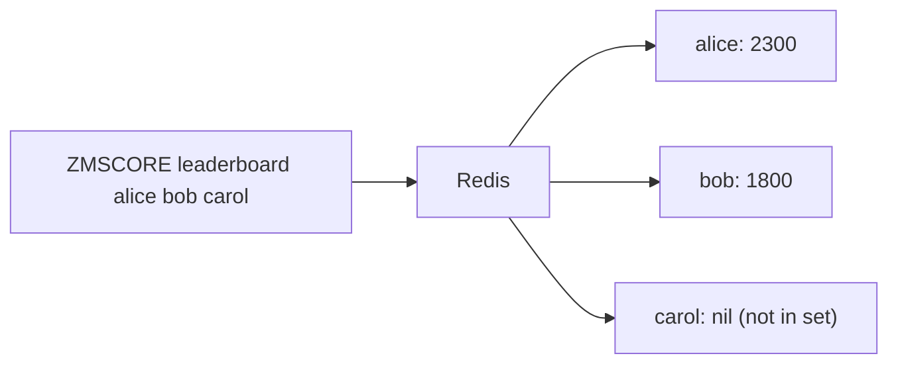

# How to Use ZMSCORE in Redis to Get Multiple Member Scores

Author: [nawazdhandala](https://www.github.com/nawazdhandala)

Tags: Redis, ZMSCORE, Sorted Set, Score, Batch

Description: Learn how to use ZMSCORE in Redis to retrieve scores for multiple sorted set members in a single command, reducing round trips and improving performance.

---

## How ZMSCORE Works

ZMSCORE retrieves the scores of multiple members from a sorted set in a single command. It was introduced in Redis 6.2 as a bulk alternative to ZSCORE, which only fetches one member's score at a time. For each member specified, ZMSCORE returns its score as a bulk string, or nil if the member does not exist in the set.



## Syntax

```redis
ZMSCORE key member [member ...]
```

- `key` - the sorted set key
- `member [member ...]` - one or more member names to look up

## Examples

### Setup - create a leaderboard

```redis
ZADD leaderboard 2300 "alice"
ZADD leaderboard 1800 "bob"
ZADD leaderboard 3100 "diana"
ZADD leaderboard 950  "eve"
```

### Get scores for multiple members

```redis
ZMSCORE leaderboard alice bob diana
```

```text
1) "2300"
2) "1800"
3) "3100"
```

### Handle members that do not exist

```redis
ZMSCORE leaderboard alice carol diana
```

```text
1) "2300"
2) (nil)
3) "3100"
```

`carol` is not in the set, so her position returns nil. The positions of the other members are unaffected.

### Single member (equivalent to ZSCORE)

```redis
ZMSCORE leaderboard alice
```

```text
1) "2300"
```

### Fetch scores for all known players at once

```redis
ZMSCORE leaderboard alice bob diana eve
```

```text
1) "2300"
2) "1800"
3) "3100"
4) "950"
```

## Comparison with ZSCORE

| Feature | ZSCORE | ZMSCORE |
|---------|--------|---------|
| Members per call | 1 | Multiple |
| Redis version | 1.2+ | 6.2+ |
| Return | Single score or nil | Array of scores/nils |

Using ZSCORE in a loop:

```redis
ZSCORE leaderboard alice
ZSCORE leaderboard bob
ZSCORE leaderboard diana
```

Using ZMSCORE in one call:

```redis
ZMSCORE leaderboard alice bob diana
```

The ZMSCORE approach saves two round trips and is preferred when you need multiple scores.

## Use Cases

**Leaderboard lookups** - Fetch scores for a list of friends or team members in one call to display relative rankings on a dashboard.

**Batch score validation** - Check multiple user scores against thresholds (e.g., qualifying scores for a tournament) without issuing one ZSCORE per user.

**Presence and score check** - Use nil returns to determine which members from a batch are not yet in the sorted set, combining membership check and score retrieval.

**Game state synchronization** - Retrieve scores for all players in a match session in a single round trip during periodic state broadcasts.

## Working with nil Results

When processing ZMSCORE results, always handle nil values to avoid errors:

```bash
# Fetch scores and process with redis-cli
redis-cli ZMSCORE leaderboard alice carol diana | while read score; do
  if [ "$score" = "" ]; then
    echo "Member not found"
  else
    echo "Score: $score"
  fi
done
```

## Summary

ZMSCORE is the batch version of ZSCORE, allowing you to retrieve scores for multiple sorted set members in a single round trip. It returns an array matching the order of the requested members, with nil for any member not present in the set. Use ZMSCORE whenever you need to look up more than one score to reduce latency and simplify your code compared to looping over individual ZSCORE calls.
