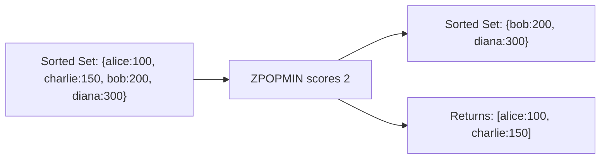

# How to Use ZPOPMIN and ZPOPMAX in Redis to Pop by Score

Author: [nawazdhandala](https://www.github.com/nawazdhandala)

Tags: Redis, Sorted Set, ZPOPMIN, ZPOPMAX, Command

Description: Learn how to use ZPOPMIN and ZPOPMAX in Redis to atomically remove and return members with the lowest or highest scores, with examples for priority queues and task scheduling.

---

## How ZPOPMIN and ZPOPMAX Work

`ZPOPMIN` removes and returns the member(s) with the lowest scores from a sorted set. `ZPOPMAX` removes and returns the member(s) with the highest scores. Both return the members along with their scores.

These commands are the building blocks for priority queue implementations where the highest or lowest priority item needs to be processed next.



## Syntax

```redis
ZPOPMIN key [count]
ZPOPMAX key [count]
```

- `key` - sorted set key
- `count` - optional number of members to pop (default 1)

Returns an array of `[member, score]` pairs. When count is not specified, returns a flat array `[member, score]`. When count is specified, returns a flat array of alternating members and scores. Returns an empty array if the set is empty.

## Examples

### Setup

```redis
ZADD tasks 1 "urgent" 5 "normal" 3 "high" 8 "low"
```

### Pop the Lowest-Score Member (ZPOPMIN)

```redis
ZPOPMIN tasks
```

```text
1) "urgent"
2) "1"
```

"urgent" (score 1) is removed from the set and returned.

### Pop the Highest-Score Member (ZPOPMAX)

```redis
ZPOPMAX tasks
```

```text
1) "low"
2) "8"
```

"low" (score 8) is removed.

### Pop Multiple Members

```redis
DEL tasks
ZADD tasks 1 "t1" 2 "t2" 3 "t3" 4 "t4" 5 "t5"
ZPOPMIN tasks 2
```

```text
1) "t1"
2) "1"
3) "t2"
4) "2"
```

### Pop More Than Available

When count exceeds the set size, all members are returned.

```redis
ZADD small 10 "a" 20 "b"
ZPOPMIN small 100
```

```text
1) "a"
2) "10"
3) "b"
4) "20"
```

### Empty Set Returns Empty Array

```redis
DEL empty
ZPOPMIN empty
```

```text
(empty array)
```

### Confirm Removal

After popping, the members are gone from the set.

```redis
DEL demo
ZADD demo 1 "x" 2 "y" 3 "z"
ZPOPMIN demo
ZRANGE demo 0 -1 WITHSCORES
```

```text
1) "x"
2) "1"
---
1) "y"
2) "2"
3) "z"
4) "3"
```

## Use Cases

### Min-Heap Priority Queue

Process tasks in order of urgency (lowest score = highest priority).

```redis
ZADD taskqueue 1 "critical" 5 "normal" 3 "high" 10 "low"
-- Process next task:
ZPOPMIN taskqueue
```

```text
1) "critical"
2) "1"
```

### Max-Score Priority Queue

Process items with the highest score first (e.g., highest bid).

```redis
ZADD bids 50.0 "bidder:1" 75.0 "bidder:2" 60.0 "bidder:3"
ZPOPMAX bids
```

```text
1) "bidder:2"
2) "75"
```

### Job Scheduling by Scheduled Time

Use UNIX timestamps as scores; ZPOPMIN pops the earliest scheduled job.

```redis
ZADD schedule 1711900100 "job:B" 1711900000 "job:A" 1711900200 "job:C"
ZPOPMIN schedule
```

```text
1) "job:A"
2) "1711900000"
```

### Leaderboard Winner Extraction

Extract and remove top N winners from a competition.

```redis
ZADD competition 9500 "alice" 8700 "bob" 7200 "charlie"
ZPOPMAX competition 2
```

```text
1) "alice"
2) "9500"
3) "bob"
4) "8700"
```

### Expiring the Oldest Entries

Remove and process the N oldest entries from a time-indexed sorted set.

```redis
ZADD events 1000 "e1" 1010 "e2" 1020 "e3"
ZPOPMIN events 2
```

```text
1) "e1"
2) "1000"
3) "e2"
4) "1010"
```

## ZPOPMIN vs BZPOPMIN

`ZPOPMIN` returns immediately with an empty array if the set is empty. `BZPOPMIN` blocks and waits for an element to become available. Use BZPOPMIN for event-driven consumers.

## Performance Considerations

- ZPOPMIN / ZPOPMAX with no count is O(log N).
- Popping `count` members is O(count * log N).
- For large batch pops from a known range, consider ZRANGEBYSCORE + ZREM or ZREMRANGEBYSCORE for better efficiency.

## Summary

`ZPOPMIN` and `ZPOPMAX` atomically remove and return the lowest- or highest-scored members from a sorted set, making them ideal for priority queue implementations. They support popping multiple members at once with the `count` option and return empty arrays on empty sets. For blocking variants that wait for data, use BZPOPMIN and BZPOPMAX.
