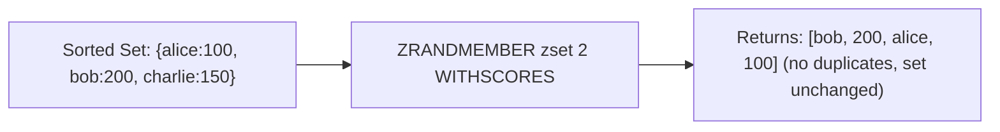

# How to Use ZRANDMEMBER in Redis for Random Sorted Set Members

Author: [nawazdhandala](https://www.github.com/nawazdhandala)

Tags: Redis, Sorted Set, ZRANDMEMBER, Command

Description: Learn how to use the Redis ZRANDMEMBER command to retrieve random members from a sorted set, with options for unique sampling and score inclusion.

---

## How ZRANDMEMBER Works

`ZRANDMEMBER` returns one or more random members from a Redis sorted set without removing them. The sorted set is unchanged after the call.

Like SRANDMEMBER for sets, ZRANDMEMBER supports two sampling modes:
- Positive count: returns up to `count` distinct members (no duplicates)
- Negative count: returns exactly `|count|` members, potentially with duplicates

The optional `WITHSCORES` flag includes each member's score in the response.

ZRANDMEMBER was introduced in Redis 6.2.



## Syntax

```redis
ZRANDMEMBER key [count [WITHSCORES]]
```

- `key` - sorted set key
- `count` - optional; positive for distinct sample; negative for sample with possible repeats
- `WITHSCORES` - include scores in the response (only valid when count is provided)

Returns a single string (no count), an array of strings (count without WITHSCORES), or a flat array of member-score pairs (count with WITHSCORES). Returns nil or empty array on empty/non-existent keys.

## Examples

### Return a Single Random Member

```redis
ZADD scores 100 "alice" 200 "bob" 150 "charlie" 300 "diana"
ZRANDMEMBER scores
```

```text
"charlie"
```

(Result varies each call)

### Return Multiple Distinct Members

```redis
ZRANDMEMBER scores 3
```

```text
1) "alice"
2) "diana"
3) "bob"
```

No duplicates; at most 3 distinct members.

### Include Scores with WITHSCORES

```redis
ZRANDMEMBER scores 2 WITHSCORES
```

```text
1) "bob"
2) "200"
3) "alice"
4) "100"
```

### Count Larger Than Set Size

When count exceeds the set size, all members are returned (no duplicates possible).

```redis
ZRANDMEMBER scores 100 WITHSCORES
```

```text
1) "alice"
2) "100"
3) "charlie"
4) "150"
5) "bob"
6) "200"
7) "diana"
8) "300"
```

### Negative Count - Allow Duplicates

```redis
ZRANDMEMBER scores -6
```

```text
1) "bob"
2) "alice"
3) "bob"
4) "diana"
5) "charlie"
6) "alice"
```

Duplicates appear because `|count|` (6) exceeds the set size (4).

### Negative Count with WITHSCORES

```redis
ZRANDMEMBER scores -4 WITHSCORES
```

```text
1) "diana"
2) "300"
3) "alice"
4) "100"
5) "diana"
6) "300"
7) "charlie"
8) "150"
```

### Non-Existent Key

```redis
DEL ghost
ZRANDMEMBER ghost
```

```text
(nil)
```

```redis
ZRANDMEMBER ghost 3
```

```text
(empty array)
```

### Set Is Not Modified

```redis
ZCARD scores
```

```text
(integer) 4
```

The sorted set remains unchanged after ZRANDMEMBER.

## Use Cases

### Random Feature Spotlight

Pick a random feature to highlight in a UI.

```redis
ZADD features:active 1 "dark_mode" 1 "new_dashboard" 1 "ai_assist" 1 "beta_chat"
ZRANDMEMBER features:active
```

```text
"ai_assist"
```

### Weighted Random Selection via Scores

Use scores as relative weights and sample via negative count to approximate a weighted distribution.

Note: Sorted sets deduplicate members, so true weighted random requires a list or Lua script. However, for broad sampling with possible duplication, negative count gives a roughly score-proportional appearance if the set is small.

### Random Sample for A/B Testing

Sample 10% of users for a feature test.

```redis
ZADD users:all 1 "u1" 1 "u2" 1 "u3" 1 "u4" 1 "u5" 1 "u6" 1 "u7" 1 "u8" 1 "u9" 1 "u10"
ZRANDMEMBER users:all 1
```

### Random Quiz Questions

Select 5 unique questions for a quiz.

```redis
ZADD questions 0 "q:1" 0 "q:2" 0 "q:3" 0 "q:4" 0 "q:5" 0 "q:6" 0 "q:7" 0 "q:8"
ZRANDMEMBER questions 5
```

```text
1) "q:3"
2) "q:7"
3) "q:1"
4) "q:5"
5) "q:8"
```

### Random Entry Point in a Ranked List

Pick a random starting point for a user browsing a leaderboard.

```redis
ZADD leaderboard 5000 "alice" 7200 "bob" 3100 "charlie" 6800 "diana"
ZRANDMEMBER leaderboard 1 WITHSCORES
```

```text
1) "diana"
2) "6800"
```

### Shuffling All Members

Get all members in a random order (shuffle equivalent).

```redis
ZADD deck 0 "A" 0 "2" 0 "3" 0 "4" 0 "5"
ZRANDMEMBER deck 5
```

```text
1) "3"
2) "A"
3) "5"
4) "2"
5) "4"
```

## Comparison: ZRANDMEMBER vs SRANDMEMBER vs SPOP

| Aspect | ZRANDMEMBER | SRANDMEMBER | ZPOPMIN/ZPOPMAX |
|---|---|---|---|
| Data structure | Sorted set | Set | Sorted set |
| Removes member | No | No | Yes |
| Returns score | Yes (WITHSCORES) | No | Yes |
| Selection order | Random | Random | By score |

## Performance Considerations

- Single random member: O(1)
- Positive count (distinct): O(N) where N is the count
- Negative count (with duplicates): O(|count|)
- For a count close to the full set size with positive count, complexity approaches O(S) where S is the set size (due to deduplication effort)

## Summary

`ZRANDMEMBER` provides non-destructive random sampling from Redis sorted sets. Use a positive count for unique samples, a negative count for fixed-size samples with possible repetition, and `WITHSCORES` to include score values. It is ideal for feature spotlights, random quiz generation, A/B test sampling, and any scenario that requires random access to a ranked collection without modifying it.
