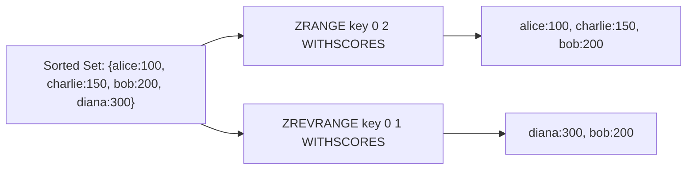

# How to Use ZRANGE and ZREVRANGE in Redis for Sorted Set Queries

Author: [nawazdhandala](https://www.github.com/nawazdhandala)

Tags: Redis, Sorted Set, ZRANGE, ZREVRANGE, Command

Description: Learn how to use ZRANGE and ZREVRANGE in Redis to retrieve members from a sorted set by index, score, or lexicographic order in ascending or descending direction.

---

## How ZRANGE and ZREVRANGE Work

`ZRANGE` retrieves members from a sorted set. In Redis 6.2+, ZRANGE was significantly enhanced and can now retrieve by index, score range, or lex range, in either ascending or descending order, replacing several older commands.

`ZREVRANGE` (older command, available since Redis 1.2) returns members in reverse score order (high to low). In Redis 6.2+, `ZRANGE ... REV` is the preferred equivalent.



## Syntax

### ZRANGE (Redis 6.2+)

```redis
ZRANGE key min max [BYSCORE | BYLEX] [REV] [LIMIT offset count] [WITHSCORES]
```

### ZRANGE (Legacy - by index)

```redis
ZRANGE key start stop [WITHSCORES]
```

### ZREVRANGE

```redis
ZREVRANGE key start stop [WITHSCORES]
```

- `start/stop` or `min/max` - index range, score range, or lex range depending on flags
- `BYSCORE` - interpret min/max as scores
- `BYLEX` - interpret min/max as lexicographic boundaries
- `REV` - reverse the order (descending)
- `LIMIT offset count` - pagination; only with BYSCORE or BYLEX
- `WITHSCORES` - include scores in the result

## Examples

### Setup

```redis
ZADD players 100 "alice" 200 "bob" 150 "charlie" 300 "diana"
```

### Get All Members by Index (Ascending)

```redis
ZRANGE players 0 -1 WITHSCORES
```

```text
1) "alice"
2) "100"
3) "charlie"
4) "150"
5) "bob"
6) "200"
7) "diana"
8) "300"
```

### Get Top 3 Members by Index

```redis
ZRANGE players 0 2 WITHSCORES
```

```text
1) "alice"
2) "100"
3) "charlie"
4) "150"
5) "bob"
6) "200"
```

### Reverse Order with ZREVRANGE (Legacy)

```redis
ZREVRANGE players 0 2 WITHSCORES
```

```text
1) "diana"
2) "300"
3) "bob"
4) "200"
5) "charlie"
6) "150"
```

### Reverse Order with ZRANGE REV (Redis 6.2+)

```redis
ZRANGE players 0 2 REV WITHSCORES
```

```text
1) "diana"
2) "300"
3) "bob"
4) "200"
5) "charlie"
6) "150"
```

### Query by Score Range with BYSCORE

Get members with scores between 100 and 200 inclusive.

```redis
ZRANGE players 100 200 BYSCORE WITHSCORES
```

```text
1) "alice"
2) "100"
3) "charlie"
4) "150"
5) "bob"
6) "200"
```

### Exclusive Score Boundaries

Use `(` prefix to make a boundary exclusive.

```redis
ZRANGE players (100 200 BYSCORE WITHSCORES
```

```text
1) "charlie"
2) "150"
3) "bob"
4) "200"
```

### Score Range in Descending Order (BYSCORE + REV)

When using REV with BYSCORE, the range is still specified as max first, min second.

```redis
ZRANGE players 200 100 BYSCORE REV WITHSCORES
```

```text
1) "bob"
2) "200"
3) "charlie"
4) "150"
5) "alice"
6) "100"
```

### Pagination with LIMIT

Get the second page of results (skip 2, take 2).

```redis
ZRANGE players 0 +inf BYSCORE WITHSCORES LIMIT 2 2
```

```text
1) "bob"
2) "200"
3) "diana"
4) "300"
```

### Query by Lexicographic Order with BYLEX

Only works correctly when all scores are equal.

```redis
ZADD names 0 "anna" 0 "bob" 0 "carol" 0 "dave" 0 "eve"
ZRANGE names "[b" "[d" BYLEX
```

```text
1) "bob"
2) "carol"
3) "dave"
```

Use `[` for inclusive and `(` for exclusive boundaries, or `-` for negative infinity and `+` for positive infinity.

```redis
ZRANGE names "[b" "(d" BYLEX
```

```text
1) "bob"
2) "carol"
```

## Use Cases

### Leaderboard Top N

Get top 10 players by score (descending).

```redis
ZADD scores 5000 "p1" 7000 "p2" 3000 "p3" 9000 "p4"
ZRANGE scores 0 9 REV WITHSCORES
```

### Pagination of Ranked Results

```redis
-- Page 1 (items 0-9)
ZRANGE scores 0 9 REV WITHSCORES

-- Page 2 (items 10-19)
ZRANGE scores 10 19 REV WITHSCORES
```

### Sliding Window by Score (Timestamp)

Retrieve events within a time range.

```redis
ZADD events 1711900000 "e:1" 1711900100 "e:2" 1711900200 "e:3"
ZRANGE events 1711900050 1711900200 BYSCORE WITHSCORES
```

### Autocomplete (Lexicographic Range)

```redis
ZADD autocomplete 0 "redis" 0 "redisson" 0 "redisearch" 0 "mysql"
ZRANGE autocomplete "[redis" "[rediz" BYLEX
```

```text
1) "redis"
2) "redisearch"
3) "redisson"
```

## Performance Considerations

- By index: O(log N + M) where M is the number of returned elements.
- By score or lex: O(log N + M) with M being the result count.
- WITHSCORES doubles the response size but requires no extra computation.
- Pagination with LIMIT is efficient - Redis uses the skip/take within the sorted index.

## Summary

`ZRANGE` is the versatile Swiss Army knife of sorted set queries in Redis 6.2+. It handles index-based, score-based, and lexicographic range queries in both ascending and descending order, with pagination support. `ZREVRANGE` remains available for legacy compatibility but ZRANGE with REV is the modern approach for descending queries.
