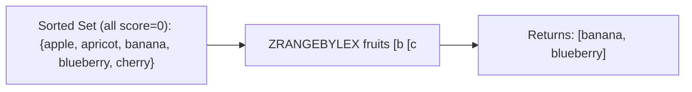

# How to Use ZRANGEBYLEX in Redis for Lexicographic Range Queries

Author: [nawazdhandala](https://www.github.com/nawazdhandala)

Tags: Redis, Sorted Set, ZRANGEBYLEX, Command

Description: Learn how to use ZRANGEBYLEX in Redis to query sorted set members by lexicographic range when all members share the same score, with examples for autocomplete and prefix search.

---

## How ZRANGEBYLEX Works

`ZRANGEBYLEX` retrieves sorted set members whose names fall within a lexicographic (alphabetical) range. It is designed for sorted sets where all members have the same score, causing Redis to fall back to lexicographic ordering as the tiebreaker.

When scores are all equal, ZRANGEBYLEX enables sorted sets to function as an ordered string index - perfect for autocomplete, prefix search, and alphabetical pagination.

Note: In Redis 6.2+, `ZRANGE key min max BYLEX` is the recommended modern equivalent.



## Syntax

```redis
ZRANGEBYLEX key min max [LIMIT offset count]
```

- `key` - sorted set key where all members should have equal scores
- `min` - lower bound; use `[` for inclusive, `(` for exclusive; use `-` for the start of the lexicographic space
- `max` - upper bound; use `[` for inclusive, `(` for exclusive; use `+` for the end of the lexicographic space
- `LIMIT offset count` - skip `offset` results and return at most `count`

Returns members in lexicographic ascending order.

## Examples

### Setup

All members must have the same score for lex ordering to be meaningful.

```redis
ZADD words 0 "apple" 0 "apricot" 0 "avocado" 0 "banana" 0 "blueberry" 0 "cherry" 0 "date"
```

### Inclusive Range

Get words from "apple" to "banana" inclusive.

```redis
ZRANGEBYLEX words "[apple" "[banana"
```

```text
1) "apple"
2) "apricot"
3) "avocado"
4) "banana"
```

### Exclusive Upper Boundary

Get words starting from "apple" up to but not including "banana".

```redis
ZRANGEBYLEX words "[apple" "(banana"
```

```text
1) "apple"
2) "apricot"
3) "avocado"
```

### Prefix Search (Autocomplete)

Get all words that start with "ap" - use the character just after "ap" as the upper bound.

```redis
ZRANGEBYLEX words "[ap" "(aq"
```

```text
1) "apple"
2) "apricot"
```

The character after "ap" in ASCII is "aq", so `(aq` excludes everything from "aq" onward.

### Unbounded Lower Limit

Get all words up to and including "banana".

```redis
ZRANGEBYLEX words "-" "[banana"
```

```text
1) "apple"
2) "apricot"
3) "avocado"
4) "banana"
```

### Unbounded Upper Limit

Get all words from "cherry" to the end.

```redis
ZRANGEBYLEX words "[cherry" "+"
```

```text
1) "cherry"
2) "date"
```

### Get All Members

```redis
ZRANGEBYLEX words "-" "+"
```

```text
1) "apple"
2) "apricot"
3) "avocado"
4) "banana"
5) "blueberry"
6) "cherry"
7) "date"
```

### Pagination with LIMIT

Get the second page of lex results.

```redis
ZRANGEBYLEX words "-" "+" LIMIT 3 3
```

```text
1) "banana"
2) "blueberry"
3) "cherry"
```

## Use Cases

### Autocomplete / Prefix Search

Build an autocomplete index.

```redis
ZADD autocomplete 0 "redis" 0 "redisson" 0 "redisearch" 0 "redisqueue" 0 "react" 0 "rust"
ZRANGEBYLEX autocomplete "[redis" "(rediu"
```

```text
1) "redis"
2) "redisearch"
3) "redisqueue"
4) "redisson"
```

To get the character just after a prefix, append the smallest possible character. A common pattern is to use `[prefix` to `[prefix\xff` where `\xff` is the highest byte value.

### Username Alphabetical Browser

Paginate through usernames alphabetically.

```redis
ZADD usernames 0 "alice" 0 "bob" 0 "carol" 0 "dave" 0 "eve" 0 "frank"
ZRANGEBYLEX usernames "[b" "[d" LIMIT 0 10
```

```text
1) "bob"
2) "carol"
3) "dave"
```

### Country Code Range

Get all ISO country codes in a range.

```redis
ZADD countries 0 "AR" 0 "AU" 0 "BR" 0 "CA" 0 "CN" 0 "DE" 0 "FR"
ZRANGEBYLEX countries "[B" "(D"
```

```text
1) "BR"
2) "CA"
3) "CN"
```

### Alphabetical Pagination for Product Catalog

```redis
ZADD catalog 0 "apple-watch" 0 "airpods" 0 "ipad" 0 "iphone" 0 "macbook"
-- Products starting with "i"
ZRANGEBYLEX catalog "[i" "(j"
```

```text
1) "ipad"
2) "iphone"
```

## Important: Scores Must Be Equal

ZRANGEBYLEX is only meaningful when all members have the same score. If scores differ, the lexicographic order is applied within each score bucket, not across the full set.

```redis
-- Wrong: mixed scores break lex ordering across the full set
ZADD mixed 1 "apple" 2 "banana"
ZRANGEBYLEX mixed "-" "+"
-- Result is not a useful lex sort
```

## ZRANGEBYLEX vs ZRANGEBYSCORE

| Aspect | ZRANGEBYLEX | ZRANGEBYSCORE |
|---|---|---|
| Ordering | Lexicographic (string) | Numeric (score) |
| Requires equal scores | Yes | No |
| Use case | Text prefix search, alphabetical pagination | Time range, numeric range |

## Performance Considerations

- ZRANGEBYLEX is O(log N + M) where N is the sorted set size and M is the number of returned members.
- LIMIT is efficient for shallow pagination but large offset values require skipping results.
- For autocomplete, structure prefix boundaries carefully to avoid over-scanning.

## Summary

`ZRANGEBYLEX` unlocks lexicographic range queries on Redis sorted sets when all members share equal scores. It powers autocomplete, prefix search, and alphabetical pagination with O(log N + M) efficiency. Use `-` and `+` for unbounded ranges, `[` for inclusive and `(` for exclusive boundaries, and LIMIT for paginating through results.
