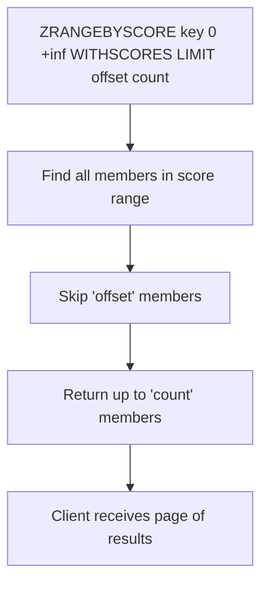

# How to Use ZRANGEBYSCORE with LIMIT in Redis for Pagination

Author: [nawazdhandala](https://www.github.com/nawazdhandala)

Tags: Redis, ZRANGEBYSCORE, Sorted Set, Pagination, LIMIT

Description: Learn how to use ZRANGEBYSCORE with the LIMIT option in Redis to paginate through sorted set members by score range, with practical examples and cursor-based patterns.

---

## How ZRANGEBYSCORE with LIMIT Works

ZRANGEBYSCORE returns members of a sorted set whose scores fall within a specified range. The optional LIMIT clause works like SQL's OFFSET and LIMIT, allowing you to skip a number of results and cap the total returned. This enables offset-based pagination through scored data.



## Syntax

```redis
ZRANGEBYSCORE key min max [WITHSCORES] [LIMIT offset count]
```

- `key` - the sorted set key
- `min` - minimum score; use `-inf` for no lower bound
- `max` - maximum score; use `+inf` for no upper bound
- `WITHSCORES` - include scores in the response
- `LIMIT offset count` - skip `offset` elements, return at most `count`

For reverse order, use ZREVRANGEBYSCORE:

```redis
ZREVRANGEBYSCORE key max min [WITHSCORES] [LIMIT offset count]
```

## Examples

### Setup - create a scored dataset

```redis
ZADD products 10.99 "notebook"
ZADD products 24.99 "keyboard"
ZADD products 49.99 "mouse-pad"
ZADD products 79.99 "headphones"
ZADD products 99.99 "webcam"
ZADD products 129.99 "monitor-arm"
ZADD products 199.99 "mechanical-keyboard"
ZADD products 299.99 "monitor"
```

### Basic range query - no pagination

```redis
ZRANGEBYSCORE products 0 100 WITHSCORES
```

```text
1) "notebook"
2) "10.99"
3) "keyboard"
4) "24.99"
5) "mouse-pad"
6) "49.99"
7) "headphones"
8) "79.99"
9) "webcam"
10) "99.99"
```

### Page 1 - first 3 results in range

```redis
ZRANGEBYSCORE products 0 +inf WITHSCORES LIMIT 0 3
```

```text
1) "notebook"
2) "10.99"
3) "keyboard"
4) "24.99"
5) "mouse-pad"
6) "49.99"
```

### Page 2 - next 3 results

```redis
ZRANGEBYSCORE products 0 +inf WITHSCORES LIMIT 3 3
```

```text
1) "headphones"
2) "79.99"
3) "webcam"
4) "99.99"
5) "monitor-arm"
6) "129.99"
```

### Page 3 - final results

```redis
ZRANGEBYSCORE products 0 +inf WITHSCORES LIMIT 6 3
```

```text
1) "mechanical-keyboard"
2) "199.99"
3) "monitor"
4) "299.99"
```

### Filter by price range with pagination

Show products priced between $50 and $200, page 1 of 2:

```redis
ZRANGEBYSCORE products 50 200 WITHSCORES LIMIT 0 2
```

```text
1) "mouse-pad"
2) "49.99"
```

Wait - 49.99 is below 50. Use exclusive boundaries with `(`:

```redis
ZRANGEBYSCORE products (49.99 200 WITHSCORES LIMIT 0 2
```

```text
1) "headphones"
2) "79.99"
3) "webcam"
4) "99.99"
```

### Reverse order - most expensive first

```redis
ZREVRANGEBYSCORE products +inf 0 WITHSCORES LIMIT 0 3
```

```text
1) "monitor"
2) "299.99"
3) "mechanical-keyboard"
4) "199.99"
5) "monitor-arm"
6) "129.99"
```

## Cursor-Based Pagination Alternative

Offset-based pagination can be slow on large sets because Redis must scan to the offset each time. A faster alternative uses the last seen score as the next page boundary:

```redis
# Page 1 - start from the beginning
ZRANGEBYSCORE products -inf +inf WITHSCORES LIMIT 0 3

# Record the last score returned: 49.99
# Page 2 - start just after the last score
ZRANGEBYSCORE products (49.99 +inf WITHSCORES LIMIT 0 3

# Record the last score returned: 99.99
# Page 3 - start just after that score
ZRANGEBYSCORE products (99.99 +inf WITHSCORES LIMIT 0 3
```

This approach performs better at scale because it uses score-based filtering rather than skipping.

## Use Cases

**Product catalog browsing** - Paginate products filtered by price range in a category page.

**Time-windowed event history** - Retrieve the Nth page of events within a time range stored as Unix timestamps.

**Leaderboard segments** - Show players ranked within a score band (e.g., 1000-2000 rating points) with page navigation.

**Feed pagination** - Use timestamps as scores to paginate through a user's activity feed within a date range.

## Summary

ZRANGEBYSCORE with LIMIT gives you SQL-like pagination over sorted set ranges, letting you combine score filtering and offset-based page navigation in a single command. For better performance on large datasets, prefer cursor-based pagination using exclusive score boundaries rather than large OFFSET values. The WITHSCORES flag is essential when you need the score for the next cursor position. Note that ZRANGEBYSCORE is deprecated in Redis 6.2 in favor of ZRANGE with the BYSCORE option, but remains fully functional.
