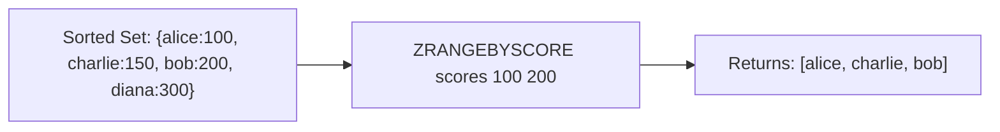

# How to Use ZRANGEBYSCORE in Redis to Query by Score

Author: [nawazdhandala](https://www.github.com/nawazdhandala)

Tags: Redis, Sorted Set, ZRANGEBYSCORE, Command

Description: Learn how to use ZRANGEBYSCORE in Redis to retrieve sorted set members within a score range, with inclusive and exclusive boundaries, pagination, and practical examples.

---

## How ZRANGEBYSCORE Works

`ZRANGEBYSCORE` retrieves members from a sorted set whose scores fall within a specified range, returned in ascending score order. It is one of the most-used sorted set commands because score-based range queries are a fundamental access pattern for time series, leaderboards, and rate limiters.

Note: In Redis 6.2+, `ZRANGE key min max BYSCORE` is the recommended modern equivalent. ZRANGEBYSCORE remains available and works identically.



## Syntax

```redis
ZRANGEBYSCORE key min max [WITHSCORES] [LIMIT offset count]
```

- `key` - sorted set key
- `min` - minimum score (inclusive); use `-inf` for unbounded lower end
- `max` - maximum score (inclusive); use `+inf` for unbounded upper end
- Prefix with `(` to make a boundary exclusive (e.g., `(100`)
- `WITHSCORES` - include scores in the response
- `LIMIT offset count` - skip `offset` results and return at most `count`

Returns an array of members (and scores if WITHSCORES) in ascending score order.

## Examples

### Setup

```redis
ZADD scores 100 "alice" 150 "charlie" 200 "bob" 300 "diana" 50 "eve"
```

### Range Query

```redis
ZRANGEBYSCORE scores 100 200
```

```text
1) "alice"
2) "charlie"
3) "bob"
```

### Include Scores

```redis
ZRANGEBYSCORE scores 100 200 WITHSCORES
```

```text
1) "alice"
2) "100"
3) "charlie"
4) "150"
5) "bob"
6) "200"
```

### Unbounded Lower Limit

Get all members with scores up to 150.

```redis
ZRANGEBYSCORE scores -inf 150 WITHSCORES
```

```text
1) "eve"
2) "50"
3) "alice"
4) "100"
5) "charlie"
6) "150"
```

### Unbounded Upper Limit

Get all members with scores of 200 or above.

```redis
ZRANGEBYSCORE scores 200 +inf WITHSCORES
```

```text
1) "bob"
2) "200"
3) "diana"
4) "300"
```

### Exclusive Boundaries with ( Prefix

Exclude the exact boundary value.

```redis
ZRANGEBYSCORE scores (100 200
```

```text
1) "charlie"
2) "bob"
```

"alice" (score 100) is excluded.

```redis
ZRANGEBYSCORE scores 100 (200
```

```text
1) "alice"
2) "charlie"
```

"bob" (score 200) is excluded.

### Both Exclusive

```redis
ZRANGEBYSCORE scores (100 (200
```

```text
1) "charlie"
```

### Pagination with LIMIT

Skip the first result and return at most 2 from the range.

```redis
ZRANGEBYSCORE scores -inf +inf LIMIT 1 2
```

```text
1) "alice"
2) "charlie"
```

The first result (eve at 50) was skipped.

### No Results in Range

```redis
ZRANGEBYSCORE scores 400 500
```

```text
(empty array)
```

## Use Cases

### Time Series: Events in a Time Window

Use UNIX timestamps as scores.

```redis
ZADD events 1711900000 "e:login" 1711900100 "e:purchase" 1711900200 "e:logout"
ZRANGEBYSCORE events 1711900050 1711900200 WITHSCORES
```

```text
1) "e:purchase"
2) "1711900100"
3) "e:logout"
4) "1711900200"
```

### Sliding Window Rate Limiter

Retrieve all requests within the last 60 seconds.

```redis
ZADD requests:user:42 1711900000 "req:1" 1711900010 "req:2" 1711900070 "req:3"
ZRANGEBYSCORE requests:user:42 1711899940 1711900000
```

### Score Range Leaderboard

Get all players in a specific score band.

```redis
ZADD game 4500 "alice" 7200 "bob" 3100 "charlie" 6800 "diana"
ZRANGEBYSCORE game 4000 7000 WITHSCORES
```

```text
1) "alice"
2) "4500"
3) "diana"
4) "6800"
```

### Paginated Product Price Filter

```redis
ZADD products:price 9.99 "prod:A" 19.99 "prod:B" 14.99 "prod:C" 24.99 "prod:D"
-- Page 1: products under $20
ZRANGEBYSCORE products:price 0 19.99 LIMIT 0 2 WITHSCORES
```

```text
1) "prod:A"
2) "9.99"
3) "prod:C"
4) "14.99"
```

### Priority Queue Drain

Process all items with priority between 5 and 10.

```redis
ZADD tasks 3 "low" 7 "medium" 10 "critical" 5 "normal"
ZRANGEBYSCORE tasks 5 10
```

```text
1) "normal"
2) "medium"
3) "critical"
```

## ZRANGEBYSCORE vs ZREVRANGEBYSCORE

`ZRANGEBYSCORE` returns results in ascending score order. `ZREVRANGEBYSCORE` returns them in descending order (and takes max before min in the argument order).

```redis
-- Ascending
ZRANGEBYSCORE scores 100 300

-- Descending equivalent
ZREVRANGEBYSCORE scores 300 100
```

In Redis 6.2+, use `ZRANGE key max min BYSCORE REV` instead.

## Performance Considerations

- ZRANGEBYSCORE is O(log N + M) where N is the sorted set size and M is the number of returned elements.
- For large sets with a small result range, this is very efficient.
- LIMIT adds a constant offset cost. Large offsets require skipping results, so score-cursor pagination is more efficient for deep pagination.

## Summary

`ZRANGEBYSCORE` retrieves sorted set members within a score range, supporting inclusive and exclusive boundaries, unbounded ranges with `-inf` and `+inf`, and pagination with LIMIT. It is the foundation for time-series queries, price filters, priority queue drains, and any use case requiring range-based access to ordered data.
