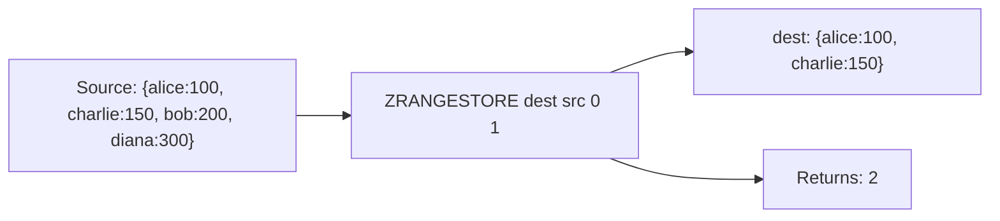

# How to Use ZRANGESTORE in Redis to Store Range Results

Author: [nawazdhandala](https://www.github.com/nawazdhandala)

Tags: Redis, Sorted Set, ZRANGESTORE, Command

Description: Learn how to use the Redis ZRANGESTORE command to compute a sorted set range query and store the result in a destination key in a single atomic operation.

---

## How ZRANGESTORE Works

`ZRANGESTORE` performs a range query on a sorted set (by index, score, or lex order) and stores the result in a destination key, returning the number of stored elements. It combines the range-reading logic of ZRANGE with the result-storing behavior of commands like ZUNIONSTORE.

This is useful when you need to persist a slice of a sorted set for caching, pagination, or further processing, without requiring a separate ZRANGE + ZADD sequence.

ZRANGESTORE was introduced in Redis 6.2.



## Syntax

```redis
ZRANGESTORE dst src min max [BYSCORE | BYLEX] [REV] [LIMIT offset count]
```

- `dst` - destination key; overwrites if exists
- `src` - source sorted set key
- `min` / `max` - range bounds (index, score, or lex depending on flags)
- `BYSCORE` - interpret min/max as scores
- `BYLEX` - interpret min/max as lexicographic boundaries
- `REV` - reverse the range direction
- `LIMIT offset count` - pagination; only valid with BYSCORE or BYLEX

Returns the number of elements stored in the destination.

## Examples

### Store by Index Range

Store the first 3 members (lowest scores) into a destination key.

```redis
ZADD leaderboard 100 "alice" 200 "bob" 150 "charlie" 300 "diana" 50 "eve"
ZRANGESTORE top3 leaderboard 0 2
ZRANGE top3 0 -1 WITHSCORES
```

```text
(integer) 3
---
1) "eve"
2) "50"
3) "alice"
4) "100"
5) "charlie"
6) "150"
```

### Store by Index in Reverse (Top Scores)

```redis
ZRANGESTORE top3_rev leaderboard 0 2 REV
ZRANGE top3_rev 0 -1 WITHSCORES
```

```text
(integer) 3
---
1) "bob"
2) "200"
3) "charlie"
4) "150"
5) "alice"
6) "100"
```

REV means the range is taken from the highest end; the stored result is still in ascending score order.

### Store by Score Range (BYSCORE)

Store all members with scores between 100 and 200.

```redis
ZRANGESTORE scored leaderboard 100 200 BYSCORE
ZRANGE scored 0 -1 WITHSCORES
```

```text
(integer) 3
---
1) "alice"
2) "100"
3) "charlie"
4) "150"
5) "bob"
6) "200"
```

### Store by Score with Pagination (LIMIT)

Store the second page (skip 1, take 2) of the score range.

```redis
ZRANGESTORE page2 leaderboard 0 +inf BYSCORE LIMIT 2 2
ZRANGE page2 0 -1 WITHSCORES
```

```text
(integer) 2
---
1) "charlie"
2) "150"
3) "bob"
4) "200"
```

### Store by Lex Range (BYLEX)

```redis
ZADD words 0 "apple" 0 "apricot" 0 "banana" 0 "cherry" 0 "date"
ZRANGESTORE bwords words "[b" "[d" BYLEX
ZRANGE bwords 0 -1
```

```text
(integer) 2
---
1) "banana"
2) "cherry"
```

### Overwriting Destination

If the destination key already exists, ZRANGESTORE replaces its contents.

```redis
ZADD old 1 "x" 2 "y"
ZRANGESTORE old leaderboard 0 1
ZRANGE old 0 -1 WITHSCORES
```

```text
1) "eve"
2) "50"
3) "alice"
4) "100"
```

Previous contents are replaced.

### Empty Range Clears Destination

If the range produces no results, the destination key is either not created or emptied.

```redis
ZRANGESTORE empty leaderboard 1000 2000 BYSCORE
ZCARD empty
```

```text
(integer) 0
```

## Use Cases

### Caching a Sorted Subset

Cache the top 100 players for a leaderboard page without re-querying the full set each time.

```redis
ZRANGESTORE cache:top100 game:scores 0 99 REV
EXPIRE cache:top100 60
```

### Pagination Snapshot

Materialize a page of results for consistent display.

```redis
ZRANGESTORE page:products:1 products:by_price 0 19 BYSCORE LIMIT 0 20
```

### Slicing a Time Series

Store the last 24 hours of events from a timestamp-scored set.

```redis
ZRANGESTORE events:today all:events 1711814400 1711900800 BYSCORE
```

### Copying a Sorted Set Slice

Copy a range of scores from one set to bootstrap another set.

```redis
ZRANGESTORE bootstrap:scores full:scores 0 49 REV
```

### Pruning to a Subset for Processing

Store only the low-priority items (high score = low priority) for background processing.

```redis
ZRANGESTORE low:priority queue 500 +inf BYSCORE
```

## ZRANGESTORE vs ZRANGE + ZADD

Without ZRANGESTORE, storing a range requires two steps:

```redis
-- Without ZRANGESTORE (non-atomic, two round trips):
ZRANGE source 0 9 WITHSCORES
-- Client receives data, then sends:
ZADD dest score1 member1 score2 member2 ...

-- With ZRANGESTORE (atomic, one round trip):
ZRANGESTORE dest source 0 9
```

ZRANGESTORE is atomic and eliminates the round trip.

## Performance Considerations

- ZRANGESTORE is O(log N + M) where N is the source set size and M is the number of elements stored.
- The result is written directly to the destination in a single operation.
- Because it is atomic, no intermediate state is visible to other clients.

## Summary

`ZRANGESTORE` atomically slices a sorted set by index, score, or lex range and stores the result in a destination key. It supports all ZRANGE modifiers including REV, BYSCORE, BYLEX, and LIMIT, making it a flexible tool for caching ranked subsets, materializing pages, and slicing time series data without extra round trips.
