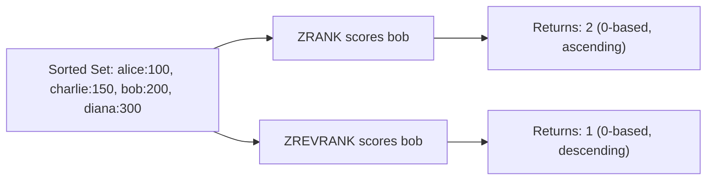

# How to Use ZRANK and ZREVRANK in Redis to Get Member Rank

Author: [nawazdhandala](https://www.github.com/nawazdhandala)

Tags: Redis, Sorted Set, ZRANK, ZREVRANK, Command

Description: Learn how to use ZRANK and ZREVRANK in Redis to get the rank position of a sorted set member in ascending or descending score order, with optional score return.

---

## How ZRANK and ZREVRANK Work

`ZRANK` returns the zero-based rank (position) of a member in a sorted set when ordered by score ascending (lowest score = rank 0). `ZREVRANK` returns the rank in descending order (highest score = rank 0).

In Redis 7.2+, both commands support an optional `WITHSCORE` flag that returns the member's score alongside its rank in a single call.



## Syntax

```redis
ZRANK key member [WITHSCORE]
ZREVRANK key member [WITHSCORE]
```

- `key` - sorted set key
- `member` - the member to look up
- `WITHSCORE` - optional (Redis 7.2+); return the score alongside the rank

ZRANK returns the rank in ascending order (0 = lowest score).
ZREVRANK returns the rank in descending order (0 = highest score).
Both return nil if the member does not exist or the key does not exist.

## Examples

### Setup

```redis
ZADD leaderboard 100 "alice" 200 "bob" 150 "charlie" 300 "diana"
```

### Get Rank (Ascending - ZRANK)

Rank 0 is the member with the lowest score.

```redis
ZRANK leaderboard "alice"
ZRANK leaderboard "charlie"
ZRANK leaderboard "bob"
ZRANK leaderboard "diana"
```

```text
(integer) 0
(integer) 1
(integer) 2
(integer) 3
```

alice has the lowest score (100) so she is rank 0.

### Get Rank (Descending - ZREVRANK)

Rank 0 is the member with the highest score.

```redis
ZREVRANK leaderboard "diana"
ZREVRANK leaderboard "bob"
ZREVRANK leaderboard "charlie"
ZREVRANK leaderboard "alice"
```

```text
(integer) 0
(integer) 1
(integer) 2
(integer) 3
```

diana has the highest score (300) so she is rank 0 in descending order.

### Non-Existent Member Returns Nil

```redis
ZRANK leaderboard "unknown"
```

```text
(nil)
```

### WITHSCORE Flag (Redis 7.2+)

Get rank and score in a single call.

```redis
ZRANK leaderboard "charlie" WITHSCORE
```

```text
1) (integer) 1
2) "150"
```

```redis
ZREVRANK leaderboard "diana" WITHSCORE
```

```text
1) (integer) 0
2) "300"
```

### Non-Existent Key Returns Nil

```redis
DEL ghost
ZRANK ghost "member"
```

```text
(nil)
```

## Rank vs Position in UI

Ranks in Redis are zero-based. When displaying to users, add 1 for a human-readable position.

```redis
ZREVRANK leaderboard "bob"
-- Returns 1 (zero-based)
-- Display as: "Position #2"
```

## Use Cases

### Leaderboard Position Lookup

```redis
ZADD game:scores 4500 "alice" 7200 "bob" 3100 "charlie"
-- bob's rank (higher is better = use ZREVRANK)
ZREVRANK game:scores "bob"
```

```text
(integer) 0
```

bob is rank 1 (#1) on the leaderboard.

### Percentile Calculation

Calculate a user's percentile ranking.

```redis
ZADD test:scores 75 "u1" 80 "u2" 60 "u3" 95 "u4" 70 "u5"
-- u2's rank (ascending = how many scored lower)
ZRANK test:scores "u2"
-- Returns 3 (3 users scored lower)
ZCARD test:scores
-- Returns 5
-- Percentile = (3 / 5) * 100 = 60th percentile
```

### Check If User Is in Top N

```redis
ZADD scores 100 "a" 200 "b" 300 "c" 400 "d" 500 "e"
ZREVRANK scores "c"
-- Returns 2 (0-based)
-- Top 3? 2 < 3, yes
```

### Display User's Standing

```redis
ZADD likes 120 "post:1" 350 "post:2" 80 "post:3"
ZREVRANK likes "post:3"
```

```text
(integer) 2
```

"post:3" is the 3rd most liked (rank index 2 = position 3).

### Conditional Processing Based on Rank

Process only top-10 members.

```redis
ZREVRANK leaderboard "alice"
-- If result <= 9, alice is in the top 10
```

## Ties in Ranking

When two members have equal scores, they are sorted lexicographically by member name. ZRANK and ZREVRANK reflect this tiebreaker.

```redis
ZADD tied 100 "zebra" 100 "apple"
ZRANK tied "apple"
ZRANK tied "zebra"
```

```text
(integer) 0
(integer) 1
```

"apple" sorts before "zebra" lexicographically.

## Performance Considerations

- ZRANK and ZREVRANK are O(log N) where N is the sorted set size.
- The WITHSCORE option (Redis 7.2+) does not add overhead - the score is already retrieved during rank lookup.
- For bulk rank lookups across many members, consider pipelining multiple ZRANK calls.

## Summary

`ZRANK` and `ZREVRANK` give you the zero-based position of any member in a sorted set, in ascending or descending score order respectively. They are essential for leaderboard position displays, percentile calculations, and top-N membership checks. The optional `WITHSCORE` flag in Redis 7.2+ allows fetching rank and score in a single round trip.
