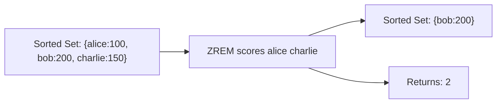

# How to Use ZREM in Redis to Remove Sorted Set Members

Author: [nawazdhandala](https://www.github.com/nawazdhandala)

Tags: Redis, Sorted Set, ZREM, Command

Description: Learn how to use the Redis ZREM command to remove one or more members from a sorted set, with examples for leaderboard cleanup, expiry, and access revocation.

---

## How ZREM Works

`ZREM` removes one or more members from a Redis sorted set. Members that do not exist in the set are silently ignored. The command returns the count of members that were actually removed.

When all members are removed, the key is automatically deleted. ZREM is O(M log N) where M is the number of members being removed and N is the total set size.



## Syntax

```redis
ZREM key member [member ...]
```

- `key` - sorted set key
- `member [member ...]` - one or more members to remove

Returns the number of members removed (members that existed in the set).

## Examples

### Remove a Single Member

```redis
ZADD leaderboard 100 "alice" 200 "bob" 150 "charlie"
ZREM leaderboard "alice"
ZRANGE leaderboard 0 -1 WITHSCORES
```

```text
(integer) 1
---
1) "charlie"
2) "150"
3) "bob"
4) "200"
```

### Remove Multiple Members at Once

```redis
ZREM leaderboard "charlie" "bob"
ZRANGE leaderboard 0 -1
```

```text
(integer) 2
---
(empty array)
```

### Non-Existent Member Returns 0

```redis
ZADD myset 10 "a"
ZREM myset "z"
```

```text
(integer) 0
```

### Mix of Existing and Non-Existing Members

```redis
ZADD myset 10 "a" 20 "b" 30 "c"
ZREM myset "a" "zzz" "c"
ZRANGE myset 0 -1
```

```text
(integer) 2
---
1) "b"
```

"a" and "c" were removed; "zzz" did not exist.

### Auto-Delete When Empty

```redis
DEL tiny
ZADD tiny 1 "only"
ZREM tiny "only"
EXISTS tiny
```

```text
(integer) 0
```

### Non-Existent Key Returns 0

```redis
DEL ghost
ZREM ghost "member"
```

```text
(integer) 0
```

## Use Cases

### Remove a Player from a Leaderboard

```redis
ZADD game:scores 5000 "player:alice" 7000 "player:bob"
-- Player left the game
ZREM game:scores "player:alice"
ZRANGE game:scores 0 -1 WITHSCORES
```

```text
1) "player:bob"
2) "7000"
```

### Revoking Access

Remove a user from an authorized set.

```redis
ZADD authorized:users 1711900000 "user:42" 1711900100 "user:99"
ZREM authorized:users "user:42"
ZSCORE authorized:users "user:42"
```

```text
(nil)
```

### Removing Expired Sessions

Combine with ZRANGEBYSCORE to first find, then remove expired entries.

```redis
ZADD sessions 1711900000 "sess:A" 1711800000 "sess:B" 1711900500 "sess:C"
-- Find expired (score < now)
ZRANGEBYSCORE sessions -inf 1711899999
-- Returns: sess:B
ZREM sessions "sess:B"
```

### Cleaning Up a Rate Limiter Window

Remove old request timestamps that fell outside the window.

```redis
ZADD requests:user:42 1711899900 "r1" 1711899950 "r2" 1711900100 "r3"
-- Remove requests older than 60 seconds before now (1711900000)
ZRANGEBYSCORE requests:user:42 -inf (1711899940
-- Find old ones, then:
ZREM requests:user:42 "r1"
```

### Disabling a Feature Flag for a User

```redis
ZADD feature:beta 1 "user:1" 1 "user:2" 1 "user:3"
ZREM feature:beta "user:2"
ZSCORE feature:beta "user:2"
```

```text
(nil)
```

## Bulk Removal: ZREMRANGEBYSCORE and ZREMRANGEBYRANK

For removing many members by range, use these specialized commands instead of batching ZREM:

```redis
-- Remove all members with score between 0 and 100
ZREMRANGEBYSCORE scores 0 100

-- Remove the bottom 5 members by rank
ZREMRANGEBYRANK scores 0 4
```

## Performance Considerations

- ZREM is O(M log N) where M is the number of members being removed and N is the sorted set size.
- For removing a range of members (e.g., expired entries), ZREMRANGEBYSCORE or ZREMRANGEBYRANK is more efficient than calling ZREM with many individual members.
- ZREM never errors on non-existent members or keys, simplifying error handling.

## Summary

`ZREM` removes one or more members from a sorted set, silently ignoring non-existent ones and returning the count of actual removals. It auto-deletes the key when the set becomes empty. For range-based removal (e.g., old timestamps, bottom N members), prefer ZREMRANGEBYSCORE or ZREMRANGEBYRANK for better efficiency.
