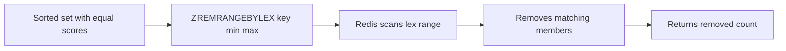

# How to Use ZREMRANGEBYLEX in Redis to Remove by Lexicographic Range

Author: [nawazdhandala](https://www.github.com/nawazdhandala)

Tags: Redis, Sorted Set, ZREMRANGEBYLEX, Command

Description: Learn how to use ZREMRANGEBYLEX in Redis to remove members from a sorted set by lexicographic range when all members share the same score.

---

## Introduction

`ZREMRANGEBYLEX` removes all members of a sorted set whose names fall within a specified lexicographic (alphabetical) range. It is designed for sorted sets where all members share the same score, enabling dictionary-style range deletions such as pruning an autocomplete index or clearing a prefix group.

## Syntax

```redis
ZREMRANGEBYLEX key min max
```

- `min` and `max` use the same interval notation as `ZRANGEBYLEX`:
  - `[value` -- inclusive lower bound
  - `(value` -- exclusive lower bound
  - `-` -- negative infinity (start of alphabet)
  - `+` -- positive infinity (end of alphabet)
- Returns the number of members removed.

## How It Works



## Basic Example

```redis
ZADD words 0 "apple" 0 "apricot" 0 "banana" 0 "blueberry" 0 "cherry"

-- Remove all words starting with 'b' (b prefix inclusive through bz)
ZREMRANGEBYLEX words "[b" "[bz"
-- (integer) 2

ZRANGE words 0 -1
-- 1) "apple"
-- 2) "apricot"
-- 3) "cherry"
```

## Inclusive vs Exclusive Bounds

```redis
ZADD letters 0 "a" 0 "b" 0 "c" 0 "d" 0 "e"

-- Remove b through d inclusive
ZREMRANGEBYLEX letters "[b" "[d"
-- (integer) 3

ZRANGE letters 0 -1
-- 1) "a"
-- 2) "e"
```

```redis
ZADD letters 0 "a" 0 "b" 0 "c" 0 "d" 0 "e"

-- Remove strictly after b up to but not including d
ZREMRANGEBYLEX letters "(b" "(d"
-- (integer) 1   (only "c" removed)

ZRANGE letters 0 -1
-- 1) "a"
-- 2) "b"
-- 3) "d"
-- 4) "e"
```

## Remove Everything

```redis
ZADD myset 0 "x" 0 "y" 0 "z"

ZREMRANGEBYLEX myset "-" "+"
-- (integer) 3
```

## Real-World Use Cases

### Autocomplete Index Pruning

Remove all autocomplete suggestions starting with a deprecated prefix:

```redis
ZADD autocomplete 0 "go" 0 "golang" 0 "goroutine" 0 "grpc" 0 "java" 0 "javascript"

-- Remove all "go" prefix entries
ZREMRANGEBYLEX autocomplete "[go" "[go\xff"
-- (integer) 3

ZRANGE autocomplete 0 -1
-- 1) "grpc"
-- 2) "java"
-- 3) "javascript"
```

### Namespace Cleanup

```redis
ZADD index 0 "user:1" 0 "user:2" 0 "user:3" 0 "post:1" 0 "post:2"

-- Remove all user entries
ZREMRANGEBYLEX index "[user:" "[user:\xff"
-- (integer) 3

ZRANGE index 0 -1
-- 1) "post:1"
-- 2) "post:2"
```

### Clear a Range of Alphabetical Entries

```redis
ZADD catalog 0 "aardvark" 0 "albatross" 0 "bear" 0 "cat" 0 "dog" 0 "eagle"

-- Remove entries from "b" through "d" inclusive
ZREMRANGEBYLEX catalog "[b" "[d\xff"
-- (integer) 3

ZRANGE catalog 0 -1
-- 1) "aardvark"
-- 2) "albatross"
-- 3) "eagle"
```

## Important: Requires Equal Scores

`ZREMRANGEBYLEX` is only meaningful when all members share the same score. If members have different scores, the lex ordering is not guaranteed to be consistent:

```redis
-- Do NOT mix scores when using ZREMRANGEBYLEX
ZADD mixed 1 "apple" 2 "banana" 3 "cherry"
-- Lex operations on mixed-score sets produce undefined results
```

## Time Complexity

**O(log(N) + M)** where N is the number of elements in the set and M is the number of elements removed.

## Related Commands

| Command             | Purpose                            |
|---------------------|------------------------------------|
| `ZRANGEBYLEX`       | Retrieve members by lex range      |
| `ZLEXCOUNT`         | Count members in lex range         |
| `ZREMRANGEBYRANK`   | Remove by rank position            |
| `ZREMRANGEBYSCORE`  | Remove by score range              |

## Summary

`ZREMRANGEBYLEX` removes sorted set members within a lexicographic range, making it ideal for cleaning up equal-score sets used as dictionaries or autocomplete indexes. Use inclusive `[` or exclusive `(` brackets for precise range control. Only use it on sets where all members share the same score to ensure correct ordering.
