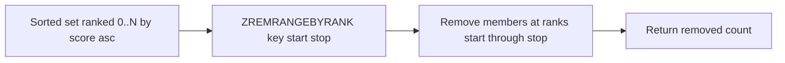

# How to Use ZREMRANGEBYRANK in Redis to Remove by Rank Range

Author: [nawazdhandala](https://www.github.com/nawazdhandala)

Tags: Redis, Sorted set, ZREMRANGEBYRANK, Command

Description: Learn how to use ZREMRANGEBYRANK in Redis to remove members within a rank range, useful for capping leaderboard sizes and trimming sorted sets.

---

## Introduction

`ZREMRANGEBYRANK` removes all members of a sorted set whose rank (zero-based position ordered by score ascending) falls within a specified range. It is the primary tool for capping sorted set sizes, trimming old entries, and enforcing "top N" constraints.

## Syntax

```redis
ZREMRANGEBYRANK key start stop
```

- `start` and `stop` are zero-based rank indices.
- Negative indices count from the end: `-1` is the last element (highest score), `-2` is second from last, and so on.
- Both bounds are inclusive.
- Returns the number of elements removed.

## How It Works



## Basic Example

```redis
ZADD scores 100 "alice" 200 "bob" 300 "charlie" 400 "diana" 500 "eve"
-- Ranks: alice=0, bob=1, charlie=2, diana=3, eve=4

-- Remove the two lowest-ranked members
ZREMRANGEBYRANK scores 0 1
-- (integer) 2

ZRANGE scores 0 -1 WITHSCORES
-- 1) "charlie"
-- 2) "300"
-- 3) "diana"
-- 4) "400"
-- 5) "eve"
-- 6) "500"
```

## Using Negative Indices

```redis
ZADD scores 100 "alice" 200 "bob" 300 "charlie" 400 "diana" 500 "eve"

-- Remove the highest scorer only (rank -1)
ZREMRANGEBYRANK scores -1 -1
-- (integer) 1

ZRANGE scores 0 -1 WITHSCORES
-- 1) "alice"
-- 2) "100"
-- 3) "bob"
-- 4) "200"
-- 5) "charlie"
-- 6) "300"
-- 7) "diana"
-- 8) "400"
```

## Real-World Use Cases

### Cap a Leaderboard to Top 100

After adding a new entry, trim the leaderboard to the top 100 high scores:

```redis
ZADD leaderboard 9800 "new-player"
-- Keep only top 100 (ranks -100 to -1 from the end)
-- Remove all elements from rank 0 up to (total_size - 101)

ZCARD leaderboard
-- (integer) 150

-- Remove bottom 50 (ranks 0 through 49)
ZREMRANGEBYRANK leaderboard 0 49
-- (integer) 50
```

### Maintain a Fixed-Size Time-Series Sorted Set

```redis
-- Insert a new event
ZADD events 1743010000 "event:latest"

-- Remove oldest entries to keep only 1000 most recent
ZREMRANGEBYRANK events 0 -1001
-- Removes all but the newest 1000
```

### Clear Lowest-Priority Jobs

```redis
ZADD jobs:priority 1 "job:low-1" 2 "job:low-2" 5 "job:medium" 10 "job:high"

-- Remove all jobs with the lowest two ranks
ZREMRANGEBYRANK jobs:priority 0 1
-- (integer) 2
```

### Remove All Members

```redis
ZADD myset 1 "a" 2 "b" 3 "c"
ZREMRANGEBYRANK myset 0 -1
-- (integer) 3
```

## Combining with ZCARD for Safe Capping

```redis
-- Atomic cap using a Lua script
EVAL "
  local size = redis.call('ZCARD', KEYS[1])
  local limit = tonumber(ARGV[1])
  if size > limit then
    redis.call('ZREMRANGEBYRANK', KEYS[1], 0, size - limit - 1)
  end
  return redis.call('ZCARD', KEYS[1])
" 1 leaderboard 100
```

## Time Complexity

**O(log(N) + M)** where N is the total number of elements in the set and M is the number of elements removed.

## Related Commands

| Command              | Removes by      |
|----------------------|-----------------|
| `ZREMRANGEBYRANK`    | Position (rank) |
| `ZREMRANGEBYSCORE`   | Score value     |
| `ZREMRANGEBYLEX`     | Lex range       |
| `ZPOPMIN`            | Lowest scores   |
| `ZPOPMAX`            | Highest scores  |

## Summary

`ZREMRANGEBYRANK` removes sorted set members by their rank position, making it the ideal command for capping leaderboards, trimming time-series data, and enforcing maximum set sizes. Use negative indices to remove from the high end, and combine with `ZCARD` or Lua scripts for safe atomic capping.
