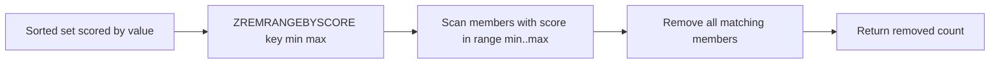

# How to Use ZREMRANGEBYSCORE in Redis to Remove by Score Range

Author: [nawazdhandala](https://www.github.com/nawazdhandala)

Tags: Redis, Sorted set, ZREMRANGEBYSCORE, Command

Description: Learn how to use ZREMRANGEBYSCORE in Redis to remove members whose scores fall within a specified numeric range, useful for expiry and cleanup.

---

## Introduction

`ZREMRANGEBYSCORE` removes all members of a sorted set whose scores fall within a specified numeric range. It is the standard tool for expiring time-based entries, clearing old scheduled jobs, and enforcing score-based retention policies.

## Syntax

```redis
ZREMRANGEBYSCORE key min max
```

- `min` and `max` are numeric score bounds.
- `-inf` and `+inf` represent negative and positive infinity.
- Prefix a value with `(` to make the bound exclusive.
- Both bounds are inclusive by default.
- Returns the number of members removed.

## How It Works



## Basic Example

```redis
ZADD prices 10 "item:a" 20 "item:b" 30 "item:c" 40 "item:d" 50 "item:e"

-- Remove items with price between 20 and 40 inclusive
ZREMRANGEBYSCORE prices 20 40
-- (integer) 3

ZRANGE prices 0 -1 WITHSCORES
-- 1) "item:a"
-- 2) "10"
-- 3) "item:e"
-- 4) "50"
```

## Using -inf and +inf

```redis
ZADD scores 100 "alice" 200 "bob" 300 "charlie"

-- Remove everyone with score below 250
ZREMRANGEBYSCORE scores -inf 249
-- (integer) 2

ZRANGE scores 0 -1 WITHSCORES
-- 1) "charlie"
-- 2) "300"
```

## Exclusive Bounds

```redis
ZADD scores 100 "alice" 200 "bob" 300 "charlie" 400 "diana"

-- Remove scores strictly between 100 and 400 (excluding endpoints)
ZREMRANGEBYSCORE scores "(100" "(400"
-- (integer) 2

ZRANGE scores 0 -1 WITHSCORES
-- 1) "alice"
-- 2) "100"
-- 3) "diana"
-- 4) "400"
```

## Real-World Use Cases

### Expire Old Events from a Time-Series Set

Use Unix timestamps as scores to implement expiry:

```redis
ZADD events 1742900000 "ev:1" 1742950000 "ev:2" 1743000000 "ev:3"

-- Remove events older than one hour ago (assume now = 1743000000)
ZREMRANGEBYSCORE events -inf 1742996400
-- (integer) 2
```

### Clean Up Expired Delayed Jobs

```redis
ZADD jobs:delayed 1742999000 "job:1" 1743001000 "job:2" 1743005000 "job:3"

-- Remove jobs scheduled before now (Unix time 1743000000)
ZREMRANGEBYSCORE jobs:delayed -inf 1743000000
-- (integer) 1
```

### Prune Low-Score Search Results Cache

```redis
ZADD search:cache 0.1 "doc:stale-1" 0.2 "doc:stale-2" 0.8 "doc:relevant" 0.9 "doc:top"

-- Remove results with relevance score below 0.5
ZREMRANGEBYSCORE search:cache -inf "(0.5"
-- (integer) 2
```

### Rate Limit Sliding Window Cleanup

Remove request timestamps outside the current window:

```redis
-- Current time: 1743000060
-- Window: last 60 seconds

ZREMRANGEBYSCORE ratelimit:user:42 -inf 1742999999
-- Removes all timestamps older than the window
```

## Remove All Members

```redis
ZADD myset 1 "a" 2 "b" 3 "c"
ZREMRANGEBYSCORE myset -inf +inf
-- (integer) 3
```

## Time Complexity

**O(log(N) + M)** where N is the total number of elements and M is the number removed.

## Related Commands

| Command             | Removes by          |
|---------------------|---------------------|
| `ZREMRANGEBYSCORE`  | Score range         |
| `ZREMRANGEBYRANK`   | Rank position       |
| `ZREMRANGEBYLEX`    | Lex range           |
| `ZRANGEBYSCORE`     | Read by score range |

## Summary

`ZREMRANGEBYSCORE` deletes all sorted set members whose scores fall within a specified range, including support for `-inf`, `+inf`, and exclusive bounds. It is the standard approach for time-based expiry, delayed job cleanup, and score-threshold pruning. For position-based removal, use `ZREMRANGEBYRANK` instead.
