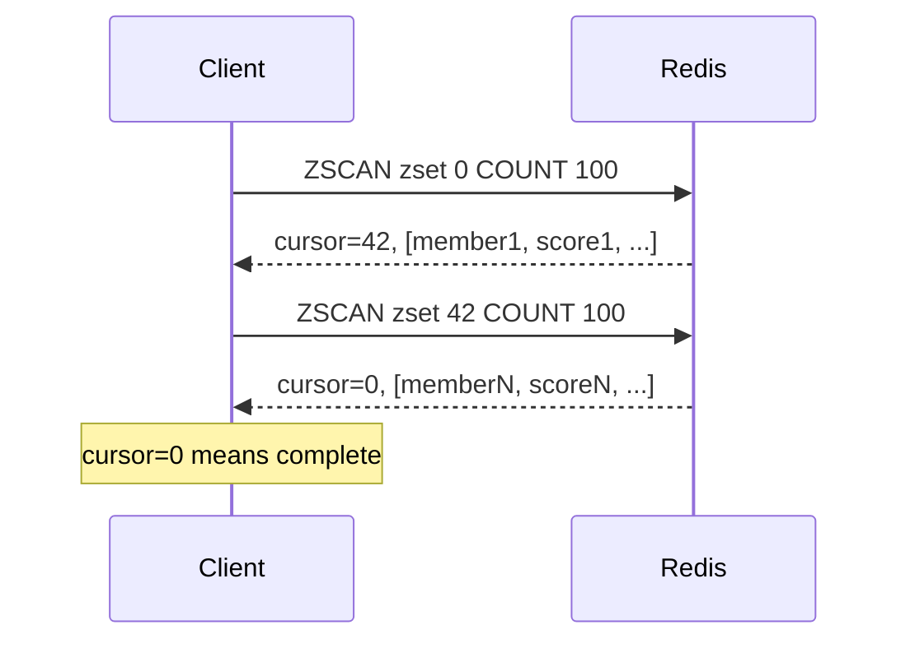

# How to Use ZSCAN in Redis to Iterate Over Sorted Set Members

Author: [nawazdhandala](https://www.github.com/nawazdhandala)

Tags: Redis, Sorted Set, ZSCAN, Command

Description: Learn how to use the Redis ZSCAN command to safely iterate over sorted set members and scores using a cursor, avoiding blocking on large sets.

---

## How ZSCAN Works

`ZSCAN` is a cursor-based iterator for Redis sorted sets. It returns a batch of members along with their scores per call, plus a cursor to continue the iteration. You call ZSCAN repeatedly with the returned cursor until it returns to `0`, signaling the full set has been scanned.

ZSCAN is the safe alternative to ZRANGE with full range for large sorted sets. It does not block the Redis server because it yields results incrementally, making it suitable for production use on sets of any size.



## Syntax

```redis
ZSCAN key cursor [MATCH pattern] [COUNT count]
```

- `key` - sorted set key
- `cursor` - start with `0`; use the cursor returned from the previous call; `0` again signals completion
- `MATCH pattern` - optional; filter members by a glob pattern
- `COUNT count` - optional hint for how many members to return per call (default 10)

Returns a two-element array: `[next_cursor, [member, score, member, score, ...]]`. When `next_cursor` is `0`, the scan is complete.

## Examples

### Simple Full Scan

```redis
ZADD scores 100 "alice" 200 "bob" 150 "charlie"
ZSCAN scores 0
```

```text
1) "0"
2) 1) "alice"
   2) "100"
   3) "charlie"
   4) "150"
   5) "bob"
   6) "200"
```

Cursor `0` means complete in one call (small set).

### Iterating with COUNT Hint

```redis
ZSCAN scores 0 COUNT 2
```

For small sets using listpack encoding, all members are returned regardless of COUNT. COUNT matters most for large hash-table-backed sets.

### Filtering with MATCH

```redis
ZADD users 10 "user:alice" 20 "user:bob" 30 "admin:carol" 40 "user:diana"
ZSCAN users 0 MATCH "user:*"
```

```text
1) "0"
2) 1) "user:alice"
   2) "10"
   3) "user:bob"
   4) "20"
   5) "user:diana"
   6) "40"
```

Only members matching the pattern are returned.

### Multi-Page Iteration on a Large Set

For a large sorted set, the cursor advances across multiple calls.

```bash
# Start
ZSCAN bigset 0 COUNT 1000
# Returns: cursor=12345, [batch1 with scores]

# Continue
ZSCAN bigset 12345 COUNT 1000
# Returns: cursor=67890, [batch2 with scores]

# Finish
ZSCAN bigset 67890 COUNT 1000
# Returns: cursor=0, [last batch with scores]
```

### MATCH with Wildcard Patterns

```redis
ZADD items 1 "prod:redis:1" 2 "prod:mysql:2" 3 "prod:redis:3" 4 "svc:api"
ZSCAN items 0 MATCH "prod:redis:*"
```

```text
1) "0"
2) 1) "prod:redis:1"
   2) "1"
   3) "prod:redis:3"
   4) "3"
```

## Parsing ZSCAN Results

ZSCAN returns members and scores interleaved as a flat array. In application code, process them in pairs.

```text
result_array = ["alice", "100", "bob", "200", "charlie", "150"]
-- Process as pairs:
-- ("alice", "100"), ("bob", "200"), ("charlie", "150")
```

## Full Iteration Pattern in Pseudocode

```text
cursor = 0
loop:
    cursor, entries = ZSCAN myzset cursor COUNT 100
    for i in range(0, len(entries), 2):
        member = entries[i]
        score = float(entries[i+1])
        process(member, score)
    if cursor == "0":
        break
```

## Use Cases

### Safe Export of Large Sorted Set

Export all member-score pairs without blocking Redis.

```redis
ZSCAN rankings 0 COUNT 500
-- Process batch
ZSCAN rankings <cursor> COUNT 500
-- Repeat until cursor = 0
```

### Searching Members by Name Pattern

Find all leaderboard entries for a specific game.

```redis
ZADD leaderboard 5000 "game1:alice" 7000 "game2:bob" 6000 "game1:charlie"
ZSCAN leaderboard 0 MATCH "game1:*"
```

```text
1) "0"
2) 1) "game1:alice"
   2) "5000"
   3) "game1:charlie"
   4) "6000"
```

### Periodic Cleanup of Stale Members

Scan through a time-indexed sorted set and remove expired entries.

```redis
-- Scan and inspect each member's score (timestamp)
ZSCAN events 0 COUNT 100
-- For each member with score < threshold, ZREM it
ZREM events "old:event:1"
```

### Auditing or Reporting

Generate a report of all scores without holding a full snapshot in memory.

```redis
ZSCAN activity:scores 0 COUNT 200
-- Accumulate statistics from each batch
```

## ZSCAN vs ZRANGE for Full Iteration

| Aspect | ZRANGE 0 -1 | ZSCAN |
|---|---|---|
| Blocks server | For large sets | No |
| Memory safe | No | Yes |
| Returns scores | With WITHSCORES | Always (interleaved) |
| Use case | Small, bounded sets | Large or unknown size |

## Important Guarantees

- Members present throughout the scan will appear at least once.
- Members added or removed during the scan may or may not appear.
- COUNT is a hint; actual returned count may vary.
- Cursor `0` in the response means completion, not an empty set.

## Performance Considerations

- Each ZSCAN call is O(N) where N is the number of members returned.
- Total complexity across a full scan is O(S) where S is the set size.
- Larger COUNT hints reduce round trips but increase per-call data transfer.

## Summary

`ZSCAN` provides safe, incremental iteration over Redis sorted set members and their scores using a cursor. It avoids the blocking behavior of full ZRANGE on large sets, supports MATCH for server-side pattern filtering, and returns members interleaved with scores. Always iterate until the returned cursor is `0` to complete the scan.
