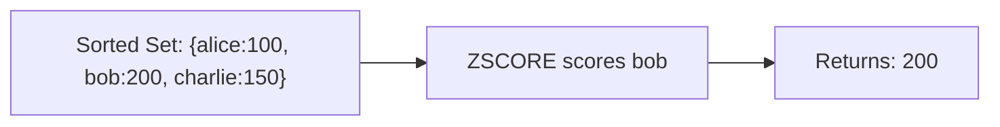

# How to Use ZSCORE in Redis to Get Member Score

Author: [nawazdhandala](https://www.github.com/nawazdhandala)

Tags: Redis, Sorted Set, ZSCORE, Command

Description: Learn how to use the Redis ZSCORE command to retrieve the score of a member in a sorted set, with examples for leaderboards, rate limiting, and score tracking.

---

## How ZSCORE Works

`ZSCORE` returns the score associated with a specific member in a Redis sorted set. The score is returned as a bulk string representing a double-precision floating-point number.

ZSCORE is an O(1) operation and is the primary way to read a member's current score without retrieving its rank or the full set. If the member or key does not exist, ZSCORE returns nil.



## Syntax

```redis
ZSCORE key member
```

- `key` - the sorted set key
- `member` - the member whose score to retrieve

Returns the score as a string, or nil if the member or key does not exist.

## Examples

### Get a Member's Score

```redis
ZADD leaderboard 4500 "alice" 7200 "bob" 3100 "charlie"
ZSCORE leaderboard "bob"
```

```text
"7200"
```

### Non-Existent Member Returns Nil

```redis
ZSCORE leaderboard "unknown"
```

```text
(nil)
```

### Non-Existent Key Returns Nil

```redis
DEL ghost
ZSCORE ghost "member"
```

```text
(nil)
```

### Floating-Point Scores

ZSCORE preserves floating-point precision.

```redis
ZADD prices 9.99 "product:A" 14.50 "product:B"
ZSCORE prices "product:A"
```

```text
"9.99"
```

### After Score Update

```redis
ZADD leaderboard 8000 "alice"
ZSCORE leaderboard "alice"
```

```text
"8000"
```

### Infinity Scores

```redis
ZADD tasks +inf "future:task" -inf "urgent:task"
ZSCORE tasks "future:task"
ZSCORE tasks "urgent:task"
```

```text
"inf"
"-inf"
```

## Use Cases

### Check a User's Points

```redis
ZADD user:points 1500 "user:42"
ZSCORE user:points "user:42"
```

```text
"1500"
```

### Verify Rate Limit Token Count

Use a sorted set where scores track counts.

```redis
ZADD ratelimit:api 25 "user:42"
ZSCORE ratelimit:api "user:42"
```

```text
"25"
```

Compare against the limit threshold in application logic.

### Get Current Price from a Price Index

```redis
ZADD product:prices 29.99 "sku:1001" 49.99 "sku:1002"
ZSCORE product:prices "sku:1001"
```

```text
"29.99"
```

### Track Last Seen Timestamp

Use UNIX timestamps as scores to record last-activity time.

```redis
ZADD active:users 1711900000 "user:1" 1711900100 "user:2"
ZSCORE active:users "user:1"
```

```text
"1711900000"
```

### Confirm ZADD Result

Check whether a ZADD operation actually changed the score.

```redis
ZSCORE scores "alice"
-- Returns "100"
ZADD scores GT 90 "alice"
ZSCORE scores "alice"
-- Still "100" because GT rejected the lower score
```

## ZSCORE vs ZMSCORE

`ZSCORE` retrieves the score for a single member. `ZMSCORE` (Redis 6.2+) retrieves scores for multiple members in a single call.

```redis
-- Single lookup
ZSCORE scores "alice"

-- Batch lookup
ZMSCORE scores "alice" "bob" "charlie"
```

For multiple lookups, ZMSCORE is more efficient.

## Checking Member Existence with ZSCORE

Since ZSCORE returns nil for non-existent members, it doubles as a membership check.

```redis
ZSCORE myset "member"
-- nil: not a member
-- any value: is a member with that score
```

## Performance Considerations

- ZSCORE is O(1) - constant time regardless of sorted set size.
- It is safe to call on very large sorted sets without performance concerns.
- For multiple score lookups, use ZMSCORE (Redis 6.2+) to batch them into one round trip.

## Summary

`ZSCORE` provides instant O(1) access to any member's score in a Redis sorted set. It returns nil for missing members and keys, making it also useful as a membership check. For retrieving scores of multiple members at once, use ZMSCORE. ZSCORE is an essential building block for leaderboard lookups, rate limit checks, and any access pattern that reads a member's current numeric value.
