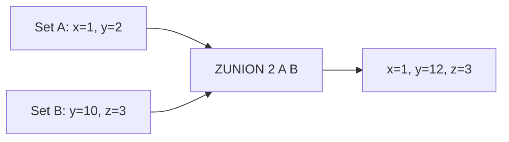

# How to Use ZUNION in Redis to Find Sorted Set Unions

Author: [nawazdhandala](https://www.github.com/nawazdhandala)

Tags: Redis, Sorted Set, ZUNION, Command

Description: Learn how to use ZUNION in Redis to merge multiple sorted sets with score aggregation options, returning all unique members with combined scores.

---

## Introduction

`ZUNION` returns the union of two or more sorted sets: all members that appear in at least one of the provided sets. When a member appears in multiple sets, its scores are combined according to the specified aggregation strategy (SUM by default). Weights can scale scores before aggregation. The source sets are not modified.

Available since Redis 6.2.

## Syntax

```redis
ZUNION numkeys key [key ...] [WEIGHTS weight [weight ...]] [AGGREGATE SUM|MIN|MAX] [WITHSCORES]
```

- `numkeys` must match the number of keys provided.
- `WEIGHTS` scales each set's scores before aggregation.
- `AGGREGATE` controls score combination: `SUM` (default), `MIN`, or `MAX`.
- `WITHSCORES` includes scores in the returned output.

## How It Works



`y` appears in both sets; with SUM aggregation its score is `2 + 10 = 12`.

## Basic Examples

### Default SUM Aggregation

```redis
ZADD set:a 1 "alpha" 2 "beta" 3 "gamma"
ZADD set:b 10 "beta" 20 "delta"

ZUNION 2 set:a set:b WITHSCORES
-- 1) "alpha"
-- 2) "1"
-- 3) "gamma"
-- 4) "3"
-- 5) "beta"
-- 6) "12"   (2+10)
-- 7) "delta"
-- 8) "20"
```

### MIN Aggregation

```redis
ZUNION 2 set:a set:b AGGREGATE MIN WITHSCORES
-- 1) "alpha"
-- 2) "1"
-- 3) "beta"
-- 4) "2"
-- 5) "gamma"
-- 6) "3"
-- 7) "delta"
-- 8) "20"
```

### MAX Aggregation

```redis
ZUNION 2 set:a set:b AGGREGATE MAX WITHSCORES
-- 1) "alpha"
-- 2) "1"
-- 3) "gamma"
-- 4) "3"
-- 5) "beta"
-- 6) "10"
-- 7) "delta"
-- 8) "20"
```

## Using WEIGHTS

Scale each set's scores before aggregation:

```redis
ZADD activity:week1 100 "alice" 80 "bob"
ZADD activity:week2 120 "alice" 90 "charlie"

-- Week 1 counts 30%, week 2 counts 70%
ZUNION 2 activity:week1 activity:week2 WEIGHTS 0.3 0.7 WITHSCORES
-- alice: 100*0.3 + 120*0.7 = 30 + 84 = 114
-- bob:   80*0.3 = 24
-- charlie: 90*0.7 = 63
-- 1) "bob"
-- 2) "24"
-- 3) "charlie"
-- 4) "63"
-- 5) "alice"
-- 6) "114"
```

## Real-World Use Cases

### Combined Leaderboard from Multiple Games

```redis
ZADD game:chess  1500 "alice" 1200 "bob"
ZADD game:go     900 "alice" 1600 "charlie"
ZADD game:poker  800 "bob" 1100 "diana"

ZUNION 3 game:chess game:go game:poker WITHSCORES
-- Combines all players with summed scores across games
```

### Merged Tag Frequency

```redis
ZADD tags:category:tech  5 "redis" 3 "postgres" 2 "kafka"
ZADD tags:category:tools 4 "redis" 6 "docker" 1 "postgres"

ZUNION 2 tags:category:tech tags:category:tools AGGREGATE SUM WITHSCORES
-- 1) "kafka"
-- 2) "2"
-- 3) "docker"
-- 4) "6"
-- 5) "postgres"
-- 6) "4"
-- 7) "redis"
-- 8) "9"
```

### Unified Activity Score

```redis
ZADD user:logins   10 "u:1" 5 "u:2"
ZADD user:purchases 50 "u:2" 30 "u:3"

ZUNION 2 user:logins user:purchases WITHSCORES
-- u:1=10, u:2=55, u:3=30
```

## Behavior with Missing Keys

```redis
ZADD set:a 1 "x" 2 "y"
ZUNION 2 set:a nonexistent WITHSCORES
-- Returns all members of set:a unchanged
```

## Time Complexity

**O(N) + O(M log M)** where N is the sum of all elements across input sets and M is the number of elements in the result.

## ZUNION vs ZUNIONSTORE

| Command       | Returns              | Stores |
|---------------|----------------------|--------|
| `ZUNION`      | Members (scores)     | No     |
| `ZUNIONSTORE` | Count                | Yes    |

## Summary

`ZUNION` merges multiple sorted sets into a combined result with configurable score aggregation (SUM, MIN, MAX) and per-set weighting. It is ideal for unified leaderboards, merged tag frequencies, and multi-source activity scoring. Use `ZUNIONSTORE` when you need to persist the union for subsequent operations.
