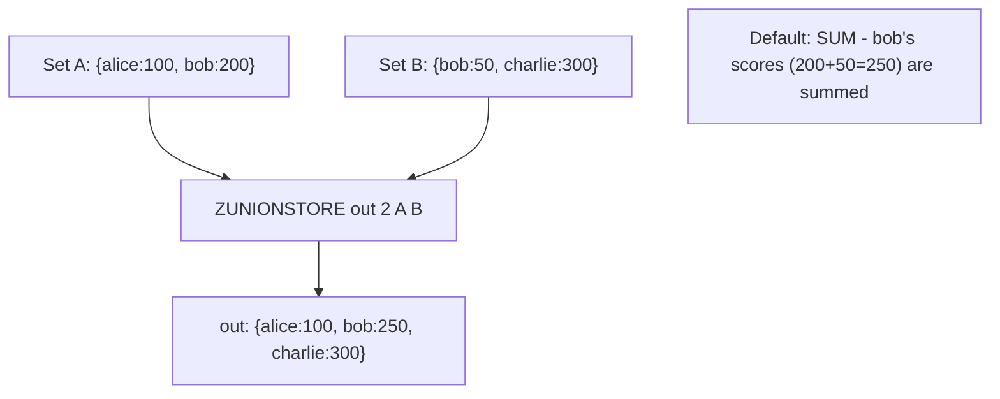

# How to Use ZUNIONSTORE in Redis for Sorted Set Union

Author: [nawazdhandala](https://www.github.com/nawazdhandala)

Tags: Redis, Sorted Set, ZUNIONSTORE, Command

Description: Learn how to use ZUNIONSTORE in Redis to compute the union of multiple sorted sets with score aggregation, storing the result in a destination key.

---

## How ZUNIONSTORE Works

`ZUNIONSTORE` computes the union of multiple sorted sets and stores the result in a destination key. A member appearing in multiple input sets appears once in the result; its score is aggregated according to the specified aggregate function (SUM, MIN, or MAX). Input sets can be weighted before aggregation.

In Redis 6.2+, the non-storing variant `ZUNION` is also available for returning the result directly without storing.



## Syntax

```redis
ZUNIONSTORE destination numkeys key [key ...] [WEIGHTS weight [weight ...]] [AGGREGATE SUM | MIN | MAX]
```

- `destination` - key to store the result; overwrites if exists
- `numkeys` - the count of input keys
- `key [key ...]` - sorted sets to union
- `WEIGHTS` - multiply each set's scores by the corresponding weight before aggregation
- `AGGREGATE` - how to combine scores for members in multiple sets (default: SUM)

Returns the number of members in the destination set.

## Examples

### Basic Union with SUM (Default)

```redis
ZADD setA 100 "alice" 200 "bob"
ZADD setB 50 "bob" 300 "charlie"
ZUNIONSTORE result 2 setA setB
ZRANGE result 0 -1 WITHSCORES
```

```text
(integer) 3
---
1) "alice"
2) "100"
3) "charlie"
4) "300"
5) "bob"
6) "250"
```

bob appears in both sets; his scores are summed (200 + 50 = 250).

### Union with MIN Aggregate

```redis
ZUNIONSTORE result_min 2 setA setB AGGREGATE MIN
ZRANGE result_min 0 -1 WITHSCORES
```

```text
1) "alice"
2) "100"
3) "bob"
4) "50"
5) "charlie"
6) "300"
```

bob's minimum score (50) is used.

### Union with MAX Aggregate

```redis
ZUNIONSTORE result_max 2 setA setB AGGREGATE MAX
ZRANGE result_max 0 -1 WITHSCORES
```

```text
1) "alice"
2) "100"
3) "bob"
4) "200"
5) "charlie"
6) "300"
```

bob's maximum score (200) is used.

### Weighted Union

Scale setA's scores by 2 and setB's scores by 0.5 before summing.

```redis
ZUNIONSTORE weighted 2 setA setB WEIGHTS 2 0.5
ZRANGE weighted 0 -1 WITHSCORES
```

```text
1) "alice"
2) "200"
3) "charlie"
4) "150"
5) "bob"
6) "425"
```

bob: (200 * 2) + (50 * 0.5) = 400 + 25 = 425.

### Three-Set Union

```redis
ZADD setC 10 "alice" 150 "diana"
ZUNIONSTORE out3 3 setA setB setC AGGREGATE SUM
ZRANGE out3 0 -1 WITHSCORES
```

```text
1) "diana"
2) "150"
3) "charlie"
4) "300"
5) "alice"
6) "110"
7) "bob"
8) "250"
```

alice: 100 (setA) + 10 (setC) = 110.

### Non-Existent Key Is Treated as Empty Set

```redis
DEL ghost
ZUNIONSTORE result 2 setA ghost
ZRANGE result 0 -1 WITHSCORES
```

```text
1) "alice"
2) "100"
3) "bob"
4) "200"
```

## Use Cases

### Aggregating Scores Across Multiple Games

Combine a player's scores from different game modes into one leaderboard.

```redis
ZADD game:mode1 500 "alice" 700 "bob"
ZADD game:mode2 300 "alice" 200 "charlie"
ZUNIONSTORE game:total 2 game:mode1 game:mode2 AGGREGATE SUM
ZREVRANGE game:total 0 -1 WITHSCORES
```

```text
1) "bob"
2) "700"
3) "alice"
4) "800"
5) "charlie"
6) "200"
```

### Merging User Feeds with Recency Weighting

Weight recent activity more heavily by assigning WEIGHTS.

```redis
ZADD feed:today 100 "post:1" 200 "post:2"
ZADD feed:yesterday 150 "post:3" 100 "post:1"
ZUNIONSTORE feed:combined 2 feed:today feed:yesterday WEIGHTS 2 1 AGGREGATE SUM
ZREVRANGE feed:combined 0 -1 WITHSCORES
```

### Multi-Category Popularity Index

```redis
ZADD popular:sports 500 "article:1" 300 "article:2"
ZADD popular:tech 400 "article:2" 200 "article:3"
ZUNIONSTORE popular:all 2 popular:sports popular:tech AGGREGATE SUM
ZREVRANGE popular:all 0 -1 WITHSCORES
```

### Computing Overall Reputation

Combine reputation from multiple categories.

```redis
ZADD rep:answers 80 "user:1" 60 "user:2"
ZADD rep:questions 40 "user:1" 90 "user:2"
ZUNIONSTORE rep:total 2 rep:answers rep:questions AGGREGATE SUM
ZREVRANGE rep:total 0 -1 WITHSCORES
```

## ZUNIONSTORE vs ZUNION (Redis 6.2+)

`ZUNION` returns the result directly without storing it.

```redis
-- Returns members directly
ZUNION 2 setA setB WITHSCORES

-- Stores result in destination
ZUNIONSTORE dest 2 setA setB
```

Use ZUNIONSTORE when you need to cache the result, perform ZRANGE on it, or use it with EXPIRE.

## Performance Considerations

- ZUNIONSTORE is O(N log N) where N is the total number of members across all input sets.
- Weighting and aggregation are computed in-memory during the operation.
- The result is written once to the destination key.

## Summary

`ZUNIONSTORE` computes the union of multiple sorted sets, aggregates scores for shared members (SUM, MIN, or MAX), supports score weighting, and stores the result for reuse. It is the foundation for multi-source leaderboards, combined feeds, and any scenario requiring the merger of independently scored collections.
