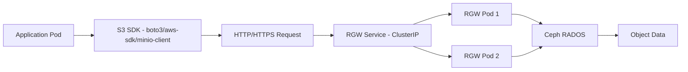

# How to Access Rook-Ceph Object Storage from an Application

Author: [nawazdhandala](https://www.github.com/nawazdhandala)

Tags: Rook, Ceph, Kubernetes, S3, ObjectStorage, Application

Description: Learn how to configure Kubernetes applications to access Rook-Ceph S3-compatible object storage using environment variables, SDKs, and the boto3 Python library.

---

## Application Access Patterns for Rook-Ceph Object Storage

Applications access Rook-Ceph object storage the same way they access Amazon S3 - using the S3 API with an endpoint URL, access key, and secret key. The only difference is the endpoint points to the RGW service inside your cluster rather than AWS. Any S3-compatible library, tool, or SDK works with Rook-Ceph without code changes.



## Step 1 - Gather the Connection Details

Get the RGW service endpoint:

```bash
kubectl -n rook-ceph get svc -l app=rook-ceph-rgw -o jsonpath='{.items[0].metadata.name}'
```

The in-cluster DNS endpoint follows this pattern:

```text
http://rook-ceph-rgw-<store-name>-a.rook-ceph.svc.cluster.local:80
```

Get the credentials from the user Secret:

```bash
ACCESS_KEY=$(kubectl -n rook-ceph get secret rook-ceph-object-user-my-store-app-user \
  -o jsonpath='{.data.AccessKey}' | base64 --decode)
SECRET_KEY=$(kubectl -n rook-ceph get secret rook-ceph-object-user-my-store-app-user \
  -o jsonpath='{.data.SecretKey}' | base64 --decode)
```

## Step 2 - Expose Credentials as Pod Environment Variables

Reference the RGW credentials Secret directly in your Deployment:

```yaml
apiVersion: apps/v1
kind: Deployment
metadata:
  name: my-s3-app
  namespace: default
spec:
  replicas: 2
  selector:
    matchLabels:
      app: my-s3-app
  template:
    metadata:
      labels:
        app: my-s3-app
    spec:
      containers:
        - name: app
          image: my-app:latest
          env:
            - name: S3_ENDPOINT
              value: "http://rook-ceph-rgw-my-store-a.rook-ceph.svc.cluster.local"
            - name: S3_BUCKET
              value: "my-app-bucket"
            - name: AWS_DEFAULT_REGION
              value: "us-east-1"
            - name: AWS_ACCESS_KEY_ID
              valueFrom:
                secretKeyRef:
                  name: rook-ceph-object-user-my-store-app-user
                  key: AccessKey
            - name: AWS_SECRET_ACCESS_KEY
              valueFrom:
                secretKeyRef:
                  name: rook-ceph-object-user-my-store-app-user
                  key: SecretKey
```

## Step 3 - Access S3 with Python (boto3)

Example Python application that uses Rook-Ceph as its S3 backend:

```python
import os
import boto3
from botocore.config import Config

# Read configuration from environment variables
endpoint_url = os.environ.get("S3_ENDPOINT")
access_key = os.environ.get("AWS_ACCESS_KEY_ID")
secret_key = os.environ.get("AWS_SECRET_ACCESS_KEY")
bucket_name = os.environ.get("S3_BUCKET", "my-app-bucket")

# Create an S3 client pointing to Rook-Ceph RGW
s3_client = boto3.client(
    "s3",
    endpoint_url=endpoint_url,
    aws_access_key_id=access_key,
    aws_secret_access_key=secret_key,
    region_name="us-east-1",
    config=Config(
        signature_version="s3v4",
        # Disable SSL verification for HTTP endpoints
        # Remove this for HTTPS deployments
    ),
    verify=False,
)

# Ensure the bucket exists
def ensure_bucket(bucket):
    try:
        s3_client.head_bucket(Bucket=bucket)
        print(f"Bucket {bucket} exists")
    except s3_client.exceptions.ClientError:
        s3_client.create_bucket(Bucket=bucket)
        print(f"Created bucket {bucket}")

# Upload a file
def upload_file(local_path, s3_key):
    s3_client.upload_file(local_path, bucket_name, s3_key)
    print(f"Uploaded {local_path} to s3://{bucket_name}/{s3_key}")

# Download a file
def download_file(s3_key, local_path):
    s3_client.download_file(bucket_name, s3_key, local_path)
    print(f"Downloaded s3://{bucket_name}/{s3_key} to {local_path}")

# List objects in the bucket
def list_objects(prefix=""):
    response = s3_client.list_objects_v2(Bucket=bucket_name, Prefix=prefix)
    for obj in response.get("Contents", []):
        print(f"  {obj['Key']} ({obj['Size']} bytes)")

if __name__ == "__main__":
    ensure_bucket(bucket_name)
    upload_file("/tmp/test.txt", "uploads/test.txt")
    list_objects("uploads/")
```

## Step 4 - Access S3 with the AWS CLI

Run an AWS CLI container configured to use Rook-Ceph:

```yaml
apiVersion: v1
kind: Pod
metadata:
  name: aws-cli-test
  namespace: default
spec:
  containers:
    - name: awscli
      image: amazon/aws-cli
      command: ["/bin/sh", "-c", "sleep 3600"]
      env:
        - name: AWS_DEFAULT_REGION
          value: "us-east-1"
        - name: AWS_ACCESS_KEY_ID
          valueFrom:
            secretKeyRef:
              name: rook-ceph-object-user-my-store-app-user
              key: AccessKey
        - name: AWS_SECRET_ACCESS_KEY
          valueFrom:
            secretKeyRef:
              name: rook-ceph-object-user-my-store-app-user
              key: SecretKey
  restartPolicy: Never
```

```bash
kubectl apply -f aws-cli-pod.yaml

# List buckets
kubectl exec aws-cli-test -- aws \
  --endpoint-url http://rook-ceph-rgw-my-store-a.rook-ceph.svc.cluster.local \
  s3 ls

# Create a bucket
kubectl exec aws-cli-test -- aws \
  --endpoint-url http://rook-ceph-rgw-my-store-a.rook-ceph.svc.cluster.local \
  s3 mb s3://test-bucket

# Upload a file
kubectl exec aws-cli-test -- aws \
  --endpoint-url http://rook-ceph-rgw-my-store-a.rook-ceph.svc.cluster.local \
  s3 cp /etc/hostname s3://test-bucket/hostname.txt
```

## Step 5 - Using ObjectBucketClaim for Auto-Injected Credentials

If using OBCs, the endpoint and credentials are automatically injected as a ConfigMap and Secret:

```yaml
apiVersion: apps/v1
kind: Deployment
metadata:
  name: obc-app
spec:
  template:
    spec:
      containers:
        - name: app
          image: my-app:latest
          envFrom:
            # Load BUCKET_HOST, BUCKET_PORT, BUCKET_NAME from ConfigMap
            - configMapRef:
                name: my-bucket-claim
            # Load AWS_ACCESS_KEY_ID, AWS_SECRET_ACCESS_KEY from Secret
            - secretRef:
                name: my-bucket-claim
```

The application constructs the endpoint URL from `BUCKET_HOST` and `BUCKET_PORT`.

## External Access via LoadBalancer

To allow access from outside the cluster, expose the RGW service:

```yaml
apiVersion: v1
kind: Service
metadata:
  name: rook-ceph-rgw-external
  namespace: rook-ceph
spec:
  type: LoadBalancer
  selector:
    app: rook-ceph-rgw
    rgw: my-store
  ports:
    - name: http
      port: 80
      targetPort: 8080
```

```bash
kubectl apply -f rgw-loadbalancer.yaml
kubectl -n rook-ceph get svc rook-ceph-rgw-external
```

## Summary

Applications access Rook-Ceph object storage using the standard S3 API by pointing their S3 client to the RGW ClusterIP service endpoint. Inject credentials via Kubernetes Secrets (either from CephObjectStoreUser or OBC Secrets) as environment variables so the application code needs no special knowledge of Rook. Python boto3, AWS CLI, and any other S3-compatible library work without modification - only the endpoint URL differs from AWS. For external access, expose the RGW service with a LoadBalancer or Ingress.
