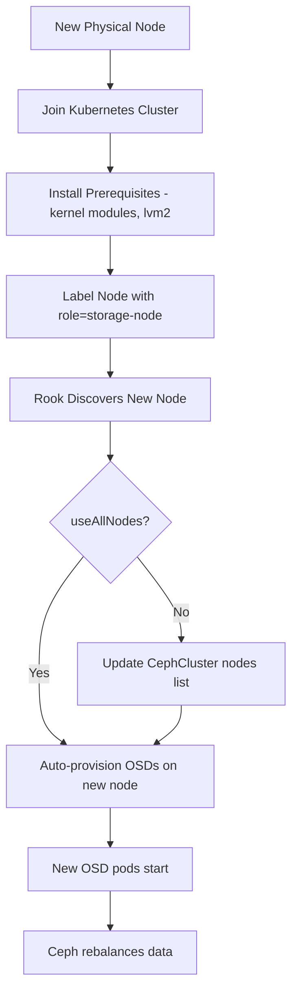

# How to Add a New Node to a Rook-Ceph Cluster

Author: [nawazdhandala](https://www.github.com/nawazdhandala)

Tags: Rook, Ceph, Kubernetes, Node, Scaling, Operation

Description: Learn how to add a new Kubernetes node to your Rook-Ceph cluster, including node preparation, labeling, and CephCluster CR updates to include the new node.

---

## How Node Addition Works in Rook-Ceph

Rook-Ceph places Ceph components (monitors, OSDs) on Kubernetes nodes based on the CephCluster `placement` spec and node labels. When you add a new node to your Kubernetes cluster, Rook automatically considers it for OSD placement if the node meets placement criteria. New monitors can only be added by explicitly increasing the monitor count.



## Step 1 - Prepare the New Node

Before the new node can participate in Rook-Ceph, install prerequisites on it.

For Ubuntu/Debian:

```bash
# Install kernel modules
sudo modprobe rbd
sudo modprobe ceph
echo "rbd" | sudo tee -a /etc/modules-load.d/rook.conf
echo "ceph" | sudo tee -a /etc/modules-load.d/rook.conf

# Install required packages
sudo apt-get update
sudo apt-get install -y lvm2 linux-modules-extra-$(uname -r)
```

For RHEL/CentOS/Rocky Linux:

```bash
sudo modprobe rbd
sudo modprobe ceph
sudo dnf install -y lvm2
```

Verify the disks on the new node are clean:

```bash
lsblk -f
```

Wipe any disks intended for Ceph OSDs:

```bash
sudo wipefs -a /dev/sdb
sudo sgdisk --zap-all /dev/sdb
```

## Step 2 - Join the New Node to Kubernetes

Follow your standard Kubernetes node join procedure. For kubeadm clusters:

```bash
# On the control plane, generate a join token
kubeadm token create --print-join-command

# On the new node, run the join command
kubeadm join <control-plane-ip>:6443 \
  --token <token> \
  --discovery-token-ca-cert-hash sha256:<hash>
```

Verify the node joined:

```bash
kubectl get nodes
```

The new node should appear as `Ready` within a minute.

## Step 3 - Label the New Node

Apply the same labels used by your CephCluster's placement spec. If your cluster uses `role=storage-node`:

```bash
kubectl label node new-node-name role=storage-node
```

Add any other labels required by your placement spec:

```bash
# If you use topology labels
kubectl label node new-node-name topology.kubernetes.io/zone=us-east-1a
```

## Step 4 - Configure PSA for Privileged Pods

Ensure the node can run privileged pods (required for OSD and CSI pods):

```bash
# If using Pod Security Admission, the namespace label handles this
kubectl get namespace rook-ceph --show-labels | grep pod-security
```

The `rook-ceph` namespace should already have the `pod-security.kubernetes.io/enforce=privileged` label from when you first set up the cluster.

## Step 5 - Update the CephCluster CR (if using explicit node list)

If your CephCluster uses `useAllNodes: false` with an explicit node list, add the new node:

```yaml
spec:
  storage:
    useAllNodes: false
    nodes:
      - name: "node1"
        devices:
          - name: "sdb"
      - name: "node2"
        devices:
          - name: "sdb"
      - name: "node3"
        devices:
          - name: "sdb"
      # Add the new node
      - name: "new-node-name"
        devices:
          - name: "sdb"
```

Apply:

```bash
kubectl apply -f ceph-cluster.yaml
```

## Step 6 - If Using useAllNodes: true

If your CephCluster has `useAllNodes: true`, Rook automatically detects the new node and its clean disks. Restart the operator to trigger immediate discovery:

```bash
kubectl -n rook-ceph rollout restart deployment/rook-ceph-operator
```

## Step 7 - Monitor OSD Provisioning

Watch for OSD prepare jobs and pods to appear for the new node:

```bash
# Watch OSD prepare jobs
kubectl -n rook-ceph get jobs -l app=rook-ceph-osd-prepare -w

# Watch for new OSD pods
kubectl -n rook-ceph get pods -l app=rook-ceph-osd -o wide | grep new-node-name
```

## Step 8 - Verify the New Node's OSDs in Ceph

From the toolbox, check the OSD tree to confirm the new node's OSDs appear:

```bash
kubectl -n rook-ceph exec deploy/rook-ceph-tools -- ceph osd tree
```

```text
ID  CLASS  WEIGHT   TYPE NAME        STATUS  REWEIGHT  PRI-AFF
-1         4.85155  root default
-3         1.21289      host node1
 0    ssd  0.30322          osd.0      up   1.00000  1.00000
...
-9         1.21289      host new-node-name
 9    ssd  0.30322          osd.9      up   1.00000  1.00000
10    ssd  0.30322          osd.10     up   1.00000  1.00000
```

Monitor rebalancing:

```bash
kubectl -n rook-ceph exec deploy/rook-ceph-tools -- ceph status
kubectl -n rook-ceph exec deploy/rook-ceph-tools -- ceph progress
```

## Increasing Monitor Count

If you are growing from 3 to 5 nodes and want more monitors for additional redundancy, update the mon count:

```yaml
spec:
  mon:
    count: 5
    allowMultiplePerNode: false
```

The operator will start two additional monitor pods on the new nodes. Wait for all monitors to join quorum:

```bash
kubectl -n rook-ceph exec deploy/rook-ceph-tools -- ceph mon stat
```

## Summary

Adding a new node to Rook-Ceph involves preparing it with required kernel modules and packages, joining it to Kubernetes, labeling it to match the CephCluster placement spec, and optionally adding it to the explicit node list in the CephCluster CR. With `useAllNodes: true`, Rook handles discovery automatically. New OSDs appear in the CRUSH tree and Ceph rebalances data across all nodes. Monitor rebalancing with `ceph status` and `ceph progress` until the cluster returns to `HEALTH_OK` with all PGs `active+clean`.
