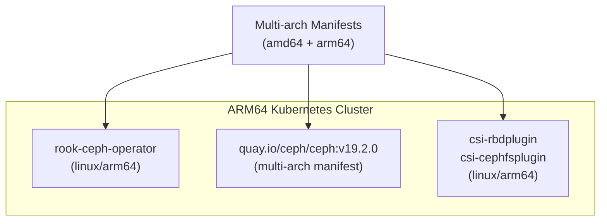

# How to Configure Rook-Ceph for ARM64 Architecture

Author: [nawazdhandala](https://www.github.com/nawazdhandala)

Tags: Rook, Ceph, Kubernetes, Storage, ARM64, Architecture

Description: Deploy Rook-Ceph on ARM64 Kubernetes clusters by using multi-arch container images, verifying kernel module support, and configuring node selectors for mixed-arch environments.

---

## ARM64 Support in Rook-Ceph

Rook-Ceph provides official multi-architecture container images supporting both `linux/amd64` and `linux/arm64` since Rook v1.10 and Ceph Quincy (v17). Modern ARM64 hardware like AWS Graviton, Apple Silicon-based cloud VMs, Raspberry Pi clusters, and NVIDIA Jetson nodes are all supported.



## Step 1 - Verify Multi-Arch Image Availability

Confirm the Ceph and Rook images support ARM64:

```bash
docker buildx imagetools inspect quay.io/ceph/ceph:v19.2.0 | grep -A2 Platform
docker buildx imagetools inspect rook/ceph:v1.15.0 | grep -A2 Platform
```

Expected output should include:

```
Platform: linux/amd64
Platform: linux/arm64
```

## Step 2 - Check ARM64 Kernel Modules

On ARM64 nodes, verify the required kernel modules are present:

```bash
uname -m
# Expected: aarch64

modprobe rbd
modprobe ceph

lsmod | grep -E "^rbd|^ceph"
```

On Ubuntu ARM64 (Graviton, Raspberry Pi):

```bash
apt-get install -y linux-modules-extra-$(uname -r)
modprobe rbd
modprobe ceph
```

## Step 3 - Deploy the Rook Operator

The Rook operator manifest works unchanged on ARM64 because Docker/containerd automatically pulls the correct architecture layer:

```bash
git clone --single-branch --branch v1.15.0 \
  https://github.com/rook/rook.git
cd rook/deploy/examples

kubectl apply --server-side -f crds.yaml
kubectl apply -f common.yaml
kubectl apply -f operator.yaml
```

Verify the operator is running on an ARM64 node:

```bash
kubectl -n rook-ceph get pods -l app=rook-ceph-operator \
  -o jsonpath='{.items[0].spec.nodeName}' | xargs -I{} \
  kubectl get node {} -o jsonpath='{.status.nodeInfo.architecture}'
```

Expected: `arm64`

## Step 4 - CephCluster for ARM64 Nodes

No ARM64-specific changes are required in the CephCluster spec. The Ceph image is multi-arch and pulls correctly:

```yaml
apiVersion: ceph.rook.io/v1
kind: CephCluster
metadata:
  name: rook-ceph
  namespace: rook-ceph
spec:
  cephVersion:
    image: quay.io/ceph/ceph:v19.2.0
    allowUnsupported: false
  dataDirHostPath: /var/lib/rook
  mon:
    count: 3
    allowMultiplePerNode: false
  mgr:
    count: 1
  dashboard:
    enabled: true
    ssl: true
  storage:
    useAllNodes: false
    useAllDevices: false
    nodes:
      - name: arm64-node-1
        devices:
          - name: sdb
      - name: arm64-node-2
        devices:
          - name: sdb
      - name: arm64-node-3
        devices:
          - name: sdb
```

## Step 5 - Mixed-Arch Clusters (ARM64 + AMD64)

If your cluster has both AMD64 and ARM64 nodes, use node selectors or taints to schedule Rook components on the appropriate nodes:

Label ARM64 storage nodes:

```bash
kubectl label node arm64-node-1 storage-arch=arm64
kubectl label node arm64-node-2 storage-arch=arm64
kubectl label node arm64-node-3 storage-arch=arm64
```

Add placement in the CephCluster:

```yaml
spec:
  placement:
    all:
      nodeAffinity:
        requiredDuringSchedulingIgnoredDuringExecution:
          nodeSelectorTerms:
            - matchExpressions:
                - key: kubernetes.io/arch
                  operator: In
                  values:
                    - arm64
```

## Step 6 - Verify ARM64 Pods are Running

```bash
# Check that Ceph pods are on ARM64 nodes
kubectl -n rook-ceph get pods -o wide | head -20

# Verify cluster health
kubectl -n rook-ceph exec -it deploy/rook-ceph-tools -- ceph status
```

## Known ARM64 Limitations

- Ceph Dashboard may have minor UI rendering differences on ARM64
- Some older Ceph tuning guides reference x86-specific NUMA topology - ignore these for ARM64
- On Raspberry Pi 4 (4 GB RAM), running a single-node cluster is feasible but tight on memory; allocate at least 6 GB if possible

## Summary

Rook-Ceph supports ARM64 natively through multi-architecture container image manifests for both the Rook operator and the Ceph container image. No changes to Kubernetes manifests are required when deploying on homogeneous ARM64 clusters. For mixed amd64/arm64 clusters, use `nodeAffinity` in the CephCluster placement spec to ensure Ceph daemons are scheduled on the correct architecture nodes. Verify that `rbd` and `ceph` kernel modules are available on ARM64 nodes before deploying.
