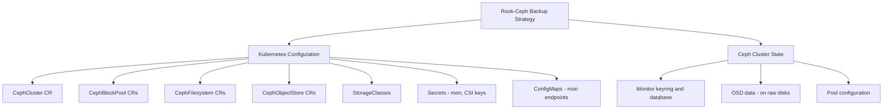

# How to Back Up Rook-Ceph Cluster Configuration

Author: [nawazdhandala](https://www.github.com/nawazdhandala)

Tags: Rook, Ceph, Kubernetes, Backup, Configuration, DisasterRecovery

Description: Learn how to back up and restore Rook-Ceph cluster configuration including CRDs, secrets, and Ceph monitor data for disaster recovery purposes.

---

## What Needs to Be Backed Up

A Rook-Ceph cluster has two categories of state that need backup: the Kubernetes configuration (CRDs, Secrets, ConfigMaps, and StorageClasses) and the Ceph cluster data (monitor database and OSD data). For a full disaster recovery capability, you need both.



## Backing Up Kubernetes Custom Resources

Export all Rook-Ceph custom resources to YAML:

```bash
#!/bin/bash
BACKUP_DIR="rook-backup-$(date +%Y%m%d)"
mkdir -p $BACKUP_DIR

echo "Backing up CephCluster..."
kubectl -n rook-ceph get cephcluster -o yaml > $BACKUP_DIR/cephcluster.yaml

echo "Backing up CephBlockPools..."
kubectl -n rook-ceph get cephblockpool -o yaml > $BACKUP_DIR/cephblockpools.yaml

echo "Backing up CephFilesystems..."
kubectl -n rook-ceph get cephfilesystem -o yaml > $BACKUP_DIR/cephfilesystems.yaml

echo "Backing up CephObjectStores..."
kubectl -n rook-ceph get cephobjectstore -o yaml > $BACKUP_DIR/cephobjectstores.yaml

echo "Backing up CephObjectStoreUsers..."
kubectl -n rook-ceph get cephobjectstoreuser -o yaml > $BACKUP_DIR/cephobjectstoreusers.yaml

echo "Backing up StorageClasses..."
kubectl get storageclass -l provisioner=rook-ceph.rbd.csi.ceph.com -o yaml > $BACKUP_DIR/storageclasses-rbd.yaml
kubectl get storageclass -l provisioner=rook-ceph.cephfs.csi.ceph.com -o yaml > $BACKUP_DIR/storageclasses-cephfs.yaml

echo "Backup saved to $BACKUP_DIR/"
ls -la $BACKUP_DIR/
```

## Backing Up Kubernetes Secrets

The Rook-Ceph secrets contain Ceph keyrings needed to operate the cluster:

```bash
#!/bin/bash
BACKUP_DIR="rook-backup-$(date +%Y%m%d)"
mkdir -p $BACKUP_DIR/secrets

echo "Backing up Rook secrets..."

# Monitor secret (contains client.admin keyring)
kubectl -n rook-ceph get secret rook-ceph-mon -o yaml \
  > $BACKUP_DIR/secrets/rook-ceph-mon.yaml

# CSI secrets
kubectl -n rook-ceph get secret rook-csi-rbd-node -o yaml \
  > $BACKUP_DIR/secrets/rook-csi-rbd-node.yaml

kubectl -n rook-ceph get secret rook-csi-rbd-provisioner -o yaml \
  > $BACKUP_DIR/secrets/rook-csi-rbd-provisioner.yaml

kubectl -n rook-ceph get secret rook-csi-cephfs-node -o yaml \
  > $BACKUP_DIR/secrets/rook-csi-cephfs-node.yaml

kubectl -n rook-ceph get secret rook-csi-cephfs-provisioner -o yaml \
  > $BACKUP_DIR/secrets/rook-csi-cephfs-provisioner.yaml

# Dashboard password
kubectl -n rook-ceph get secret rook-ceph-dashboard-password -o yaml \
  > $BACKUP_DIR/secrets/rook-ceph-dashboard-password.yaml

echo "Secrets backed up to $BACKUP_DIR/secrets/"
```

## Backing Up ConfigMaps

Monitor endpoint information is stored in a ConfigMap:

```bash
kubectl -n rook-ceph get configmap rook-ceph-mon-endpoints -o yaml \
  > $BACKUP_DIR/rook-ceph-mon-endpoints.yaml
```

## Backing Up Ceph Monitor Data

The Ceph monitor database contains the cluster map (CRUSH map, OSD map, PG map, auth keys). Back up the monitor data directory from the host:

```bash
# Find which nodes run monitors
kubectl -n rook-ceph get pods -l app=rook-ceph-mon -o wide | awk '{print $7}'

# SSH to each monitor node and backup the data directory
# Default dataDirHostPath is /var/lib/rook
sudo tar -czf /tmp/rook-mon-backup-$(hostname)-$(date +%Y%m%d).tar.gz \
  /var/lib/rook/mon-a  # or mon-b, mon-c
```

## Backing Up Ceph Cluster Configuration from Ceph

Export the complete Ceph configuration and maps from the toolbox:

```bash
kubectl -n rook-ceph exec deploy/rook-ceph-tools -- bash -c "
  # Export CRUSH map
  ceph osd getcrushmap -o /tmp/crush.bin
  crushtool -d /tmp/crush.bin -o /tmp/crush.txt
  cat /tmp/crush.txt

  # Export OSD map
  ceph osd dump > /tmp/osd-dump.txt

  # Export pool configuration
  ceph osd pool ls detail > /tmp/pool-config.txt

  # Export auth keys
  ceph auth list > /tmp/auth-keys.txt

  # Export full cluster config
  ceph config dump > /tmp/ceph-config-dump.txt
" > $BACKUP_DIR/ceph-state.txt
```

## Automated Backup with CronJob

Create a CronJob that runs daily backups and stores them in S3-compatible storage:

```yaml
apiVersion: batch/v1
kind: CronJob
metadata:
  name: rook-config-backup
  namespace: rook-ceph
spec:
  schedule: "0 3 * * *"
  jobTemplate:
    spec:
      template:
        spec:
          serviceAccountName: rook-backup-sa
          containers:
            - name: backup
              image: bitnami/kubectl:latest
              command:
                - /bin/sh
                - -c
                - |
                  DATE=$(date +%Y%m%d)
                  mkdir -p /backup

                  # Export CRs
                  kubectl -n rook-ceph get cephcluster -o yaml > /backup/cephcluster.yaml
                  kubectl -n rook-ceph get cephblockpool -o yaml > /backup/cephblockpools.yaml
                  kubectl -n rook-ceph get cephfilesystem -o yaml > /backup/cephfilesystems.yaml
                  kubectl -n rook-ceph get cephobjectstore -o yaml > /backup/cephobjectstores.yaml

                  # Export secrets
                  kubectl -n rook-ceph get secret rook-ceph-mon -o yaml > /backup/secret-mon.yaml
                  kubectl -n rook-ceph get secret rook-csi-rbd-node -o yaml > /backup/secret-rbd-node.yaml
                  kubectl -n rook-ceph get secret rook-csi-rbd-provisioner -o yaml > /backup/secret-rbd-prov.yaml

                  echo "Backup complete for $DATE"
                  ls -la /backup/
              volumeMounts:
                - name: backup-storage
                  mountPath: /backup
          restartPolicy: OnFailure
          volumes:
            - name: backup-storage
              persistentVolumeClaim:
                claimName: backup-pvc
```

## Restoring Configuration

To restore Rook-Ceph configuration after a cluster rebuild:

```bash
# Restore secrets first (before deploying Helm charts)
kubectl apply -f $BACKUP_DIR/secrets/rook-ceph-mon.yaml
kubectl apply -f $BACKUP_DIR/secrets/rook-csi-rbd-node.yaml
kubectl apply -f $BACKUP_DIR/secrets/rook-csi-rbd-provisioner.yaml

# Restore monitor ConfigMap
kubectl apply -f $BACKUP_DIR/rook-ceph-mon-endpoints.yaml

# Install Rook operator
helm install rook-ceph rook-release/rook-ceph --namespace rook-ceph

# Apply CephCluster CR
kubectl apply -f $BACKUP_DIR/cephcluster.yaml

# After cluster is healthy, restore pools and storage classes
kubectl apply -f $BACKUP_DIR/cephblockpools.yaml
kubectl apply -f $BACKUP_DIR/cephfilesystems.yaml
kubectl apply -f $BACKUP_DIR/storageclasses-rbd.yaml
```

## Summary

A complete Rook-Ceph configuration backup includes: all custom resources (CephCluster, CephBlockPool, CephFilesystem, CephObjectStore), all Kubernetes Secrets containing Ceph keyrings and CSI credentials, the mon-endpoints ConfigMap, and optionally the Ceph monitor database from the host filesystem. Automate exports with a CronJob that runs daily. The Rook operator recreates Ceph pools and storage classes from the CR definitions, but the CSI secrets and mon credentials must be present before the operator starts to allow it to reconnect to an existing Ceph cluster rather than bootstrapping a new one.
