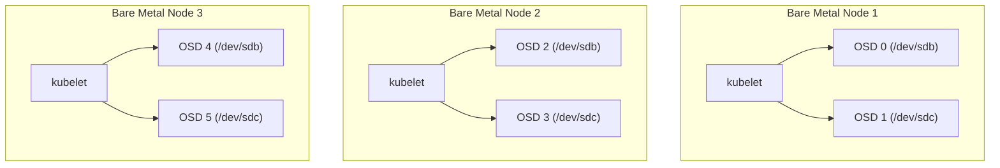

# How to Set Up Rook-Ceph Example Configs for Bare Metal

Author: [nawazdhandala](https://www.github.com/nawazdhandala)

Tags: Rook, Ceph, Kubernetes, Storage, Bare Metal, Configuration

Description: Configure Rook-Ceph for bare-metal Kubernetes clusters using raw block devices, direct disk access, explicit node/device selection, and host networking for optimal performance.

---

## Bare Metal vs. Cloud Storage Topology

On bare metal, Kubernetes nodes have physical disks attached directly. Rook can consume these as raw block devices without needing a cloud provider's PVC provisioner. The typical bare-metal architecture routes Ceph traffic over dedicated storage NICs to separate it from the Kubernetes pod network.



## Prerequisites

- Three or more Kubernetes worker nodes with spare raw block devices
- Each OSD disk must have no filesystem, partition table, or LVM signature
- Kernel modules: `rbd` and `cephfs` (for block and filesystem access)
- Rook operator deployed with CRDs applied

## Step 1 - Prepare Disks on Each Node

On every storage node, wipe all OSD disks:

```bash
# Replace sdb and sdc with your actual disk names
wipefs -a /dev/sdb
wipefs -a /dev/sdc

# Verify no signatures remain
blkid /dev/sdb
blkid /dev/sdc
```

Confirm the disks are visible from Kubernetes:

```bash
kubectl -n rook-ceph exec -it deploy/rook-ceph-tools -- \
  ceph-volume inventory
```

## Step 2 - CephCluster Manifest for Bare Metal

This configuration explicitly lists nodes and devices, uses host networking for maximum throughput, and separates public and cluster networks:

```yaml
apiVersion: ceph.rook.io/v1
kind: CephCluster
metadata:
  name: rook-ceph
  namespace: rook-ceph
spec:
  cephVersion:
    image: quay.io/ceph/ceph:v19.2.0
    allowUnsupported: false
  dataDirHostPath: /var/lib/rook
  skipUpgradeChecks: false
  continueUpgradeAfterChecksEvenIfNotHealthy: false
  mon:
    count: 3
    allowMultiplePerNode: false
  mgr:
    count: 2
    modules:
      - name: pg_autoscaler
        enabled: true
      - name: rook
        enabled: true
  dashboard:
    enabled: true
    ssl: true
  monitoring:
    enabled: true
    metricsDisabled: false
  network:
    provider: host
    addressRanges:
      public:
        - 10.10.1.0/24
      cluster:
        - 10.10.2.0/24
  crashCollector:
    disable: false
  logCollector:
    enabled: true
    periodicity: daily
    maxLogSize: 500M
  cleanupPolicy:
    confirmation: ""
    sanitizeDisks:
      method: quick
      dataSource: zero
      iteration: 1
    allowUninstallWithVolumes: false
  storage:
    useAllNodes: false
    useAllDevices: false
    config:
      osdsPerDevice: "1"
    nodes:
      - name: storage-node-1
        devices:
          - name: sdb
          - name: sdc
      - name: storage-node-2
        devices:
          - name: sdb
          - name: sdc
      - name: storage-node-3
        devices:
          - name: sdb
          - name: sdc
  resources:
    osd:
      requests:
        cpu: "500m"
        memory: "2Gi"
      limits:
        cpu: "2"
        memory: "4Gi"
    mon:
      requests:
        cpu: "200m"
        memory: "512Mi"
      limits:
        cpu: "1"
        memory: "2Gi"
    mgr:
      requests:
        cpu: "200m"
        memory: "512Mi"
      limits:
        cpu: "1"
        memory: "2Gi"
```

## Step 3 - Create a Replicated Block Pool

```yaml
apiVersion: ceph.rook.io/v1
kind: CephBlockPool
metadata:
  name: replicapool
  namespace: rook-ceph
spec:
  failureDomain: host
  replicated:
    size: 3
    requireSafeReplicaSize: true
```

## Step 4 - Create a StorageClass

```yaml
apiVersion: storage.k8s.io/v1
kind: StorageClass
metadata:
  name: rook-ceph-block
provisioner: rook-ceph.rbd.csi.ceph.com
parameters:
  clusterID: rook-ceph
  pool: replicapool
  imageFormat: "2"
  imageFeatures: layering
  csi.storage.k8s.io/provisioner-secret-name: rook-csi-rbd-provisioner
  csi.storage.k8s.io/provisioner-secret-namespace: rook-ceph
  csi.storage.k8s.io/controller-expand-secret-name: rook-csi-rbd-provisioner
  csi.storage.k8s.io/controller-expand-secret-namespace: rook-ceph
  csi.storage.k8s.io/node-stage-secret-name: rook-csi-rbd-node
  csi.storage.k8s.io/node-stage-secret-namespace: rook-ceph
reclaimPolicy: Delete
allowVolumeExpansion: true
```

## Step 5 - Verify the Cluster

```bash
# Check OSD status
kubectl -n rook-ceph exec -it deploy/rook-ceph-tools -- ceph osd status

# Check overall health
kubectl -n rook-ceph exec -it deploy/rook-ceph-tools -- ceph health detail

# List OSDs and their disks
kubectl -n rook-ceph exec -it deploy/rook-ceph-tools -- ceph osd tree
```

## Summary

Bare-metal Rook-Ceph deployments use `useAllNodes: false` and `useAllDevices: false` with explicit node and device lists to prevent Rook from accidentally claiming OS disks. Host networking with `network.provider: host` and explicit CIDR ranges for public and cluster networks maximizes throughput by routing storage traffic directly over physical NICs. After deployment, verify OSDs are up using `ceph osd status` and confirm replication is working with `ceph health detail`.
