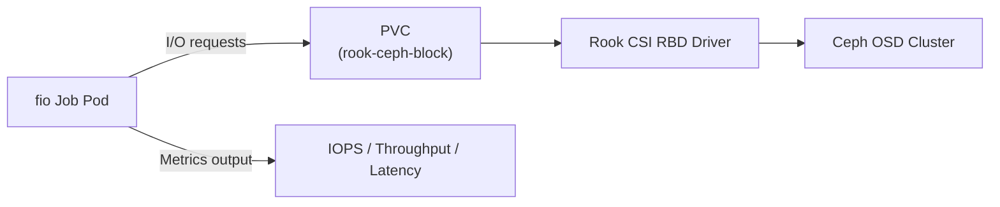

# How to Benchmark Rook-Ceph Storage Performance with fio

Author: [nawazdhandala](https://www.github.com/nawazdhandala)

Tags: Rook, Ceph, Kubernetes, Benchmark, Performance, Fio, Storage

Description: Benchmark Rook-Ceph storage performance using fio jobs on Kubernetes to measure IOPS, throughput, and latency for block and filesystem volumes.

---

## Why Benchmark Rook-Ceph Storage

Before deploying production workloads on Rook-Ceph, benchmark the storage to establish a performance baseline and verify the cluster meets your application's IOPS, throughput, and latency requirements. fio (Flexible I/O Tester) is the standard tool for storage benchmarking.



## Step 1 - Create Benchmark PVCs

Create PVCs for benchmarking both block (RBD) and filesystem (CephFS) storage:

```yaml
apiVersion: v1
kind: PersistentVolumeClaim
metadata:
  name: fio-rbd-pvc
spec:
  accessModes:
    - ReadWriteOnce
  storageClassName: rook-ceph-block
  resources:
    requests:
      storage: 20Gi
---
apiVersion: v1
kind: PersistentVolumeClaim
metadata:
  name: fio-cephfs-pvc
spec:
  accessModes:
    - ReadWriteMany
  storageClassName: rook-cephfs
  resources:
    requests:
      storage: 20Gi
```

Apply them:

```bash
kubectl apply -f fio-pvcs.yaml
kubectl get pvc fio-rbd-pvc fio-cephfs-pvc
```

## Step 2 - Create a fio Job for Random Read IOPS

This job tests 4K random read IOPS - the most important metric for database workloads:

```yaml
apiVersion: batch/v1
kind: Job
metadata:
  name: fio-rand-read
spec:
  template:
    spec:
      restartPolicy: Never
      containers:
        - name: fio
          image: nixery.dev/shell/fio
          command:
            - fio
            - --name=randread
            - --ioengine=libaio
            - --direct=1
            - --rw=randread
            - --bs=4k
            - --numjobs=4
            - --iodepth=32
            - --runtime=60
            - --time_based
            - --filename=/data/testfile
            - --size=4G
            - --output-format=json+
          volumeMounts:
            - name: fio-data
              mountPath: /data
      volumes:
        - name: fio-data
          persistentVolumeClaim:
            claimName: fio-rbd-pvc
```

Apply and check results:

```bash
kubectl apply -f fio-randread-job.yaml
kubectl wait --for=condition=complete job/fio-rand-read --timeout=120s
kubectl logs job/fio-rand-read
```

## Step 3 - Create a fio Job for Sequential Write Throughput

Test sequential write throughput - important for logging, backup, and streaming workloads:

```yaml
apiVersion: batch/v1
kind: Job
metadata:
  name: fio-seq-write
spec:
  template:
    spec:
      restartPolicy: Never
      containers:
        - name: fio
          image: nixery.dev/shell/fio
          command:
            - fio
            - --name=seqwrite
            - --ioengine=libaio
            - --direct=1
            - --rw=write
            - --bs=1m
            - --numjobs=1
            - --iodepth=16
            - --runtime=60
            - --time_based
            - --filename=/data/testfile
            - --size=4G
          volumeMounts:
            - name: fio-data
              mountPath: /data
      volumes:
        - name: fio-data
          persistentVolumeClaim:
            claimName: fio-rbd-pvc
```

## Step 4 - Create a fio Job for Random Write IOPS

Test 4K random write IOPS - critical for transactional databases:

```yaml
apiVersion: batch/v1
kind: Job
metadata:
  name: fio-rand-write
spec:
  template:
    spec:
      restartPolicy: Never
      containers:
        - name: fio
          image: nixery.dev/shell/fio
          command:
            - fio
            - --name=randwrite
            - --ioengine=libaio
            - --direct=1
            - --rw=randwrite
            - --bs=4k
            - --numjobs=4
            - --iodepth=32
            - --runtime=60
            - --time_based
            - --filename=/data/testfile
            - --size=4G
          volumeMounts:
            - name: fio-data
              mountPath: /data
      volumes:
        - name: fio-data
          persistentVolumeClaim:
            claimName: fio-rbd-pvc
```

## Step 5 - Create a fio Job for Mixed Read/Write (Database Simulation)

A 70% read / 30% write mix simulates typical OLTP database I/O patterns:

```yaml
apiVersion: batch/v1
kind: Job
metadata:
  name: fio-mixed-rw
spec:
  template:
    spec:
      restartPolicy: Never
      containers:
        - name: fio
          image: nixery.dev/shell/fio
          command:
            - fio
            - --name=mixed
            - --ioengine=libaio
            - --direct=1
            - --rw=randrw
            - --rwmixread=70
            - --bs=4k
            - --numjobs=8
            - --iodepth=32
            - --runtime=120
            - --time_based
            - --filename=/data/testfile
            - --size=4G
            - --group_reporting
          volumeMounts:
            - name: fio-data
              mountPath: /data
      volumes:
        - name: fio-data
          persistentVolumeClaim:
            claimName: fio-rbd-pvc
```

## Step 6 - Benchmark CephFS (Shared Filesystem)

Test CephFS throughput with multiple concurrent writers from different pods:

```yaml
apiVersion: batch/v1
kind: Job
metadata:
  name: fio-cephfs-write
spec:
  completions: 4
  parallelism: 4
  template:
    spec:
      restartPolicy: Never
      containers:
        - name: fio
          image: nixery.dev/shell/fio
          command:
            - sh
            - -c
            - |
              fio --name=cephfs-write \
                  --ioengine=sync \
                  --rw=write \
                  --bs=64k \
                  --numjobs=1 \
                  --runtime=60 \
                  --time_based \
                  --filename=/data/testfile-$(hostname) \
                  --size=1G
          volumeMounts:
            - name: fio-data
              mountPath: /data
      volumes:
        - name: fio-data
          persistentVolumeClaim:
            claimName: fio-cephfs-pvc
```

## Reading fio Results

Key metrics from fio output:

```text
read: IOPS=45.2k, BW=176MiB/s (185MB/s)
  lat (usec): min=123, max=8932, avg=848.3, stdev=312.1
  clat percentiles (usec):
    | 50.00th=[  700]
    | 99.00th=[ 2900]
    | 99.99th=[ 8192]
```

- `IOPS` - operations per second (higher is better)
- `BW` - throughput in MB/s (higher is better)
- `avg` latency - average I/O response time (lower is better)
- `99.99th percentile` - worst-case latency tail (important for SLAs)

## Monitoring Ceph During Benchmarks

Watch Ceph performance in real time during benchmark runs:

```bash
kubectl -n rook-ceph exec -it deploy/rook-ceph-tools -- ceph -w
```

Check OSD throughput:

```bash
kubectl -n rook-ceph exec -it deploy/rook-ceph-tools -- \
  ceph osd perf
```

## Summary

Benchmarking Rook-Ceph with fio involves creating PVCs backed by the storage classes you want to test, then running fio jobs with specific workload patterns (random read, sequential write, mixed I/O). Key metrics are IOPS for random I/O, throughput for sequential I/O, and latency percentiles for latency-sensitive workloads. Run benchmarks before go-live to validate the cluster meets application requirements, and monitor Ceph metrics with `ceph -w` during tests to identify bottlenecks.
