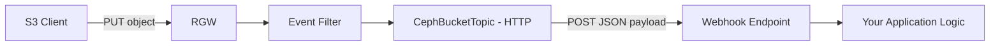

# How to Configure Bucket Notifications with HTTP in Rook-Ceph

Author: [nawazdhandala](https://www.github.com/nawazdhandala)

Tags: Rook, Ceph, Kubernetes, HTTP, Webhook, Bucket, Notification, ObjectStore

Description: Learn how to configure Ceph RGW bucket notifications to send S3 events to an HTTP webhook endpoint using Rook's CephBucketTopic and CephBucketNotification CRDs.

---

HTTP/HTTPS webhooks are the simplest way to receive S3 bucket event notifications from Rook RGW. The RGW posts JSON event payloads to your endpoint whenever objects are created, deleted, or modified.

## HTTP Notification Flow



## Step 1: Create CephBucketTopic for HTTP

```yaml
apiVersion: ceph.rook.io/v1
kind: CephBucketTopic
metadata:
  name: s3-http-topic
  namespace: rook-ceph
spec:
  objectStoreName: my-store
  objectStoreNamespace: rook-ceph
  endpoint:
    http:
      uri: http://my-webhook-service.default.svc.cluster.local:8080/s3-events
      disableVerifySSL: false
```

For HTTPS with custom CA:

```yaml
spec:
  objectStoreName: my-store
  objectStoreNamespace: rook-ceph
  endpoint:
    http:
      uri: https://my-webhook-service.default.svc.cluster.local:8443/s3-events
      disableVerifySSL: false
```

## Step 2: Verify Topic ARN

```bash
kubectl get cephbuckettopic s3-http-topic -n rook-ceph -o yaml
# status.ARN should be populated

kubectl get cephbuckettopic s3-http-topic -n rook-ceph \
  -o jsonpath='{.status.ARN}'
```

## Step 3: Create CephBucketNotification

```yaml
apiVersion: ceph.rook.io/v1
kind: CephBucketNotification
metadata:
  name: http-notification
  namespace: default
spec:
  topic: s3-http-topic
  events:
    - s3:ObjectCreated:*
    - s3:ObjectRemoved:*
  filter:
    keyFilters:
      - name: suffix
        value: .json
    metadataFilters:
      - name: x-amz-meta-source
        value: api
```

## Step 4: Link to an OBC

```yaml
apiVersion: objectbucket.io/v1alpha1
kind: ObjectBucketClaim
metadata:
  name: my-bucket
  namespace: default
  labels:
    notifications.rook.io/http-notification: "true"
spec:
  bucketName: my-events-bucket
  storageClassName: rook-ceph-bucket
```

## Example Webhook Receiver (Python/Flask)

```python
from flask import Flask, request, jsonify
import json

app = Flask(__name__)

@app.route('/s3-events', methods=['POST'])
def handle_s3_event():
    payload = request.get_json()
    for record in payload.get('Records', []):
        event_name = record.get('eventName')
        bucket = record['s3']['bucket']['name']
        key = record['s3']['object']['key']
        size = record['s3']['object'].get('size', 0)
        print(f"Event: {event_name}, Bucket: {bucket}, Key: {key}, Size: {size}")
    return jsonify({'status': 'ok'}), 200

if __name__ == '__main__':
    app.run(host='0.0.0.0', port=8080)
```

Deploy as a Kubernetes service:

```yaml
apiVersion: apps/v1
kind: Deployment
metadata:
  name: webhook-receiver
  namespace: default
spec:
  replicas: 1
  selector:
    matchLabels:
      app: webhook-receiver
  template:
    metadata:
      labels:
        app: webhook-receiver
    spec:
      containers:
        - name: receiver
          image: my-webhook:latest
          ports:
            - containerPort: 8080
---
apiVersion: v1
kind: Service
metadata:
  name: my-webhook-service
  namespace: default
spec:
  selector:
    app: webhook-receiver
  ports:
    - port: 8080
      targetPort: 8080
```

## Test the Notification

```bash
# Upload an object
aws s3 cp /tmp/data.json s3://my-events-bucket/data.json \
  --endpoint-url http://rook-ceph-rgw-my-store.rook-ceph.svc:80

# Check webhook receiver logs
kubectl logs -n default deploy/webhook-receiver --tail=20
```

Expected log output:

```yaml
Event: ObjectCreated:Put, Bucket: my-events-bucket, Key: data.json, Size: 1024
```

## Event Payload Structure

```json
{
  "Records": [{
    "eventVersion": "2.1",
    "eventSource": "ceph:s3",
    "eventName": "ObjectCreated:Put",
    "eventTime": "2026-03-31T12:00:00.000Z",
    "s3": {
      "bucket": {
        "name": "my-events-bucket",
        "arn": "arn:aws:s3:::my-events-bucket"
      },
      "object": {
        "key": "data.json",
        "size": 1024,
        "eTag": "abc123",
        "versionId": ""
      }
    }
  }]
}
```

## Troubleshooting

```bash
# Check notification config on the bucket
kubectl exec -n rook-ceph deploy/rook-ceph-tools -- \
  radosgw-admin notification list --bucket=my-events-bucket

# Check RGW logs for delivery failures
kubectl logs -n rook-ceph -l app=rook-ceph-rgw --tail=50 | grep "notification"
```

## Summary

HTTP/HTTPS bucket notifications in Rook use `CephBucketTopic` with an `http.uri` field pointing to your webhook endpoint. Create a `CephBucketNotification` with event type filters and key/metadata filters, then link it to buckets via OBC labels. The RGW posts standard S3 event JSON payloads to your endpoint for every matching operation, enabling serverless-style triggers without a message broker.
