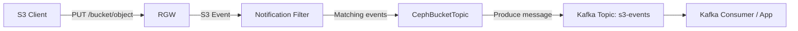

# How to Configure Bucket Notifications with Kafka in Rook-Ceph

Author: [nawazdhandala](https://www.github.com/nawazdhandala)

Tags: Rook, Ceph, Kubernetes, Kafka, Bucket, Notification, ObjectStore, RGW

Description: Learn how to configure Ceph RGW bucket notifications to publish S3 events to Apache Kafka topics using Rook's CephBucketTopic and CephBucketNotification CRDs.

---

Ceph RGW bucket notifications publish S3 events (PUT, DELETE, COPY) to external message queues. Rook provides `CephBucketTopic` and `CephBucketNotification` CRDs to manage this declaratively with Kafka as the target.

## Notification Flow



## Prerequisites

A running Kafka cluster accessible from the RGW pods:

```bash
kubectl get pods -n kafka
# kafka-0, kafka-1, kafka-2 should be Running
```

## Step 1: Create a CephBucketTopic

```yaml
apiVersion: ceph.rook.io/v1
kind: CephBucketTopic
metadata:
  name: s3-kafka-topic
  namespace: rook-ceph
spec:
  objectStoreName: my-store
  objectStoreNamespace: rook-ceph
  endpoint:
    kafka:
      uri: kafka://kafka.kafka.svc.cluster.local:9092
      useSSL: false
      disableVerifySSL: false
      ackLevel: broker
```

For a TLS-enabled Kafka:

```yaml
spec:
  objectStoreName: my-store
  objectStoreNamespace: rook-ceph
  endpoint:
    kafka:
      uri: kafka://kafka.kafka.svc.cluster.local:9093
      useSSL: true
      disableVerifySSL: false
```

## Step 2: Check Topic ARN

```bash
kubectl get cephbuckettopic s3-kafka-topic -n rook-ceph -o jsonpath='{.status.ARN}'
# Example: arn:aws:sns:default::s3-kafka-topic
```

## Step 3: Create a CephBucketNotification

```yaml
apiVersion: ceph.rook.io/v1
kind: CephBucketNotification
metadata:
  name: my-bucket-notification
  namespace: default
spec:
  topic: s3-kafka-topic
  events:
    - s3:ObjectCreated:*
    - s3:ObjectRemoved:*
  filter:
    keyFilters:
      - name: prefix
        value: uploads/
      - name: suffix
        value: .jpg
```

## Step 4: Attach the Notification to an OBC

The `CephBucketNotification` is linked to a bucket through the OBC label:

```yaml
apiVersion: objectbucket.io/v1alpha1
kind: ObjectBucketClaim
metadata:
  name: my-bucket
  namespace: default
  labels:
    # This label links the notification to the bucket
    notifications.rook.io/my-bucket-notification: "true"
spec:
  bucketName: my-application-bucket
  storageClassName: rook-ceph-bucket
```

Or add the label to an existing OBC:

```bash
kubectl label objectbucketclaim my-bucket \
  notifications.rook.io/my-bucket-notification=true \
  -n default
```

## Verify Notification is Set

```bash
# Check CephBucketNotification status
kubectl get cephbucketnotification -n default

# Verify via radosgw-admin
kubectl exec -n rook-ceph deploy/rook-ceph-tools -- \
  radosgw-admin notification list --bucket=my-application-bucket
```

## Test: Upload an Object and Consume from Kafka

```bash
# Upload an object
aws s3 cp /tmp/test.jpg s3://my-application-bucket/uploads/test.jpg \
  --endpoint-url http://rook-ceph-rgw-my-store.rook-ceph.svc:80

# Consume messages from the Kafka topic
kubectl exec -n kafka kafka-0 -- \
  kafka-console-consumer.sh \
    --bootstrap-server localhost:9092 \
    --topic s3-kafka-topic \
    --from-beginning \
    --max-messages 1
```

The consumed message will be a JSON payload like:

```json
{
  "Records": [{
    "eventName": "ObjectCreated:Put",
    "s3": {
      "bucket": {"name": "my-application-bucket"},
      "object": {"key": "uploads/test.jpg", "size": 12345}
    }
  }]
}
```

## Summary

Rook's `CephBucketTopic` defines the Kafka endpoint for S3 event publishing, while `CephBucketNotification` configures the event types and key filters. Link notifications to buckets by labeling the `ObjectBucketClaim`. All matching S3 operations then produce messages to the configured Kafka topic, enabling event-driven processing pipelines from object storage.
