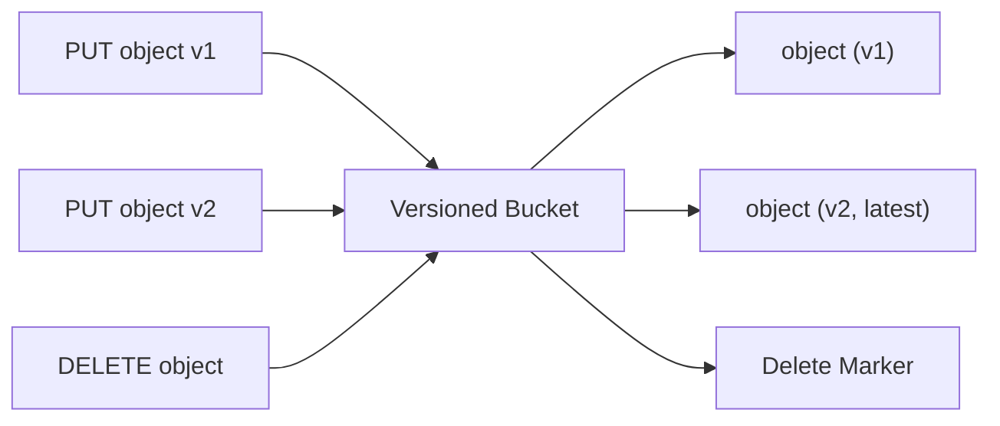

# How to Enable Bucket Versioning in Rook-Ceph Object Store

Author: [nawazdhandala](https://www.github.com/nawazdhandala)

Tags: Rook, Ceph, Kubernetes, S3, Object Storage, Versioning, RGW

Description: Enable and manage S3 bucket versioning in Rook-Ceph object store to protect objects from accidental deletion and support point-in-time recovery.

---

## How Bucket Versioning Works in Rook-Ceph

Rook-Ceph's RadosGW (RGW) implements the S3 API, including bucket versioning. When versioning is enabled on a bucket, Ceph stores every version of every object. Deletions insert a delete marker rather than removing the object, making accidental deletions recoverable. This is useful for backup, audit, and compliance use cases.



## Prerequisites

- A running Rook-Ceph object store (`CephObjectStore` deployed)
- S3 credentials (from OBC Secret or a manually created RGW user)
- AWS CLI or an S3-compatible client configured

## Step 1 - Configure AWS CLI to Point to RGW

Set up an AWS CLI profile for the Rook-Ceph RGW endpoint:

```bash
aws configure --profile rook
```

Enter the access key, secret key, and set the region to `us-east-1` (RGW accepts any region string).

Set the default endpoint in your shell for convenience:

```bash
export RGW_ENDPOINT=http://$(kubectl -n rook-ceph get svc rook-ceph-rgw-my-store -o jsonpath='{.spec.clusterIP}')
```

## Step 2 - Create a Bucket

Create a new bucket for versioning:

```bash
aws s3api create-bucket \
  --bucket versioned-bucket \
  --endpoint-url $RGW_ENDPOINT \
  --profile rook
```

## Step 3 - Enable Versioning

Enable versioning on the bucket using the S3 API:

```bash
aws s3api put-bucket-versioning \
  --bucket versioned-bucket \
  --versioning-configuration Status=Enabled \
  --endpoint-url $RGW_ENDPOINT \
  --profile rook
```

Verify versioning is enabled:

```bash
aws s3api get-bucket-versioning \
  --bucket versioned-bucket \
  --endpoint-url $RGW_ENDPOINT \
  --profile rook
```

Expected output:

```text
{
    "Status": "Enabled"
}
```

## Step 4 - Upload Multiple Versions of an Object

Upload the first version:

```bash
echo "version 1" > data.txt
aws s3api put-object \
  --bucket versioned-bucket \
  --key data.txt \
  --body data.txt \
  --endpoint-url $RGW_ENDPOINT \
  --profile rook
```

Upload the second version (same key, different content):

```bash
echo "version 2" > data.txt
aws s3api put-object \
  --bucket versioned-bucket \
  --key data.txt \
  --body data.txt \
  --endpoint-url $RGW_ENDPOINT \
  --profile rook
```

## Step 5 - List Object Versions

List all versions of all objects in the bucket:

```bash
aws s3api list-object-versions \
  --bucket versioned-bucket \
  --endpoint-url $RGW_ENDPOINT \
  --profile rook
```

Output will include `Versions` array (each object version with a VersionId) and `DeleteMarkers` array.

## Step 6 - Retrieve a Specific Version

Retrieve a specific version by VersionId:

```bash
aws s3api get-object \
  --bucket versioned-bucket \
  --key data.txt \
  --version-id <VersionId> \
  recovered-data.txt \
  --endpoint-url $RGW_ENDPOINT \
  --profile rook
```

## Step 7 - Delete an Object (Insert Delete Marker)

Delete the object normally (inserts a delete marker):

```bash
aws s3api delete-object \
  --bucket versioned-bucket \
  --key data.txt \
  --endpoint-url $RGW_ENDPOINT \
  --profile rook
```

Attempting to get the object now returns a 404, but the versions still exist.

## Step 8 - Restore a Deleted Object

To restore the object, delete the delete marker by specifying its VersionId:

```bash
# Find the delete marker's VersionId
aws s3api list-object-versions \
  --bucket versioned-bucket \
  --endpoint-url $RGW_ENDPOINT \
  --profile rook \
  --query 'DeleteMarkers[?Key==`data.txt`]'

# Delete the delete marker
aws s3api delete-object \
  --bucket versioned-bucket \
  --key data.txt \
  --version-id <DeleteMarkerVersionId> \
  --endpoint-url $RGW_ENDPOINT \
  --profile rook
```

The object is now restored to the latest non-deleted version.

## Step 9 - Suspend Versioning

To stop creating new versions while keeping existing versions:

```bash
aws s3api put-bucket-versioning \
  --bucket versioned-bucket \
  --versioning-configuration Status=Suspended \
  --endpoint-url $RGW_ENDPOINT \
  --profile rook
```

Note: versioning cannot be fully disabled once enabled, only suspended.

## Using Versioning via Radosgw-Admin

You can also check versioning status and bucket info from the Ceph CLI:

```bash
kubectl -n rook-ceph exec -it deploy/rook-ceph-tools -- \
  radosgw-admin bucket stats --bucket=versioned-bucket
```

Check object versions at the RADOS level:

```bash
kubectl -n rook-ceph exec -it deploy/rook-ceph-tools -- \
  radosgw-admin bi list --bucket=versioned-bucket | head -20
```

## Summary

Bucket versioning in Rook-Ceph is enabled through the standard S3 API using `put-bucket-versioning`. Once enabled, every PUT creates a new version and every DELETE inserts a delete marker, preserving previous versions. Use `list-object-versions` to see all versions and `get-object --version-id` to retrieve specific versions. To restore deleted objects, remove the delete marker. This capability is essential for data protection and compliance in production object storage deployments.
