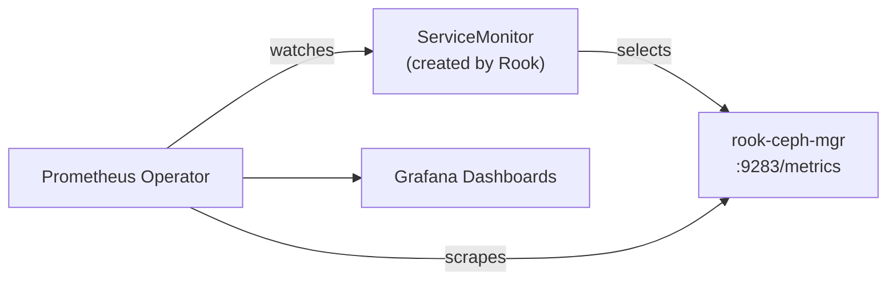

# How to Configure Ceph Monitoring in the CephCluster CRD

Author: [nawazdhandala](https://www.github.com/nawazdhandala)

Tags: Rook, Ceph, Kubernetes, Monitoring, Prometheus, Storage

Description: Configure the monitoring section of the CephCluster CRD to enable Prometheus metrics, create ServiceMonitor resources, and integrate with an existing monitoring stack.

---

## Monitoring Architecture in Rook-Ceph

When monitoring is enabled in the CephCluster, the Ceph MGR module exposes metrics on a dedicated port, and Rook creates Prometheus ServiceMonitor resources that the Prometheus Operator scrapes automatically.



## Basic Monitoring Configuration

Enable monitoring in the CephCluster spec:

```yaml
apiVersion: ceph.rook.io/v1
kind: CephCluster
metadata:
  name: rook-ceph
  namespace: rook-ceph
spec:
  cephVersion:
    image: quay.io/ceph/ceph:v19.2.0
  dataDirHostPath: /var/lib/rook
  monitoring:
    enabled: true
    metricsDisabled: false
```

When `monitoring.enabled: true`, Rook:
1. Enables the Ceph MGR prometheus module
2. Creates a Service exposing metrics on port 9283
3. Creates a ServiceMonitor CRD for the Prometheus Operator

## Prerequisites

The monitoring section requires the Prometheus Operator to be installed in the cluster. Verify it is present:

```bash
kubectl get crd servicemonitors.monitoring.coreos.com
kubectl get crd prometheusrules.monitoring.coreos.com
```

If not installed, deploy the kube-prometheus-stack or the Prometheus Operator directly:

```bash
helm repo add prometheus-community https://prometheus-community.github.io/helm-charts
helm install kube-prometheus-stack prometheus-community/kube-prometheus-stack \
  -n monitoring --create-namespace
```

## Viewing the Created ServiceMonitor

After enabling monitoring:

```bash
kubectl -n rook-ceph get servicemonitor
```

Inspect the Rook-created ServiceMonitor:

```bash
kubectl -n rook-ceph get servicemonitor rook-ceph-mgr -o yaml
```

## Disabling Certain Metrics

To reduce cardinality in large clusters, disable high-cardinality metrics:

```yaml
spec:
  monitoring:
    enabled: true
    metricsDisabled: false
```

To disable all Prometheus metrics from the dashboard (but keep the dashboard itself):

```yaml
spec:
  dashboard:
    enabled: true
  monitoring:
    enabled: false
```

## Verify Metrics are Being Scraped

Check the MGR metrics endpoint directly:

```bash
kubectl -n rook-ceph port-forward svc/rook-ceph-mgr 9283:9283 &
curl -s http://localhost:9283/metrics | grep ceph_health_status
```

You should see `ceph_health_status` with a value of `0` (OK), `1` (WARN), or `2` (ERROR).

## PrometheusRule for Ceph Alerts

Rook provides ready-to-use alerting rules:

```bash
kubectl apply -f rook/deploy/examples/monitoring/prometheus-ceph-rules.yaml
```

This creates PrometheusRule resources with alerts like:

- `CephHealthError` - Cluster health is ERROR
- `CephOSDDown` - One or more OSDs are down
- `CephMonQuorumAtRisk` - Only 1 Mon remaining in quorum
- `CephNearFull` - Cluster is above nearFullRatio

View created rules:

```bash
kubectl -n rook-ceph get prometheusrule
```

## Grafana Dashboard Import

Import Ceph Grafana dashboards using the official dashboard IDs:

```bash
# In Grafana UI, import these dashboard IDs from grafana.com:
# 2842 - Ceph Cluster
# 5336 - Ceph OSD
# 5342 - Ceph Pool
```

Or apply the pre-built ConfigMaps from the Rook repository:

```bash
kubectl apply -f rook/deploy/examples/monitoring/grafana-dashboards.yaml
```

## Monitoring Rook Operator Metrics

The Rook operator also exposes its own metrics:

```bash
kubectl -n rook-ceph port-forward svc/rook-ceph-operator-metrics 9443:9443 &
curl -k https://localhost:9443/metrics | grep rook_
```

## Summary

Enable Ceph monitoring in the CephCluster CRD with `monitoring.enabled: true` and `metricsDisabled: false`. Rook automatically enables the Ceph MGR Prometheus module, creates a metrics service on port 9283, and creates a ServiceMonitor for the Prometheus Operator. Apply the bundled PrometheusRule manifest for Ceph health alerts, and import Grafana dashboard IDs 2842, 5336, and 5342 for cluster, OSD, and pool visualization.
