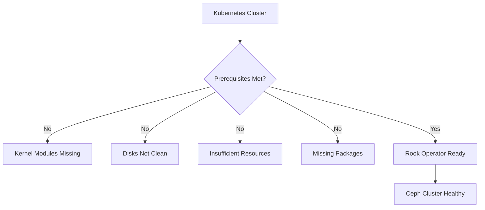

# How to Set Up Rook-Ceph Prerequisites on Your Kubernetes Cluster

Author: [nawazdhandala](https://www.github.com/nawazdhandala)

Tags: Rook, Ceph, Kubernetes, Prerequisites, Storage, Setup

Description: A complete checklist for preparing your Kubernetes cluster to run Rook-Ceph, covering kernel modules, disk requirements, and node labeling.

---

## Why Prerequisites Matter

Rook-Ceph has specific requirements that differ from most Kubernetes workloads. Ceph writes directly to block devices and relies on Linux kernel features like RBD (RADOS Block Device) for volume attachments. Skipping prerequisite verification is the most common cause of failed or unstable Rook-Ceph deployments.



## Kernel Module Requirements

Rook-Ceph requires certain kernel modules to be loaded on all nodes that will run OSD or CSI pods. The most critical module is `rbd` for block device support, and `ceph` for CephFS mounts.

Check if required modules are available:

```bash
lsmod | grep rbd
lsmod | grep ceph
```

Load modules manually if they are not present:

```bash
sudo modprobe rbd
sudo modprobe ceph
```

Make the modules load automatically on boot by adding them to the modules configuration:

```bash
echo "rbd" | sudo tee /etc/modules-load.d/rook-rbd.conf
echo "ceph" | sudo tee /etc/modules-load.d/rook-ceph.conf
```

On some distributions like Ubuntu, you may also need to install extra kernel packages:

```bash
sudo apt-get install -y linux-modules-extra-$(uname -r)
```

## Disk Requirements

Rook-Ceph requires raw, unformatted block devices or partitions with no filesystem signatures. Disks that have been previously used must be wiped before Rook can claim them.

Check disk status on each node:

```bash
lsblk -f
```

Disks are eligible for Rook if they show no FSTYPE and no MOUNTPOINT in the output:

```text
NAME   FSTYPE LABEL UUID MOUNTPOINT
sda
sdb    ext4         xxxx /data     <- NOT eligible
sdc                              <- Eligible (no FSTYPE)
sdd                              <- Eligible (no FSTYPE)
```

Wipe a previously used disk to remove filesystem and partition signatures:

```bash
# Replace /dev/sdc with your target disk
sudo wipefs -a /dev/sdc
sudo dd if=/dev/zero of=/dev/sdc bs=4096 count=100
sudo sgdisk --zap-all /dev/sdc
```

## LVM Cleanup

If a disk has LVM metadata from a previous Ceph deployment, the standard wipe may not be sufficient. Remove LVM signatures explicitly:

```bash
sudo pvremove /dev/sdc --force --force
sudo dmsetup remove_all
sudo wipefs -a /dev/sdc
```

## Package Dependencies

The CSI driver pods require certain tools to be available on the nodes. Install them before deploying Rook:

For Ubuntu/Debian nodes:

```bash
sudo apt-get update
sudo apt-get install -y lvm2 cryptsetup-bin
```

For RHEL/CentOS/Rocky Linux nodes:

```bash
sudo dnf install -y lvm2 cryptsetup
```

## Namespace and RBAC Preparation

Create the `rook-ceph` namespace before deploying via Helm if you need to pre-configure secrets or labels:

```bash
kubectl create namespace rook-ceph
```

Label namespace for monitoring if you are using Prometheus Operator:

```bash
kubectl label namespace rook-ceph prometheus=kube-prometheus
```

## Node Labeling

Label nodes that should participate in the Ceph cluster. This allows you to use node selectors in the CephCluster CR to control placement:

```bash
# Label storage nodes
kubectl label node node1 role=storage-node
kubectl label node node2 role=storage-node
kubectl label node node3 role=storage-node
```

Verify the labels were applied:

```bash
kubectl get nodes --show-labels | grep storage-node
```

## Network Requirements

Ceph generates significant internal traffic between OSDs, monitors, and the manager. Ensure your cluster nodes meet these network requirements:

- At least 1 Gbps connectivity between all storage nodes
- No firewall rules blocking traffic on ports 6789 (monitors), 6800-7300 (OSDs), and 8443 (dashboard)
- Consistent hostname resolution between nodes (DNS or /etc/hosts)

Test connectivity between nodes:

```bash
# From node1, test connectivity to node2 on OSD port range
nc -zv node2 6800
```

## Container Runtime Requirements

Rook-Ceph pods require privileged container access to interact with block devices. Verify that your container runtime allows privileged pods:

```bash
kubectl auth can-i create pods --as=system:serviceaccount:rook-ceph:rook-ceph-osd -n rook-ceph
```

For clusters using Pod Security Admission, the `rook-ceph` namespace must be labeled to allow privileged workloads:

```bash
kubectl label namespace rook-ceph \
  pod-security.kubernetes.io/enforce=privileged \
  pod-security.kubernetes.io/warn=privileged
```

## Pre-flight Validation Script

Run this script on each storage node to quickly validate prerequisites:

```bash
#!/bin/bash
echo "=== Checking RBD kernel module ==="
modprobe rbd && echo "OK: rbd module loaded" || echo "FAIL: rbd module unavailable"

echo "=== Checking Ceph kernel module ==="
modprobe ceph && echo "OK: ceph module loaded" || echo "FAIL: ceph module unavailable"

echo "=== Checking LVM2 ==="
which lvs > /dev/null 2>&1 && echo "OK: lvm2 installed" || echo "FAIL: lvm2 not found"

echo "=== Checking available block devices ==="
lsblk -f | awk '$2=="" && $6=="" {print "Available: "$1}'

echo "=== Done ==="
```

## Summary

Setting up Rook-Ceph prerequisites involves loading the `rbd` and `ceph` kernel modules, ensuring disk devices are clean with no filesystem signatures, installing `lvm2` and optionally `cryptsetup`, labeling storage nodes, and configuring the namespace for privileged pods. Performing these steps on every node before deploying the operator saves significant troubleshooting time and ensures a smooth cluster bootstrap.
