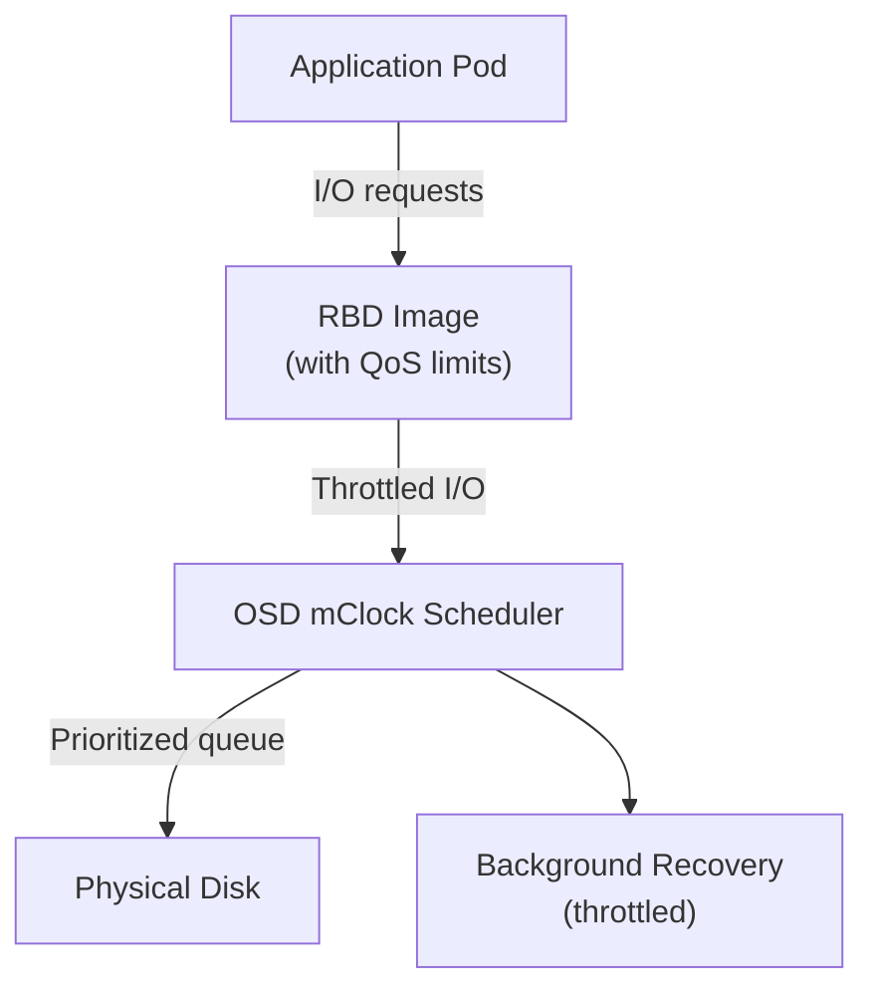

# How to Configure Ceph QoS and Throttling in Rook

Author: [nawazdhandala](https://www.github.com/nawazdhandala)

Tags: Rook, Ceph, Kubernetes, QoS, Throttling, Storage, Performance

Description: Configure Ceph Quality of Service and I/O throttling in Rook-Ceph using RBD image-level IOPS limits and pool-level recovery throttling to protect workloads.

---

## How Ceph QoS Works

Ceph supports QoS (Quality of Service) at the RBD image level through the mClock scheduler and RBD namespace throttling. This allows you to limit the IOPS and throughput that individual RBD volumes can consume, preventing any single workload from saturating the storage cluster and impacting other tenants.



## Setting RBD Image-Level IOPS Limits

RBD images support per-image IOPS and bandwidth limits using image metadata. These limits are enforced by the RBD client in the CSI driver.

Set IOPS limits on an existing RBD image:

```bash
kubectl -n rook-ceph exec -it deploy/rook-ceph-tools -- \
  rbd config image set replicapool/csi-vol-abc123 rbd_qos_iops_limit 1000
```

Set read IOPS limit:

```bash
kubectl -n rook-ceph exec -it deploy/rook-ceph-tools -- \
  rbd config image set replicapool/csi-vol-abc123 rbd_qos_read_iops_limit 800
```

Set write IOPS limit:

```bash
kubectl -n rook-ceph exec -it deploy/rook-ceph-tools -- \
  rbd config image set replicapool/csi-vol-abc123 rbd_qos_write_iops_limit 200
```

Set bandwidth limit in bytes per second (100 MB/s):

```bash
kubectl -n rook-ceph exec -it deploy/rook-ceph-tools -- \
  rbd config image set replicapool/csi-vol-abc123 rbd_qos_bps_limit 104857600
```

Verify the limits:

```bash
kubectl -n rook-ceph exec -it deploy/rook-ceph-tools -- \
  rbd config image get replicapool/csi-vol-abc123 rbd_qos_iops_limit
```

## Setting Pool-Level Default QoS

Apply default QoS to all images in a pool using pool-level config:

```bash
kubectl -n rook-ceph exec -it deploy/rook-ceph-tools -- \
  rbd config pool set replicapool rbd_qos_iops_limit 5000
```

Set burst limits (allow temporary IOPS bursts):

```bash
kubectl -n rook-ceph exec -it deploy/rook-ceph-tools -- \
  rbd config pool set replicapool rbd_qos_iops_burst 8000
```

Set the burst duration in seconds:

```bash
kubectl -n rook-ceph exec -it deploy/rook-ceph-tools -- \
  rbd config pool set replicapool rbd_qos_iops_burst_seconds 10
```

## Configuring StorageClass with QoS Annotations

For new volumes provisioned via CSI, you can set QoS parameters in the StorageClass or in volume annotations. Use the `csi.storage.k8s.io/fstype` and custom parameters:

```yaml
apiVersion: storage.k8s.io/v1
kind: StorageClass
metadata:
  name: rook-ceph-block-limited
provisioner: rook-ceph.rbd.csi.ceph.com
parameters:
  clusterID: rook-ceph
  pool: replicapool
  imageFormat: "2"
  imageFeatures: layering
  csi.storage.k8s.io/provisioner-secret-name: rook-csi-rbd-provisioner
  csi.storage.k8s.io/provisioner-secret-namespace: rook-ceph
  csi.storage.k8s.io/controller-expand-secret-name: rook-csi-rbd-provisioner
  csi.storage.k8s.io/controller-expand-secret-namespace: rook-ceph
  csi.storage.k8s.io/node-stage-secret-name: rook-csi-rbd-node
  csi.storage.k8s.io/node-stage-secret-namespace: rook-ceph
  imageFeatures: layering
  mounter: rbd
reclaimPolicy: Delete
allowVolumeExpansion: true
```

After creating a PV, apply QoS settings to the underlying RBD image by looking up the image name from the PV:

```bash
kubectl get pv <pv-name> -o jsonpath='{.spec.csi.volumeAttributes.imageName}'
```

Then apply the limits as shown above.

## Configuring OSD Recovery Throttling

During data recovery (after OSD failures or rebalancing), recovery I/O can impact client workloads. Throttle recovery to protect production performance:

```bash
kubectl -n rook-ceph exec -it deploy/rook-ceph-tools -- \
  ceph config set osd osd_recovery_max_active 1
```

Limit recovery operations per OSD:

```bash
kubectl -n rook-ceph exec -it deploy/rook-ceph-tools -- \
  ceph config set osd osd_recovery_op_priority 3
```

Limit backfill (rebalancing) operations:

```bash
kubectl -n rook-ceph exec -it deploy/rook-ceph-tools -- \
  ceph config set osd osd_max_backfills 1
```

## Configuring mClock QoS Scheduler

Ceph's mClock scheduler (available in Quincy and later) provides weighted QoS for OSD operations. Configure it via the CephCluster config section:

```yaml
apiVersion: ceph.rook.io/v1
kind: CephCluster
metadata:
  name: rook-ceph
  namespace: rook-ceph
spec:
  cephConfig:
    osd:
      osd_op_queue: mclock_scheduler
      osd_mclock_profile: balanced
```

Available mClock profiles:
- `balanced` - equal weight for client I/O and recovery (default)
- `high_client_ops` - prioritizes client I/O over recovery
- `high_recovery_ops` - prioritizes recovery over client I/O

Set the profile to high_client_ops for production clusters under load:

```bash
kubectl -n rook-ceph exec -it deploy/rook-ceph-tools -- \
  ceph config set osd osd_mclock_profile high_client_ops
```

## Verifying QoS is Active

Check OSD performance with throttling active:

```bash
kubectl -n rook-ceph exec -it deploy/rook-ceph-tools -- \
  ceph osd perf
```

Check Prometheus metrics for I/O rates:

```bash
kubectl -n rook-ceph exec -it deploy/rook-ceph-tools -- \
  ceph -w
```

The `ceph -w` output shows real-time I/O rates, which should reflect the throttle limits.

## Summary

Ceph QoS in Rook can be applied at the RBD image level (per-volume IOPS and BW limits), pool level (defaults for all volumes), and OSD scheduler level (mClock profiles). Image-level limits use `rbd config image set` to cap IOPS and bandwidth for individual volumes. Recovery throttling via `osd_recovery_max_active` and `osd_max_backfills` protects production workloads during OSD recovery. The mClock scheduler profiles (`balanced`, `high_client_ops`, `high_recovery_ops`) provide coarse-grained prioritization for overall cluster behavior.
