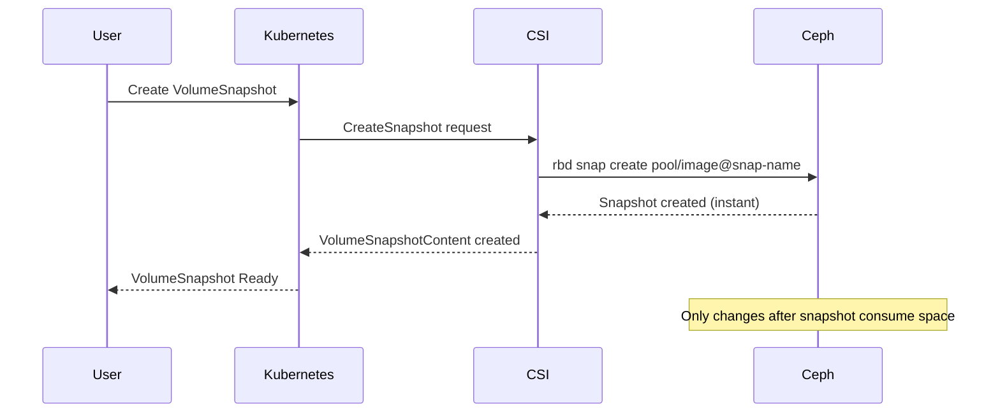

# How to Use Ceph Snapshots with Rook (VolumeSnapshot)

Author: [nawazdhandala](https://www.github.com/nawazdhandala)

Tags: Rook, Ceph, Kubernetes, Snapshot, VolumeSnapshot, DataProtection

Description: Learn how to use the Kubernetes VolumeSnapshot API with Rook-Ceph to create point-in-time snapshots of RBD and CephFS persistent volumes.

---

## How Volume Snapshots Work in Rook-Ceph

Kubernetes VolumeSnapshots use the CSI driver to create point-in-time copies of PVCs. For RBD volumes, the snapshot is a thin copy-on-write snapshot of the RBD image stored in the same Ceph pool. For CephFS volumes, the snapshot is a directory snapshot within the subvolume. Snapshots are nearly instantaneous and only consume space for changed blocks after creation.



## Prerequisites

Ensure the VolumeSnapshot CRDs and the external-snapshotter controller are installed:

```bash
# Check for VolumeSnapshot CRDs
kubectl get crd | grep volumesnapshot

# Check for snapshotter controller
kubectl -n kube-system get pods | grep snapshotter
```

Install the external-snapshotter if not present:

```bash
kubectl apply -f https://raw.githubusercontent.com/kubernetes-csi/external-snapshotter/master/client/config/crd/snapshot.storage.k8s.io_volumesnapshotclasses.yaml
kubectl apply -f https://raw.githubusercontent.com/kubernetes-csi/external-snapshotter/master/client/config/crd/snapshot.storage.k8s.io_volumesnapshotcontents.yaml
kubectl apply -f https://raw.githubusercontent.com/kubernetes-csi/external-snapshotter/master/client/config/crd/snapshot.storage.k8s.io_volumesnapshots.yaml
kubectl apply -f https://raw.githubusercontent.com/kubernetes-csi/external-snapshotter/master/deploy/kubernetes/snapshot-controller/rbac-snapshot-controller.yaml
kubectl apply -f https://raw.githubusercontent.com/kubernetes-csi/external-snapshotter/master/deploy/kubernetes/snapshot-controller/setup-snapshot-controller.yaml
```

## Step 1 - Create a VolumeSnapshotClass for RBD

The VolumeSnapshotClass tells the CSI driver how to create snapshots:

```yaml
apiVersion: snapshot.storage.k8s.io/v1
kind: VolumeSnapshotClass
metadata:
  name: csi-rbdplugin-snapclass
  annotations:
    snapshot.storage.kubernetes.io/is-default-class: "true"
driver: rook-ceph.rbd.csi.ceph.com
deletionPolicy: Delete
parameters:
  clusterID: rook-ceph
  csi.storage.k8s.io/snapshotter-secret-name: rook-csi-rbd-provisioner
  csi.storage.k8s.io/snapshotter-secret-namespace: rook-ceph
```

```bash
kubectl apply -f rbd-snapshot-class.yaml
```

## Step 2 - Create a VolumeSnapshotClass for CephFS

For CephFS volumes:

```yaml
apiVersion: snapshot.storage.k8s.io/v1
kind: VolumeSnapshotClass
metadata:
  name: csi-cephfsplugin-snapclass
driver: rook-ceph.cephfs.csi.ceph.com
deletionPolicy: Delete
parameters:
  clusterID: rook-ceph
  csi.storage.k8s.io/snapshotter-secret-name: rook-csi-cephfs-provisioner
  csi.storage.k8s.io/snapshotter-secret-namespace: rook-ceph
```

## Step 3 - Create a VolumeSnapshot

Create a snapshot of an existing PVC:

```yaml
apiVersion: snapshot.storage.k8s.io/v1
kind: VolumeSnapshot
metadata:
  name: myapp-snapshot-20260331
  namespace: default
spec:
  volumeSnapshotClassName: csi-rbdplugin-snapclass
  source:
    # The PVC to snapshot
    persistentVolumeClaimName: my-app-data
```

```bash
kubectl apply -f snapshot.yaml
```

Wait for the snapshot to be ready:

```bash
kubectl get volumesnapshot myapp-snapshot-20260331 -w
```

```text
NAME                         READYTOUSE   SOURCEPVC     SOURCESNAPSHOTCONTENT   RESTORESIZE   SNAPSHOTCLASS              SNAPSHOTCONTENT                                    CREATIONTIME   AGE
myapp-snapshot-20260331      true         my-app-data                           20Gi          csi-rbdplugin-snapclass    snapcontent-xxxx-xxxx-xxxx                         10s            30s
```

When `READYTOUSE` is `true`, the snapshot is complete.

## Verifying the Snapshot in Ceph

From the toolbox, list snapshots for the RBD image:

```bash
# First find the RBD image name
kubectl get pv $(kubectl get pvc my-app-data -o jsonpath='{.spec.volumeName}') \
  -o jsonpath='{.spec.csi.volumeHandle}'

# Then list snapshots
kubectl -n rook-ceph exec deploy/rook-ceph-tools -- \
  rbd snap ls replicapool/csi-vol-xxxx-xxxx
```

```text
SNAPID  NAME                                        SIZE    PROTECTED  TIMESTAMP
     4  csi-snap-xxxx-xxxx-xxxx-xxxx-xxxxxxxxxxxx  20 GiB  yes        Tue Mar 31 10:00:00 2026
```

## Creating Scheduled Snapshots

Use a CronJob to create snapshots on a schedule:

```yaml
apiVersion: batch/v1
kind: CronJob
metadata:
  name: snapshot-scheduler
  namespace: default
spec:
  schedule: "0 2 * * *"
  jobTemplate:
    spec:
      template:
        spec:
          serviceAccountName: snapshot-sa
          containers:
            - name: snapshot-creator
              image: bitnami/kubectl:latest
              command:
                - /bin/sh
                - -c
                - |
                  DATE=$(date +%Y%m%d-%H%M)
                  kubectl apply -f - <<EOF
                  apiVersion: snapshot.storage.k8s.io/v1
                  kind: VolumeSnapshot
                  metadata:
                    name: myapp-snapshot-$DATE
                    namespace: default
                  spec:
                    volumeSnapshotClassName: csi-rbdplugin-snapclass
                    source:
                      persistentVolumeClaimName: my-app-data
                  EOF
          restartPolicy: OnFailure
```

## Cleaning Up Old Snapshots

Delete a snapshot when no longer needed:

```bash
kubectl delete volumesnapshot myapp-snapshot-20260331
```

The CSI driver removes the underlying RBD snapshot from Ceph.

List all snapshots in a namespace:

```bash
kubectl get volumesnapshot -A
```

## Summary

Rook-Ceph integrates with the Kubernetes VolumeSnapshot API through CSI drivers. The workflow is: install the external-snapshotter, create a VolumeSnapshotClass referencing the appropriate CSI driver (RBD or CephFS), then create VolumeSnapshot objects pointing at PVCs you want to snapshot. Snapshots are near-instantaneous (copy-on-write) and only consume space for changed data. Use a CronJob to automate regular snapshots for backup purposes. Snapshots serve as the source for both PVC restore and PVC clone operations.
