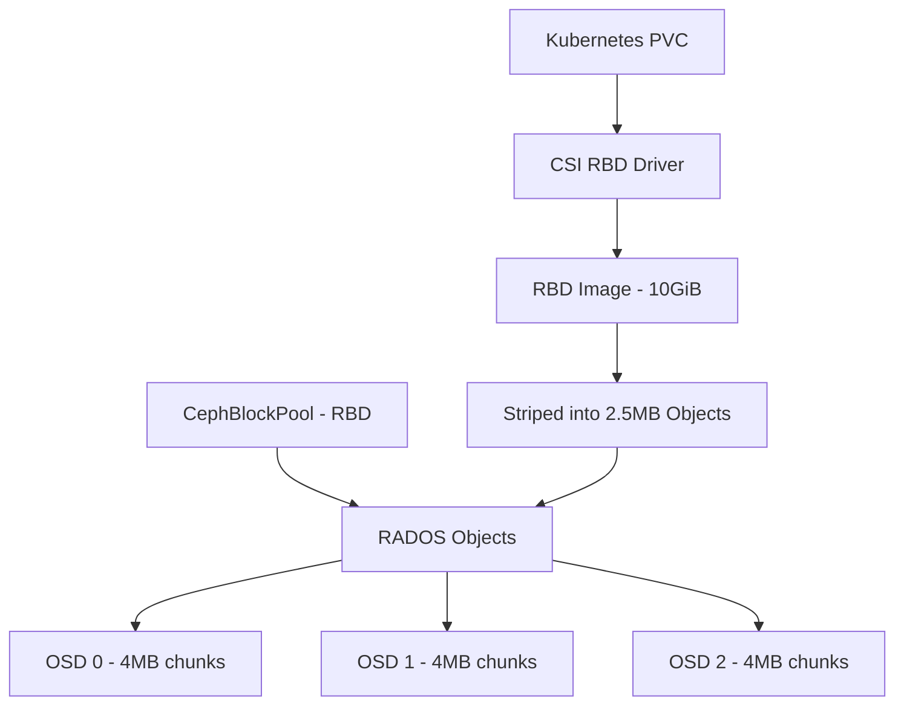

# How to Create a CephBlockPool for RBD Storage in Rook

Author: [nawazdhandala](https://www.github.com/nawazdhandala)

Tags: Rook, Ceph, Kubernetes, RBD, CephBlockPool, Storage

Description: Step-by-step guide to creating and configuring a CephBlockPool resource specifically optimized for RADOS Block Device (RBD) workloads in Rook.

---

## How RBD Pools Differ from Other Ceph Pools

Ceph supports multiple data backends. RADOS Block Device (RBD) pools store thin-provisioned disk images that are striped across multiple OSDs. Unlike object storage pools (used by RGW) or CephFS metadata pools, RBD pools need specific feature flags and image formats to work with the Kubernetes CSI driver.



## RBD Image Format Requirements

Rook's CSI driver requires RBD image format 2 with specific feature flags. These are set on the StorageClass, not the pool itself, but the pool must be enabled for these features. The key features used are:

- `layering` - Required for cloning and snapshotting
- `deep-flatten` - Required for flattening clones
- `exclusive-lock` - Required for multi-writer protection
- `object-map` - Required for fast diff and export
- `fast-diff` - Required for incremental snapshots

## Creating the CephBlockPool

Create a CephBlockPool optimized for RBD workloads:

```yaml
apiVersion: ceph.rook.io/v1
kind: CephBlockPool
metadata:
  name: rbd-pool
  namespace: rook-ceph
spec:
  # Spread data replicas across different hosts for fault tolerance
  failureDomain: host
  replicated:
    size: 3
    # Refuse writes if fewer than min_size replicas are available
    requireSafeReplicaSize: true
    # Enable hybrid mode: use primary device class for most I/O
    hybridStorage:
      primaryDeviceClass: ssd
      secondaryDeviceClass: hdd
```

For a simpler pool without hybrid storage:

```yaml
apiVersion: ceph.rook.io/v1
kind: CephBlockPool
metadata:
  name: rbd-pool
  namespace: rook-ceph
spec:
  failureDomain: host
  replicated:
    size: 3
    requireSafeReplicaSize: true
```

Apply:

```bash
kubectl apply -f rbd-pool.yaml
```

## Creating the Secrets for CSI Authentication

The CSI driver needs credentials to create and mount RBD images. The Rook operator automatically creates these secrets when you create the CephBlockPool and pair it with a StorageClass. Verify they exist:

```bash
kubectl -n rook-ceph get secret rook-csi-rbd-provisioner
kubectl -n rook-ceph get secret rook-csi-rbd-node
```

If they are missing, check the operator logs for errors:

```bash
kubectl -n rook-ceph logs deployment/rook-ceph-operator | grep -i "rbd"
```

## Creating the StorageClass for RBD

Link the CephBlockPool to a Kubernetes StorageClass so applications can request RBD volumes:

```yaml
apiVersion: storage.k8s.io/v1
kind: StorageClass
metadata:
  name: rook-ceph-block
  annotations:
    storageclass.kubernetes.io/is-default-class: "true"
provisioner: rook-ceph.rbd.csi.ceph.com
parameters:
  clusterID: rook-ceph
  pool: rbd-pool
  imageFormat: "2"
  # Enable RBD features needed by the CSI driver
  imageFeatures: layering,deep-flatten,exclusive-lock,object-map,fast-diff
  csi.storage.k8s.io/provisioner-secret-name: rook-csi-rbd-provisioner
  csi.storage.k8s.io/provisioner-secret-namespace: rook-ceph
  csi.storage.k8s.io/controller-expand-secret-name: rook-csi-rbd-provisioner
  csi.storage.k8s.io/controller-expand-secret-namespace: rook-ceph
  csi.storage.k8s.io/node-stage-secret-name: rook-csi-rbd-node
  csi.storage.k8s.io/node-stage-secret-namespace: rook-ceph
reclaimPolicy: Delete
allowVolumeExpansion: true
mountOptions: []
```

## Testing RBD Pool Functionality

Create a test PVC and pod to verify the pool works end-to-end:

```yaml
apiVersion: v1
kind: PersistentVolumeClaim
metadata:
  name: rbd-test-pvc
spec:
  accessModes:
    - ReadWriteOnce
  resources:
    requests:
      storage: 1Gi
  storageClassName: rook-ceph-block
---
apiVersion: v1
kind: Pod
metadata:
  name: rbd-test-pod
spec:
  containers:
    - name: test
      image: busybox
      command: ["/bin/sh", "-c", "dd if=/dev/urandom of=/data/test bs=1M count=10 && echo 'RBD write test passed'"]
      volumeMounts:
        - name: data
          mountPath: /data
  volumes:
    - name: data
      persistentVolumeClaim:
        claimName: rbd-test-pvc
  restartPolicy: Never
```

```bash
kubectl apply -f rbd-test.yaml
kubectl wait --for=condition=Complete pod/rbd-test-pod --timeout=60s
kubectl logs rbd-test-pod
```

## Listing RBD Images in the Pool

From the toolbox, list all RBD images provisioned in the pool:

```bash
kubectl -n rook-ceph exec deploy/rook-ceph-tools -- rbd ls rbd-pool
```

Inspect a specific image:

```bash
kubectl -n rook-ceph exec deploy/rook-ceph-tools -- \
  rbd info rbd-pool/csi-vol-xxxxxxxx-xxxx-xxxx-xxxx-xxxxxxxxxxxx
```

```text
rbd image 'csi-vol-xxxxxxxx':
        size 1 GiB in 256 objects
        order 22 (4 MiB objects)
        snapshot_count: 0
        id: a1b2c3d4e5f6
        block_name_prefix: rbd_data.a1b2c3d4e5f6
        format: 2
        features: layering, deep-flatten, exclusive-lock, object-map, fast-diff
        op_features:
        flags:
        create_timestamp: Thu Mar 31 10:00:00 2026
        access_timestamp: Thu Mar 31 10:00:00 2026
        modify_timestamp: Thu Mar 31 10:00:00 2026
```

## Summary

Creating a CephBlockPool for RBD storage involves defining the pool with the correct `failureDomain` and `replicated.size`, then creating a StorageClass that references the pool with `imageFormat: "2"` and the required `imageFeatures`. The Rook operator automatically provisions CSI authentication secrets. With the pool and StorageClass in place, Kubernetes PVCs using `ReadWriteOnce` access mode can dynamically provision RBD images backed by your Ceph cluster. Use the toolbox to inspect images with `rbd info` and validate pool health with `ceph osd pool get`.
