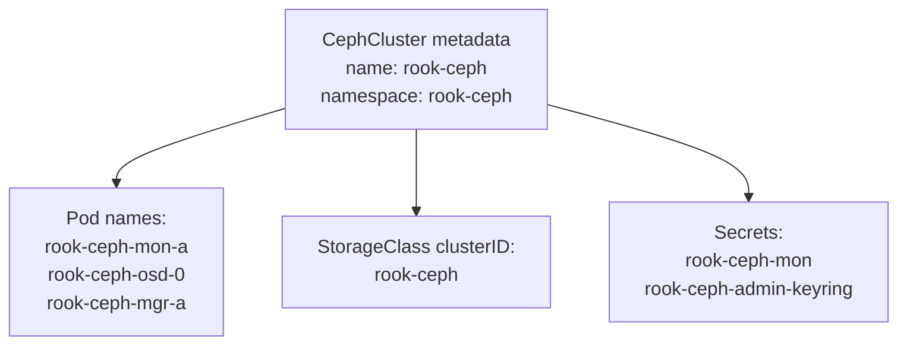

# How to Configure the CephCluster CRD Metadata (Name and Namespace)

Author: [nawazdhandala](https://www.github.com/nawazdhandala)

Tags: Rook, Ceph, Kubernetes, Storage, CRD, Configuration

Description: Configure the name and namespace fields in the CephCluster CRD metadata, understand naming constraints, multi-cluster deployments, and how the metadata affects Ceph resource naming.

---

## Why CephCluster Metadata Matters

The `metadata.name` and `metadata.namespace` fields in the CephCluster CRD are not just Kubernetes labels. They directly control:

- The Kubernetes namespace where all Ceph daemon pods are created
- The Ceph cluster name embedded in keyring files and configuration
- The prefix used by Rook when naming OSD, Mon, and MGR resources
- The CSI driver's `clusterID` parameter in StorageClasses



## Standard Single-Cluster Configuration

The conventional configuration uses `rook-ceph` for both name and namespace:

```yaml
apiVersion: ceph.rook.io/v1
kind: CephCluster
metadata:
  name: rook-ceph
  namespace: rook-ceph
spec:
  cephVersion:
    image: quay.io/ceph/ceph:v19.2.0
  dataDirHostPath: /var/lib/rook
  mon:
    count: 3
```

This is the default in Rook's example manifests and is assumed by most documentation.

## Custom Name and Namespace

You can change both values. For example, a cluster named `production-ceph` in the `storage` namespace:

```yaml
apiVersion: ceph.rook.io/v1
kind: CephCluster
metadata:
  name: production-ceph
  namespace: storage
spec:
  cephVersion:
    image: quay.io/ceph/ceph:v19.2.0
  dataDirHostPath: /var/lib/rook
```

When using a custom namespace, the Rook operator must also be installed in that namespace, or the operator must be configured to watch that namespace:

```bash
# Check operator namespace configuration
kubectl -n rook-ceph get configmap rook-ceph-operator-config \
  -o jsonpath='{.data.ROOK_CURRENT_NAMESPACE_ONLY}'
```

If `ROOK_CURRENT_NAMESPACE_ONLY` is `"true"`, the operator only watches its own namespace.

## Multi-Cluster Deployments

To run multiple independent Ceph clusters on the same Kubernetes cluster, use different namespaces:

```yaml
# Cluster 1
apiVersion: ceph.rook.io/v1
kind: CephCluster
metadata:
  name: ceph-us-east
  namespace: ceph-us-east
---
# Cluster 2
apiVersion: ceph.rook.io/v1
kind: CephCluster
metadata:
  name: ceph-us-west
  namespace: ceph-us-west
```

Each namespace needs its own Rook operator deployment, CRD RBAC, and common resources.

## Impact on CSI StorageClass clusterID

The StorageClass `clusterID` parameter must match the CephCluster namespace:

```yaml
apiVersion: storage.k8s.io/v1
kind: StorageClass
metadata:
  name: rook-ceph-block
provisioner: rook-ceph.rbd.csi.ceph.com
parameters:
  clusterID: storage    # Must match CephCluster namespace
  pool: replicapool
```

If `clusterID` does not match the namespace, PVC provisioning will fail with an "unknown cluster" error.

## Adding Labels and Annotations

Add labels for organizational purposes:

```yaml
apiVersion: ceph.rook.io/v1
kind: CephCluster
metadata:
  name: rook-ceph
  namespace: rook-ceph
  labels:
    environment: production
    team: platform
    version: "19.2"
  annotations:
    description: "Primary storage cluster for production workloads"
    contact: "platform-team@example.com"
```

Labels and annotations do not affect Rook behavior but help with `kubectl get cephcluster -A` filtering:

```bash
kubectl get cephcluster -A -l environment=production
```

## Checking Existing CephCluster Metadata

```bash
kubectl get cephcluster -A
kubectl describe cephcluster rook-ceph -n rook-ceph
```

## Namespace Naming Constraints

Kubernetes namespace names must:

- Contain only lowercase alphanumeric characters and hyphens
- Start and end with alphanumeric characters
- Be 63 characters or fewer

Valid: `rook-ceph`, `storage`, `ceph-prod`, `cluster-1`
Invalid: `Rook_Ceph`, `storage/ceph`, `rook.ceph`

## Summary

The CephCluster `metadata.name` and `metadata.namespace` fields control the Kubernetes namespace for Ceph pods, the cluster name in keyring files, and the `clusterID` that StorageClasses reference. The conventional default is `rook-ceph` for both. To run multiple clusters, use separate namespaces with a dedicated operator per namespace. Always ensure the StorageClass `clusterID` parameter matches the CephCluster namespace, not its name.
